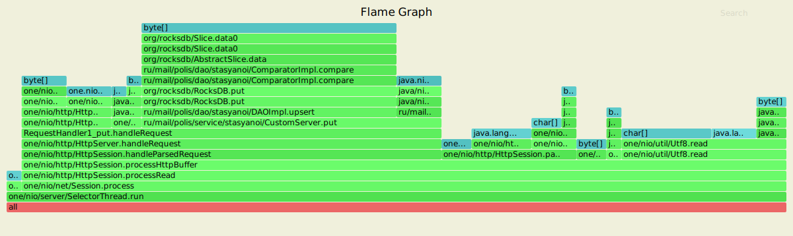
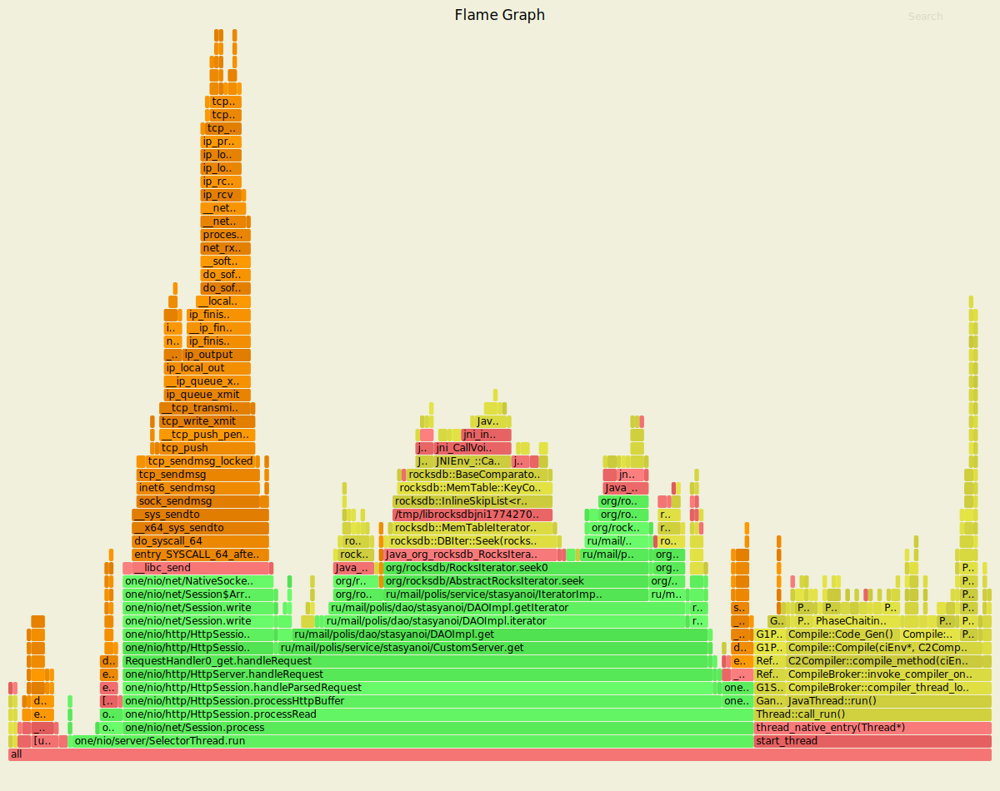
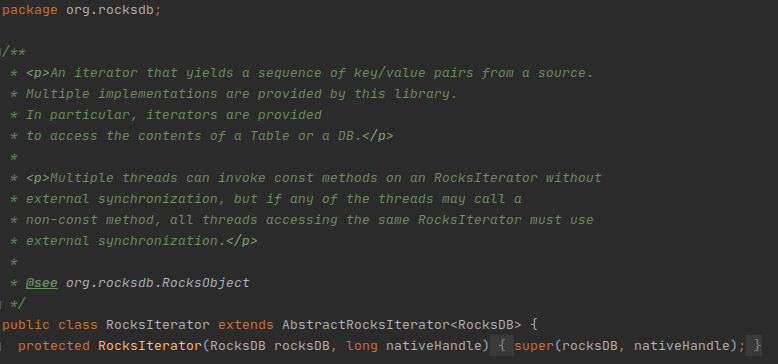

В рамках использования утилиты wrk2|profiler сервер имеет следующие показатели для put.
---------------------------------------------------------------------------------------

Running 15s test @ http://localhost:8080
  1 threads and 17 connections
  Thread calibration: mean lat.: 1.172ms, rate sampling interval: 10ms
    
     Thread Stats   Avg      Stdev     Max   +/- Stdev
      Latency     1.12ms  496.18us   2.91ms   65.13%
      Req/Sec     2.11k   144.57     2.56k    75.51%
  
  Latency Distribution (HdrHistogram - Recorded Latency)
  
     50.000%    1.08ms
     75.000%    1.47ms
     90.000%    1.78ms
     99.000%    2.34ms
     99.900%    2.69ms
     99.990%    2.90ms
     99.999%    2.91ms
    100.000%    2.91ms
    
Скрипт PUT
----------------------------------------------------------------

rm wrkLogsPut.txt

../wrk2/wrk -t1 -c17 -d15s -R2000 -s ../wrk2/scripts/put.lua --u_latency http://localhost:8080 > wrkLogsPut.txt &

rm flamePutCpu.svg 

rm flamePutAlloc.svg 

rm flamePutLock.svg 

../async-profiler-1.8.1-linux-x64/profiler.sh -d 5 -e cpu -f flamePutCpu.svg $(lsof -t -i :8080 -s TCP:LISTEN)

../async-profiler-1.8.1-linux-x64/profiler.sh -d 5 -e alloc -f flamePutAlloc.svg $(lsof -t -i :8080 -s TCP:LISTEN)

../async-profiler-1.8.1-linux-x64/profiler.sh -d 5 -e lock -f flamePutLock.svg $(lsof -t -i :8080 -s TCP:LISTEN)

----------------------------------------------------------------
CPU put
----------------------------------------------------

------------------------------------------------------
ALLOC put
----------------------------------------------------

LOCK put
----------------------------------------------------

В рамках использования утилиты wrk2|profiler сервер имеет следующие показатели для get.
---------------------------------------------------------------------------------------

Running 15s test @ http://localhost:8080
  1 threads and 17 connections
  Thread calibration: mean lat.: 1.166ms, rate sampling interval: 10ms
    
      Thread Stats   Avg      Stdev     Max   +/- Stdev
      Latency     1.15ms  503.35us   5.05ms   63.92%
      Req/Sec     2.11k   135.10     2.56k    78.69%
  
  Latency Distribution (HdrHistogram - Recorded Latency)
    
     50.000%    1.11ms
     75.000%    1.52ms
     90.000%    1.82ms
     99.000%    2.29ms
     99.900%    2.81ms
     99.990%    4.82ms
     99.999%    5.05ms
    100.000%    5.05ms

Скрипт GET
----------------------------------------------------------------

rm wrkLogsGet.txt

../wrk2/wrk -t1 -c17 -d15s -R2000 -s ../wrk2/scripts/get.lua --u_latency http://localhost:8080 > wrkLogsGet.txt &

rm flameGetCpu.svg 

rm flameGetAlloc.svg  

rm flameGetLock.svg 

../async-profiler-1.8.1-linux-x64/profiler.sh -d 5 -e cpu -f flameGetCpu.svg $(lsof -t -i :8080 -s TCP:LISTEN)

../async-profiler-1.8.1-linux-x64/profiler.sh -d 5 -e alloc -f flameGetAlloc.svg $(lsof -t -i :8080 -s TCP:LISTEN)

../async-profiler-1.8.1-linux-x64/profiler.sh -d 5 -e lock -f flameGetLock.svg $(lsof -t -i :8080 -s TCP:LISTEN)

----------------------------------------------------------------
CPU get
----------------------------------------------------

------------------------------------------------------
ALLOC get
----------------------------------------------------

LOCK get
----------------------------------------------------

Вывод:

В рамках нагрузочного тестирования для PUT/GET

№1 Потоков - 1 

№2 Соединений - 17

№3 Продолжительность - 15 секунд

№4 Количество запросов (Rate) - 2000

1) Put

 Latency -> Avg. 1.12ms | Max. 2.91ms

 Req/Sec -> Avg. 2.11k  | Max. 2.56k 

2) Get

 Latency -> Avg. 1.15ms | Max. 5.91ms

 Req/Sec -> Avg. 2.11k  | Max. 2.56k 
 
GET запросы выполняюстя дольше, 
чем PUT запросы в данном случае по причине того, 
что GET запрос нужно блокировать достаточно рано для того, 
чтобы работа с итератором была валидной.  
 
Из имеющихся svg можно сделать вывод, что 
put использует неблокирующую снихронизацию т.к. 
сам lock graph пустой. Get использует 1-у блокировку на уровне 
ДАО имплементации ввиду того, что там используется rocksdb итератор, 
который так же нуждается во внешней синхронизации при вызове 
не-конст методов. 

