В рамках использования утилиты wrk2|profiler сервер имеет следующие показатели для put.
---------------------------------------------------------------------------------------

Скрипт PUT
----------------------------------------------------------------

rm wrkLogsPut.txt

rm flamePutCpu.svg 

rm flamePutAlloc.svg 

rm flamePutLock.svg 

../../wrk2/wrk -t1 -c65 -d25s -R2000 -s ../../wrk2/scripts/put.lua --u_latency http://localhost:8080 > wrkLogsPut.txt &

sleep 5s

echo "start analitics"

../../async-profiler-1.8.1-linux-x64/profiler.sh -d 5 -e cpu -f flamePutCpu.svg $(lsof -t -i :8080 -s TCP:LISTEN)

../../async-profiler-1.8.1-linux-x64/profiler.sh -d 5 -e alloc -f flamePutAlloc.svg $(lsof -t -i :8080 -s TCP:LISTEN)

../../async-profiler-1.8.1-linux-x64/profiler.sh -d 5 -e lock -f flamePutLock.svg $(lsof -t -i :8080 -s TCP:LISTEN)

echo "end analitics"

SYNCHRONOUS 
-----------
Running 25s test @ http://localhost:8080

  1 threads and 65 connections

  Thread calibration: mean lat.: 1.301ms, rate sampling interval: 10ms
    
    Thread Stats   Avg      Stdev     Max   +/- Stdev

    Latency     1.15ms  590.80us  15.08ms   74.00%
    Req/Sec     2.11k   192.74     4.22k    70.15%

  Latency Distribution (HdrHistogram - Recorded Latency)
 
    50.000%    1.13ms
    75.000%    1.51ms
    90.000%    1.80ms
    99.000%    2.29ms
    99.900%    5.28ms
    99.990%    14.92ms
    99.999%    15.09ms
    100.000%   15.09ms

----------------------------------------------------------------
CPU put SYNC 
----------------------------------------------------
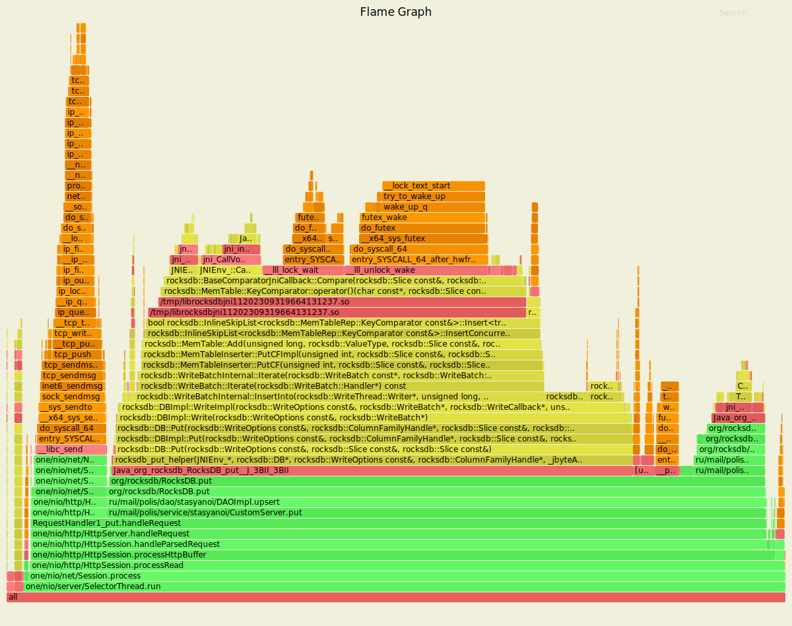
------------------------------------------------------
ALLOC put SYNC
----------------------------------------------------
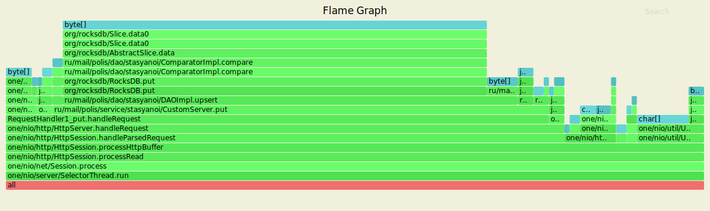
LOCK put SYNC
----------------------------------------------------

ASYNCHRONOUS 
-----------    
 
Running 25s test @ http://localhost:8080

  1 threads and 65 connections

  Thread calibration: mean lat.: 1.289ms, rate sampling interval: 10ms

    Thread Stats   Avg      Stdev     Max   +/- Stdev

    Latency     1.34ms    1.08ms  22.86ms   97.01%

    Req/Sec     2.11k   253.36     4.70k    86.35%

  Latency Distribution (HdrHistogram - Recorded Latency)

     50.000%    1.24ms
     75.000%    1.65ms
     90.000%    1.99ms
     99.000%    4.51ms
     99.900%   15.69ms
     99.990%   21.26ms
     99.999%   22.88ms
    100.000%   22.88ms

----------------------------------------------------------------
CPU put ASYNC
----------------------------------------------------
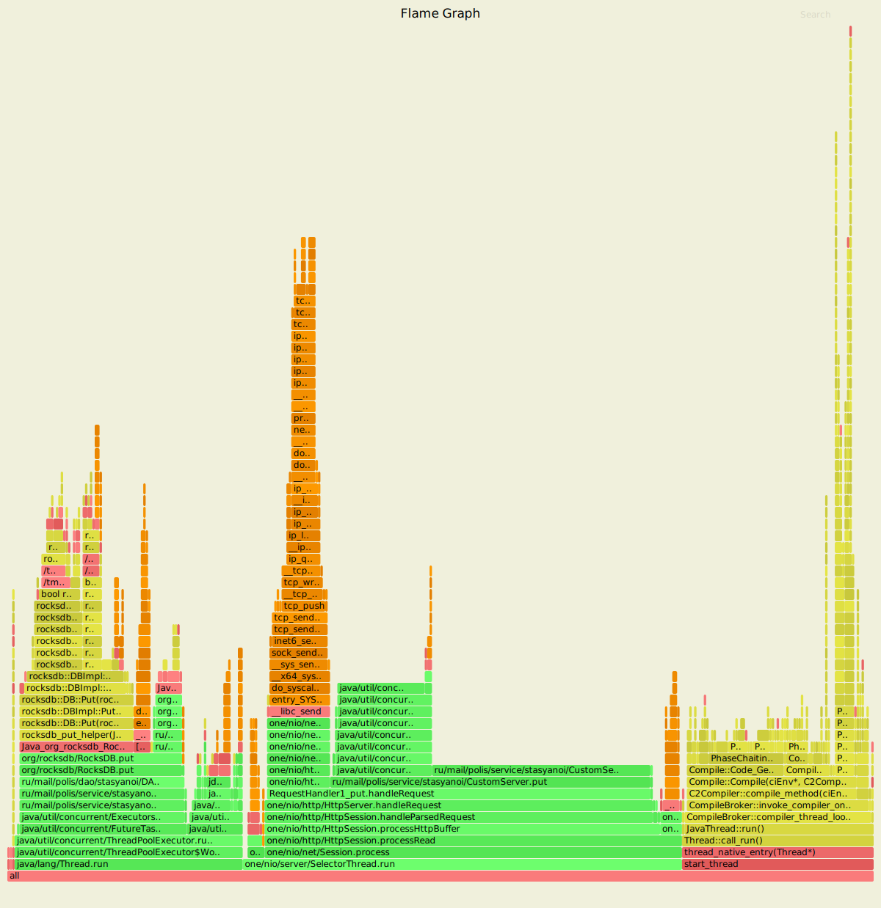
------------------------------------------------------
ALLOC put ASYNC
----------------------------------------------------
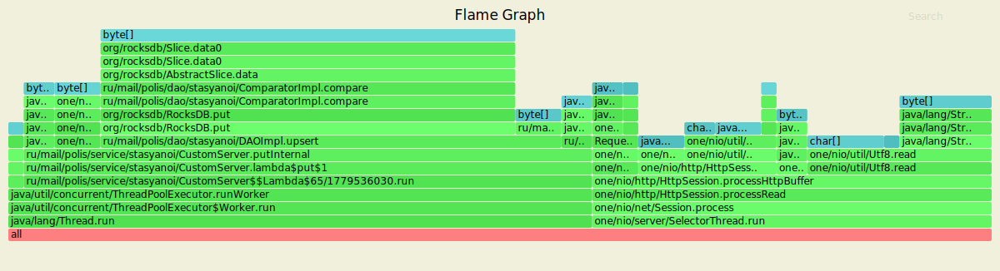
LOCK put ASYNC
----------------------------------------------------
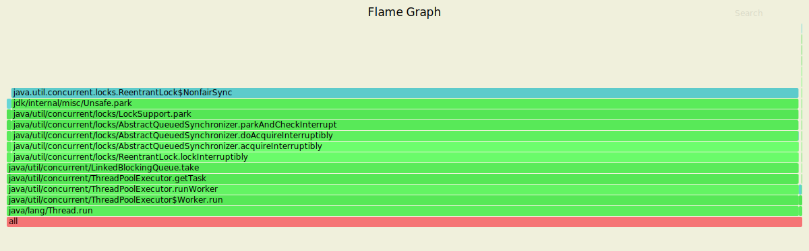

В рамках использования утилиты wrk2|profiler сервер имеет следующие показатели для get.
---------------------------------------------------------------------------------------

Скрипт GET
----------------------------------------------------------------

rm wrkLogsGet.txt

rm flameGetCpu.svg 

rm flameGetAlloc.svg  

rm flameGetLock.svg 

../../wrk2/wrk -t1 -c65 -d25s -R2000 -s ../../wrk2/scripts/get.lua --u_latency http://localhost:8080 > wrkLogsGet.txt &

sleep 5s

echo "start analitics"

../../async-profiler-1.8.1-linux-x64/profiler.sh -d 5 -e cpu -f flameGetCpu.svg $(lsof -t -i :8080 -s TCP:LISTEN)

../../async-profiler-1.8.1-linux-x64/profiler.sh -d 5 -e alloc -f flameGetAlloc.svg $(lsof -t -i :8080 -s TCP:LISTEN)

../../async-profiler-1.8.1-linux-x64/profiler.sh -d 5 -e lock -f flameGetLock.svg $(lsof -t -i :8080 -s TCP:LISTEN)

echo "end analitics"

SYNCHRONOUS
----------------------------------------------------------------------

Running 25s test @ http://localhost:8080

  1 threads and 65 connections

  Thread calibration: mean lat.: 1.187ms, rate sampling interval: 10ms

    Thread Stats   Avg      Stdev     Max   +/- Stdev

    Latency     1.24ms    0.89ms  27.90ms   93.91%
    Req/Sec     2.11k   204.04     4.70k    77.69%
  
  Latency Distribution (HdrHistogram - Recorded Latency)
 
    50.000%    1.18ms
    75.000%    1.57ms
    90.000%    1.87ms
    99.000%    2.40ms
    99.900%    14.15ms
    99.990%    26.13ms
    99.999%    27.92ms
    100.000%   27.92ms

----------------------------------------------------------------
CPU get SYNC
----------------------------------------------------
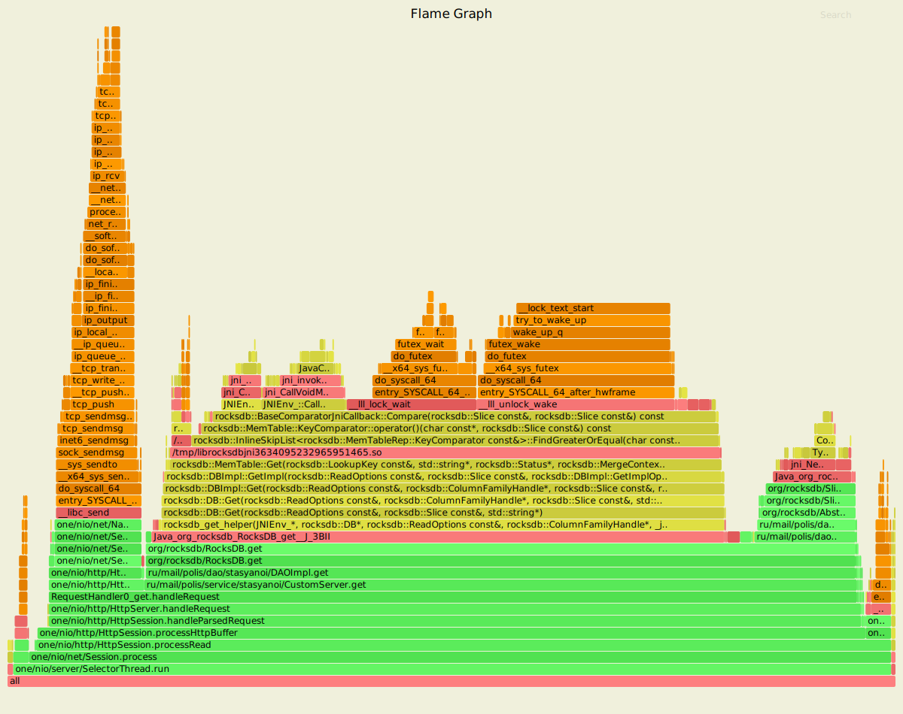
------------------------------------------------------
ALLOC get SYNC
----------------------------------------------------
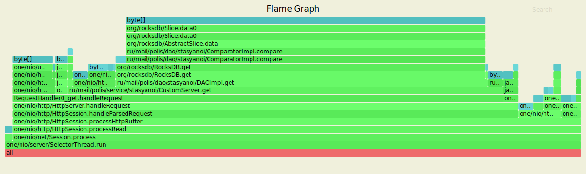

LOCK get SYNC
----------------------------------------------------
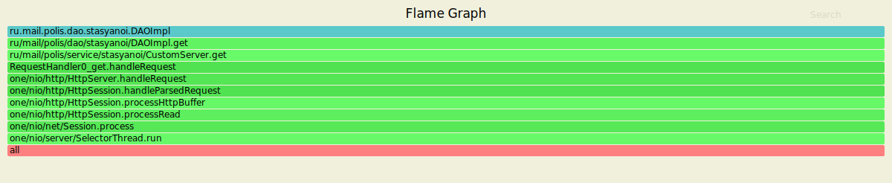

ASYNCHRONOUS
----------------------------------------------------------------------

Running 25s test @ http://localhost:8080

  1 threads and 65 connections

  Thread calibration: mean lat.: 5.065ms, rate sampling interval: 17ms

  Thread Stats   Avg      Stdev     Max   +/- Stdev

    Latency     5.26ms    2.80ms  26.03ms   72.00%
    Req/Sec     2.06k     1.55k    4.06k    43.99%

  Latency Distribution (HdrHistogram - Recorded Latency)

     50.000%    4.90ms
     75.000%    6.82ms
     90.000%    8.71ms
     99.000%   14.42ms
     99.900%   19.44ms
     99.990%   24.32ms
     99.999%   26.05ms
    100.000%   26.05ms

----------------------------------------------------------------
CPU get ASYNC
----------------------------------------------------
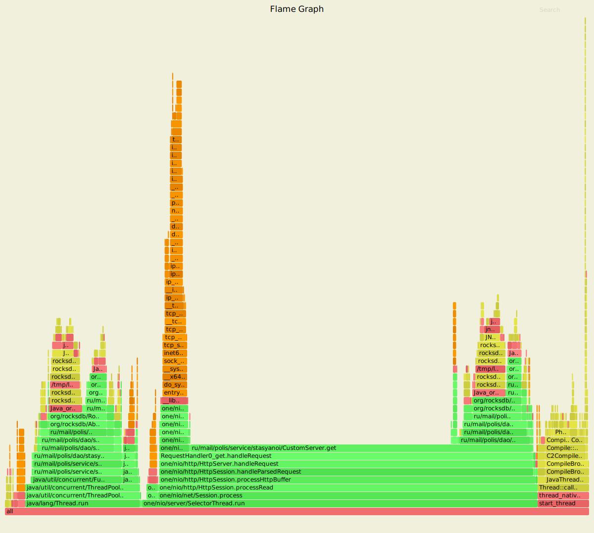
------------------------------------------------------
ALLOC get ASYNC
----------------------------------------------------
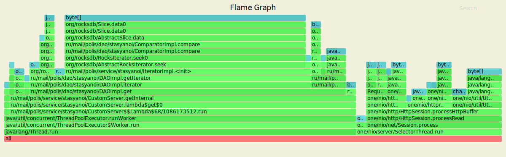

LOCK get ASYNC
----------------------------------------------------
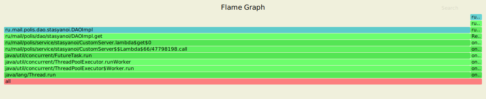

Вывод:

В рамках нагрузочного тестирования для PUT/GET

№1 Потоков - 1 

№2 Соединений - 65

№3 Продолжительность - 15 секунд

№4 Количество запросов (Rate) - 2000

1) Put

SYNC

 Latency -> Avg. 1.15ms | Max. 15.08ms

 Req/Sec -> Avg. 2.11k  | Max. 4.22k 

ASYNC

 Latency -> Avg. 1.34ms | Max. 22.86ms

 Req/Sec -> Avg. 2.11k  | Max. 4.78k
  

2) Get
 
SYNC

 Latency -> Avg. 1.24ms | Max. 27.90ms

 Req/Sec -> Avg. 2.11k  | Max. 4.70k 

ASYNC

 Latency -> Avg. 4.51ms | Max. 12.18ms

 Req/Sec -> Avg. 2.09k  | Max. 5.42k 
 
 
В рамках графов CPU асинхронных запросов можно так же заметить, что запросы к 
хранилищу теперь делаются в рамках отдельного потока. Что отражает тот факт, 
что запросы теперь обрабатывается отдельным пулом потоков. 

График lock при синхронном и асинхронном put запросе так же отличаются. 
При синхронном запросе судя по графику, блокировка отсутствует.
При асинхронном запросе проявляется блокировка очереди задач
связанной с работой ExecutorService.   
 