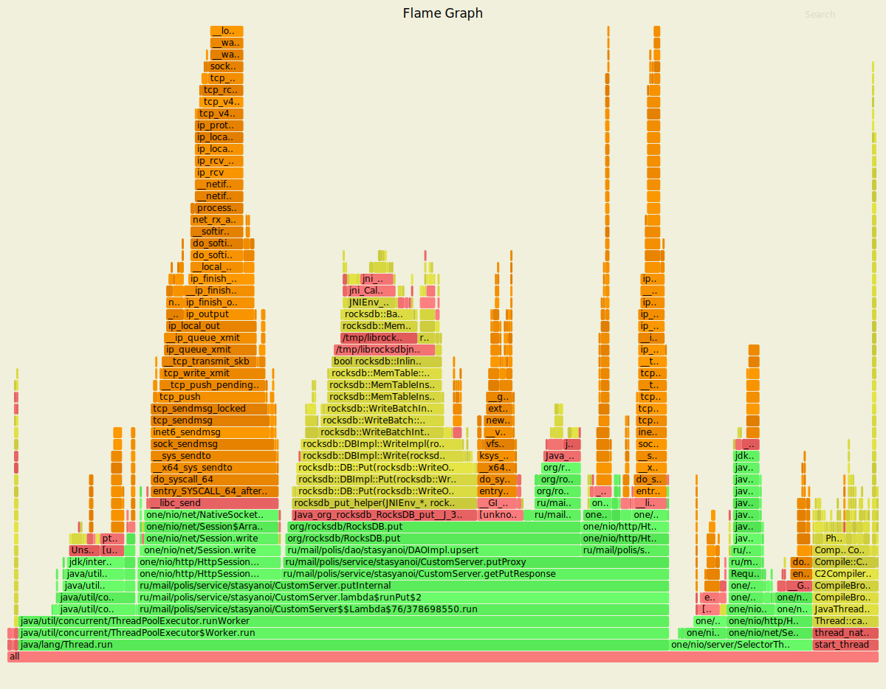
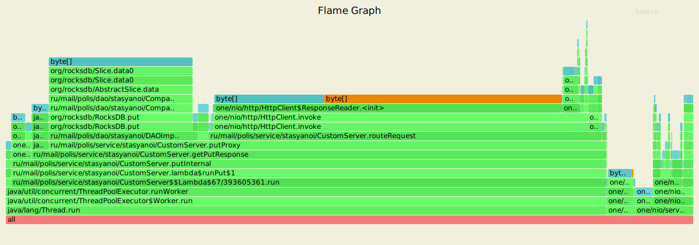
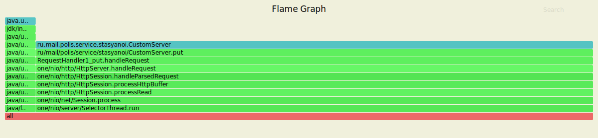
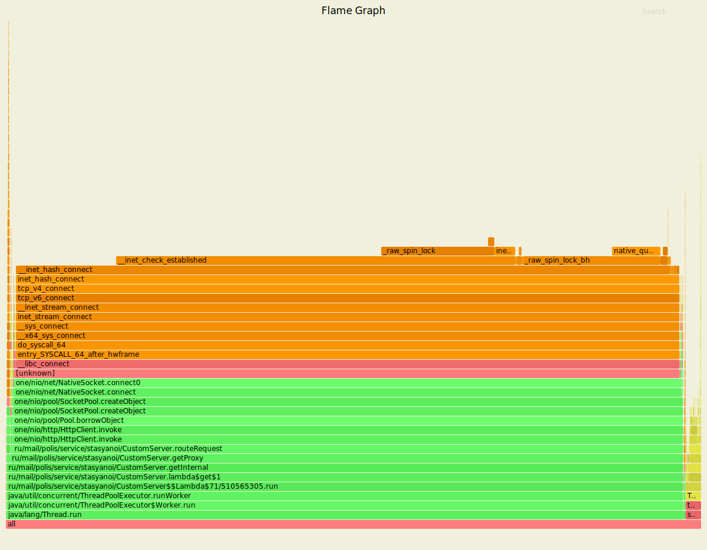
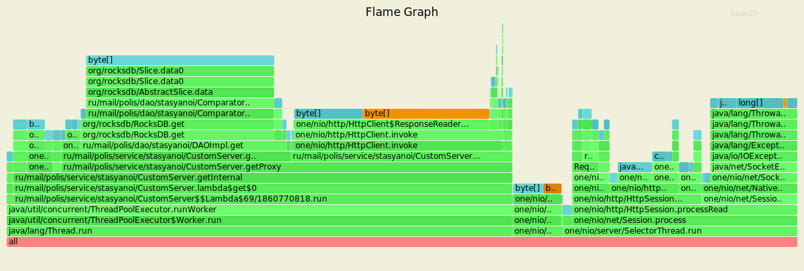
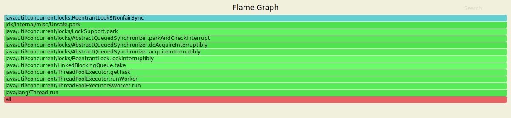

В рамках использования утилиты wrk2|profiler сервер имеет следующие показатели для put.
---------------------------------------------------------------------------------------

Running 50s test @ http://localhost:8080
 
  1 threads and 20 connections
 
  Thread calibration: mean lat.: 1.451ms, rate sampling interval: 10ms
 
    Thread Stats   Avg      Stdev     Max   +/- Stdev
    Latency     1.73ms    1.94ms  52.32ms   87.19%
    Req/Sec     1.05k   160.70     5.67k    82.49%
  
  Latency Distribution (HdrHistogram - Recorded Latency)
 
    50.000%    1.21ms
    75.000%    1.73ms
    90.000%    4.41ms
    99.000%    6.62ms
    99.900%    25.45ms
    99.990%    46.72ms
    99.999%    52.35ms
    100.000%   52.35ms
    
Скрипт PUT
----------------------------------------------------------------

rm wrkLogsPut1.txt

rm flamePutCpu1.svg 

rm flamePutAlloc1.svg 

rm flamePutLock1.svg

../../wrk2/wrk -c20 -d50s -R1000 -s ../../wrk2/scripts/put.lua --u_latency http://localhost:8080 > wrkLogsPut1.txt &

sleep 10s

echo "start analitics"

../../async-profiler-1.8.1-linux-x64/profiler.sh -d 10 -e cpu -f flamePutCpu1.svg $(lsof -t -i :8080 -s TCP:LISTEN) 

../../async-profiler-1.8.1-linux-x64/profiler.sh -d 10 -e alloc -f flamePutAlloc1.svg $(lsof -t -i :8080 -s TCP:LISTEN) 

../../async-profiler-1.8.1-linux-x64/profiler.sh -d 10 -e lock -f flamePutLock1.svg $(lsof -t -i :8080 -s TCP:LISTEN)

echo "end analitics"

sleep 10s

----------------------------------------------------------------
CPU put
----------------------------------------------------

------------------------------------------------------
ALLOC put
----------------------------------------------------

LOCK put
----------------------------------------------------

В рамках использования утилиты wrk2|profiler сервер имеет следующие показатели для get.
---------------------------------------------------------------------------------------

Running 50s test @ http://localhost:8080
 
  1 threads and 20 connections
 
  Thread calibration: mean lat.: 4.335ms, rate sampling interval: 13ms
 
    Thread Stats   Avg      Stdev     Max   +/- Stdev
    Latency   415.99ms  674.95ms   2.16s    78.72%
    Req/Sec     1.00k   237.68     2.00k    75.30%
  
  Latency Distribution (HdrHistogram - Recorded Latency)
    
    50.000%    7.36ms
    75.000%  516.86ms
    90.000%     1.70s 
    99.000%     1.99s 
    99.900%     2.12s 
    99.990%     2.15s 
    99.999%     2.16s 
    100.000%    2.16s 

Скрипт GET
----------------------------------------------------------------

rm wrkLogsGet1.txt

rm flameGetCpu1.svg 

rm flameGetAlloc1.svg  

rm flameGetLock1.svg 

../../wrk2/wrk -c20 -d50s -R1000 -s ../../wrk2/scripts/get.lua --u_latency http://localhost:8080 > wrkLogsGet1.txt &

sleep 10s

echo "start analitics"

../../async-profiler-1.8.1-linux-x64/profiler.sh -d 10 -e cpu -f flameGetCpu1.svg $(lsof -t -i :8080 -s TCP:LISTEN) 

../../async-profiler-1.8.1-linux-x64/profiler.sh -d 10 -e alloc -f flameGetAlloc1.svg $(lsof -t -i :8080 -s TCP:LISTEN) 

../../async-profiler-1.8.1-linux-x64/profiler.sh -d 10 -e lock -f flameGetLock1.svg $(lsof -t -i :8080 -s TCP:LISTEN) 

echo "end analitics"

----------------------------------------------------------------
CPU get
----------------------------------------------------

------------------------------------------------------
ALLOC get
----------------------------------------------------

LOCK get
----------------------------------------------------

Вывод:

В рамках нагрузочного тестирования для PUT/GET

№1 Соединений - 20

№2 Продолжительность - 50 секунд

№3 Количество запросов (Rate) - 1000

1) Put
 Latency -> Avg. 1.73ms | Max. 52.32ms
 Req/Sec -> Avg. 1.05k  | Max. 5.67k 

2) Get
 Latency -> Avg. 415.99ms | Max. 2.16s
 Req/Sec -> Avg. 1.00k  | Max. 2.00k 
 
На снимках работы CPU можно видеть переадресовку 
запросов на другие сервисы. 
Причем GET запросы выполняются дольше чем PUT запросы.
Работа проходит значительно медленнее по сравнению с реализацией без хэширования.
Вызвано замедление хэшированием.

Результаты 3-го этапа для сравнения:

1) Put

SYNC

 Latency -> Avg. 6.14ms | Max. 203.01ms

 Req/Sec -> Avg. 6.17k  | Max. 14.06k 

ASYNC

 Latency -> Avg. 12.20ms | Max. 151.42ms

 Req/Sec -> Avg. 6.04k  | Max. 10.75k
  

2) Get
 
SYNC

 Latency -> Avg. 12.49ms | Max. 455.94ms

 Req/Sec -> Avg. 6.08k  | Max. 14.09k 

ASYNC

 Latency -> Avg. 4.71ms | Max. 95.42ms

 Req/Sec -> Avg. 6.01k  | Max. 6.76k  

