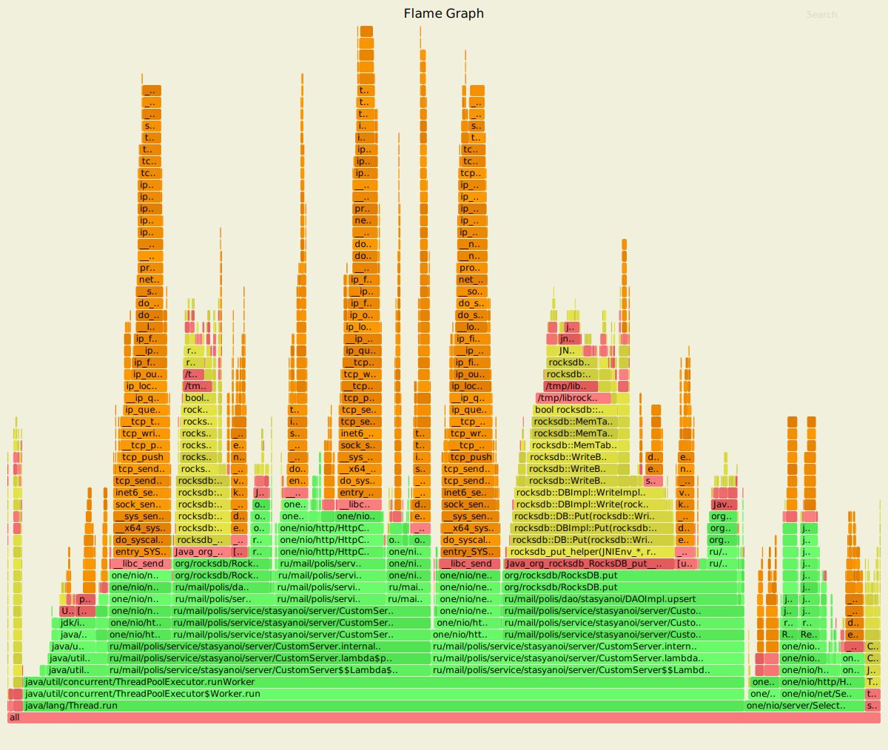
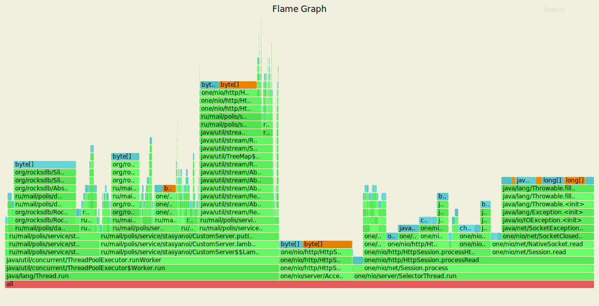
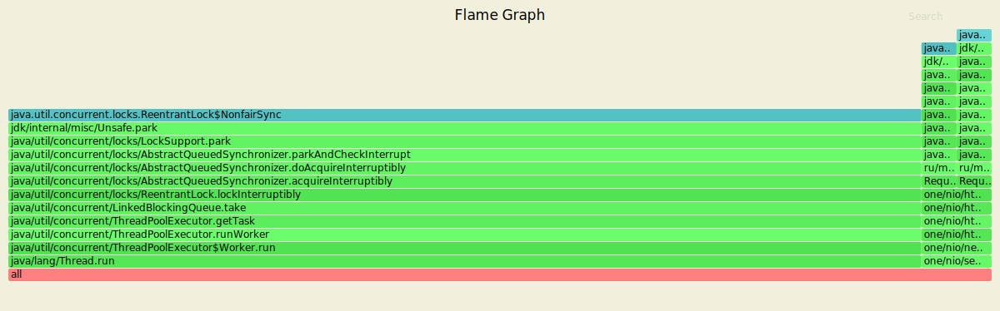
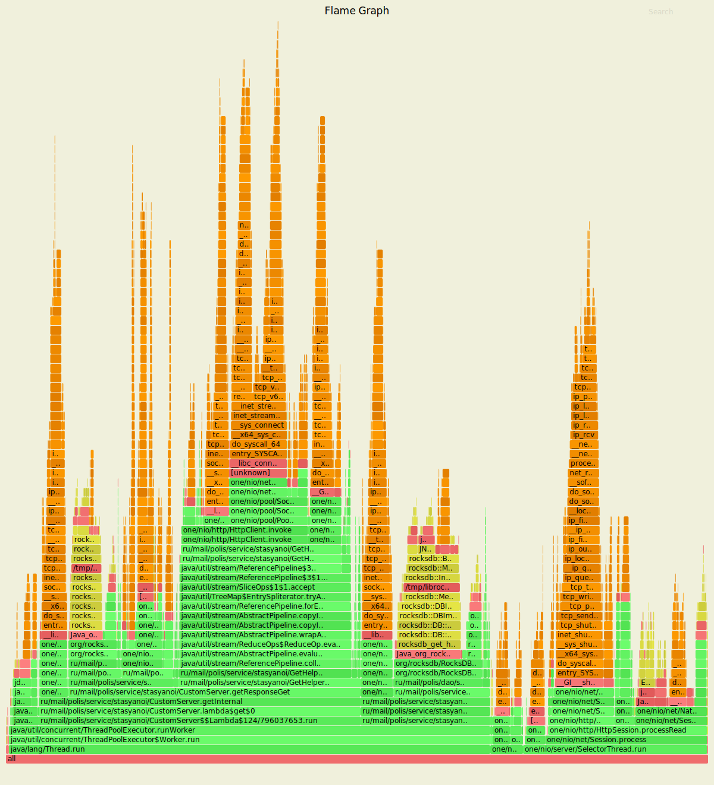
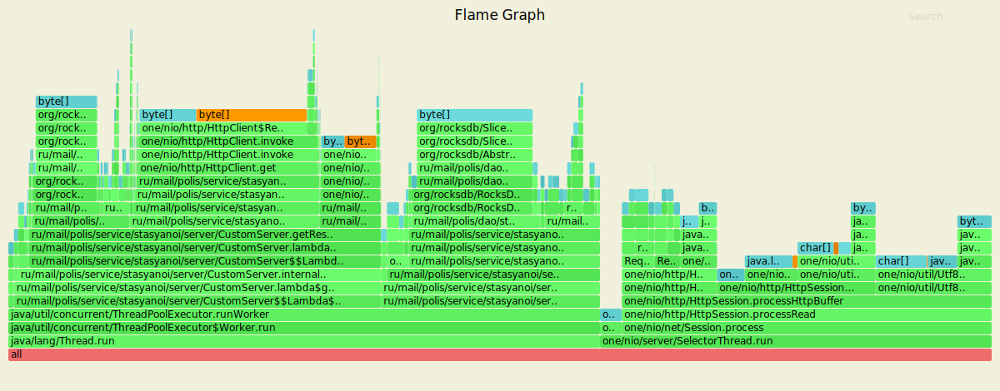

В рамках использования утилиты wrk2|profiler сервер имеет следующие показатели для put.
---------------------------------------------------------------------------------------

Running 50s test @ http://localhost:8080
 
  2 threads and 10 connections
 
  Thread calibration: mean lat.: 1.876ms, rate sampling interval: 10ms
 
  Thread calibration: mean lat.: 1.928ms, rate sampling interval: 10ms
 
    Thread Stats   Avg      Stdev     Max   +/- Stdev
    Latency     1.83ms  460.40us   5.80ms   67.62%
    Req/Sec   527.83     81.91     0.89k    70.91%
  
  Latency Distribution (HdrHistogram - Recorded Latency)

    50.000%    1.82ms
    75.000%    2.14ms
    90.000%    2.42ms
    99.000%    2.90ms
    99.900%    3.90ms
    99.990%    5.09ms
    99.999%    5.80ms
    100.000%    5.80ms
    
Скрипт PUT
----------------------------------------------------------------

    rm wrkLogsPut1.txt
    rm flamePutCpu1.svg     
    rm flamePutAlloc1.svg 
    rm flamePutLock1.svg
    ../../wrk2/wrk -c10 -d50s -R1000 -s ../../wrk2/scripts/put.lua --u_latency http://localhost:8080 > wrkLogsPut1.txt &
    sleep 10s
    echo "start analitics"
    ../../async-profiler-1.8.1-linux-x64/profiler.sh -d 10 -e cpu -f flamePutCpu1.svg $(lsof -t -i :8080 -s TCP:LISTEN) 
    ../../async-profiler-1.8.1-linux-x64/profiler.sh -d 10 -e alloc -f flamePutAlloc1.svg $(lsof -t -i :8080 -s TCP:LISTEN) 
    ../../async-profiler-1.8.1-linux-x64/profiler.sh -d 10 -e lock -f flamePutLock1.svg $(lsof -t -i :8080 -s TCP:LISTEN)
    echo "end analitics"
    sleep 10s

----------------------------------------------------------------
CPU put
----------------------------------------------------

------------------------------------------------------
ALLOC put
----------------------------------------------------

----------------------------------------------------
LOCK put
----------------------------------------------------

В рамках использования утилиты wrk2|profiler сервер имеет следующие показатели для get.
---------------------------------------------------------------------------------------

Running 50s test @ http://localhost:8080
 
  2 threads and 10 connections
 
  Thread calibration: mean lat.: 1.661ms, rate sampling interval: 10ms
 
  Thread calibration: mean lat.: 1.636ms, rate sampling interval: 10ms
 
    Thread Stats   Avg      Stdev     Max   +/- Stdev
    Latency     1.64ms  511.21us   6.62ms   69.67%
    Req/Sec   526.87     73.48     0.89k    78.40%
  
  Latency Distribution (HdrHistogram - Recorded Latency)
    
    50.000%    1.61ms
    75.000%    1.95ms
    90.000%    2.29ms
    99.000%    2.98ms
    99.900%    3.92ms
    99.990%    5.82ms
    99.999%    6.63ms
    100.000%    6.63ms

Скрипт GET
----------------------------------------------------------------

    rm wrkLogsGet1.txt
    rm flameGetCpu1.svg 
    rm flameGetAlloc1.svg  
    rm flameGetLock1.svg 
    ../../wrk2/wrk -c10 -d50s -R1000 -s ../../wrk2/scripts/get.lua --u_latency http://localhost:8080 > wrkLogsGet1.txt &
    sleep 10s
    echo "start analitics"
    ../../async-profiler-1.8.1-linux-x64/profiler.sh -d 10 -e cpu -f flameGetCpu1.svg $(lsof -t -i :8080 -s TCP:LISTEN) 
    ../../async-profiler-1.8.1-linux-x64/profiler.sh -d 10 -e alloc -f flameGetAlloc1.svg $(lsof -t -i :8080 -s TCP:LISTEN) 
    ../../async-profiler-1.8.1-linux-x64/profiler.sh -d 10 -e lock -f flameGetLock1.svg $(lsof -t -i :8080 -s TCP:LISTEN) 
    echo "end analitics"

----------------------------------------------------------------
CPU get
----------------------------------------------------

------------------------------------------------------
ALLOC get
----------------------------------------------------

----------------------------------------------------
LOCK get
----------------------------------------------------

Вывод (этап репликации):

В рамках нагрузочного тестирования для PUT/GET

№1 Потоков - 2 

№2 Соединений - 10

№3 Продолжительность - 50 секунд

№4 Количество запросов (Rate) - 1000

1) Put
   
    
    Thread Stats   Avg      Stdev     Max   +/- Stdev
    Latency     1.83ms  460.40us   5.80ms   67.62%
    Req/Sec   527.83     81.91     0.89k    70.91%
    
  Latency Distribution (HdrHistogram - Recorded Latency)
  
    99.900%    3.90ms
    99.990%    5.09ms
    99.999%    5.80ms

2) Get

    
    Thread Stats   Avg      Stdev     Max   +/- Stdev
    Latency     1.64ms  511.21us   6.62ms   69.67%
    Req/Sec   526.87     73.48     0.89k    78.40%
 
  Latency Distribution (HdrHistogram - Recorded Latency)
 
    99.900%    3.92ms
    99.990%    5.82ms
    99.999%    6.63ms

РЕЗУЛЬТАТЫ 4-ГО ЭТАПА:

№1 Потоки - 2

№2 Соединений - 20

№3 Продолжительность - 50 секунд

№4 Количество запросов (Rate) - 1000

1) Put

     Latency     1.25ms  426.25us   3.52ms   66.81%
     Req/Sec   526.92     78.74     0.89k    71.86%

  Latency Distribution (HdrHistogram - Recorded Latency)
    
     99.900%     2.59ms
     99.990%     2.86ms
     99.999%     3.53ms
    
2) Get

    Latency     1.25ms  444.71us   4.23ms   68.11%
    Req/Sec   528.07     82.27     0.89k    65.96%
    
  Latency Distribution (HdrHistogram - Recorded Latency)
    
    99.900%     2.72ms
    99.990%     3.28ms
    99.999%     4.24ms

Функционал репликации требует дополнительной вычислительной мощности - из-за этого 
невозможно использовать нагрузку этапа 4 (сервисы падают).
Количество соединений для 5-го этапа в 2 раза меньше (10).
Учитывая, что в 4 и 5 этапе использовались 3 ноды с репликационным фактором в 2 реплики,
то при использовании той же нагрузки на 4 этапе, в 5-м этапе использование ресурсов выросло примерно в 2 раза.
При уменьшении количества соединений в 2 раза нагрузка должно быть снова равной той, что на 4-м этапе.  

Задержка для 5-го этапа по сравнению с 4-м в среднем больше (и по Latency Distribution) на 35 - 40%, 
что скорее всего вызвано тем, что появилась дополнительная логика репликации.  

