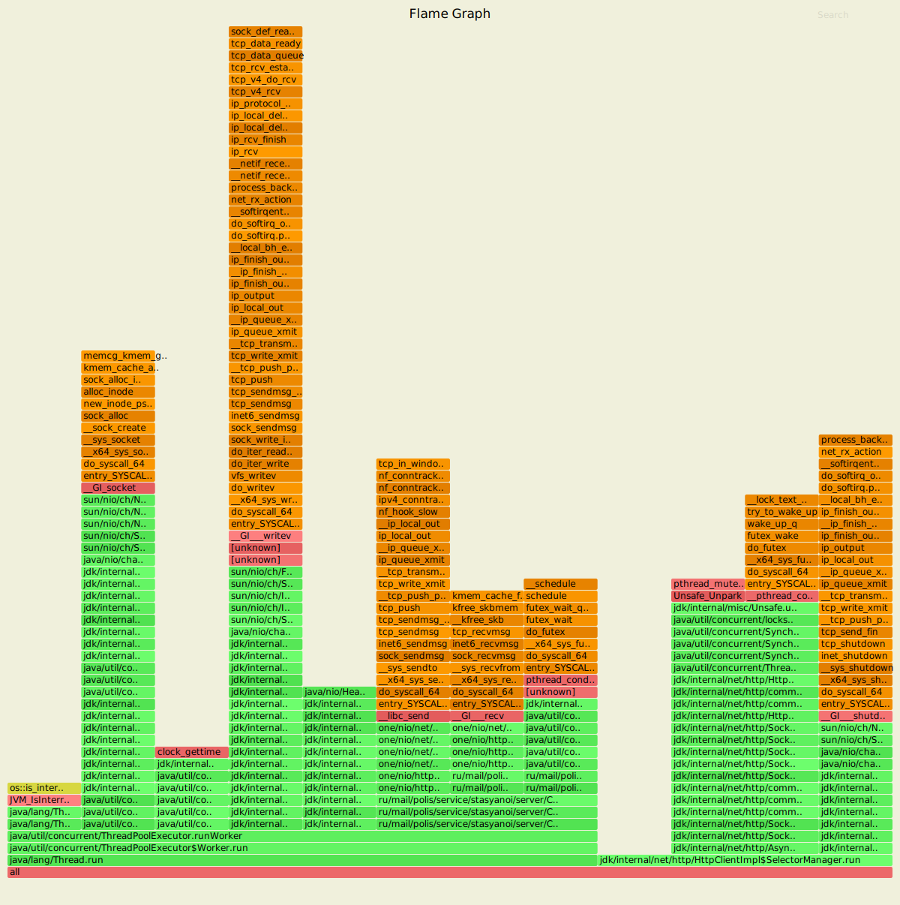
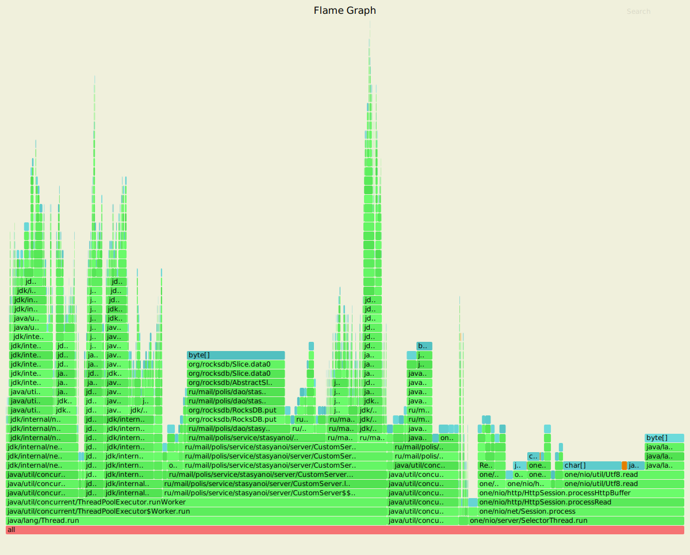
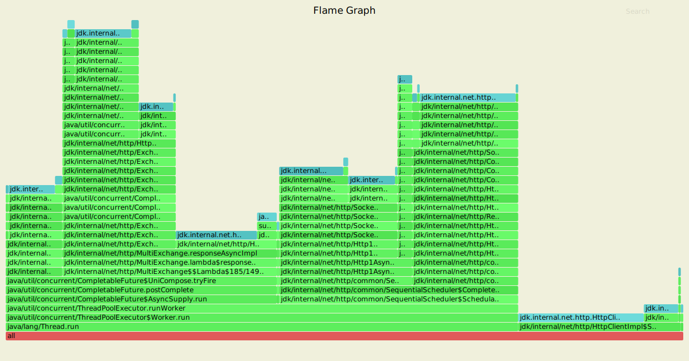
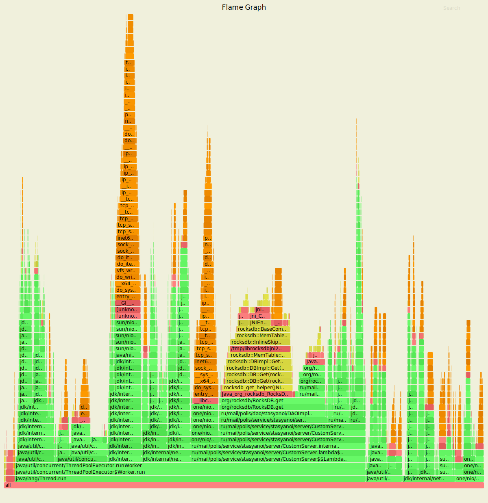
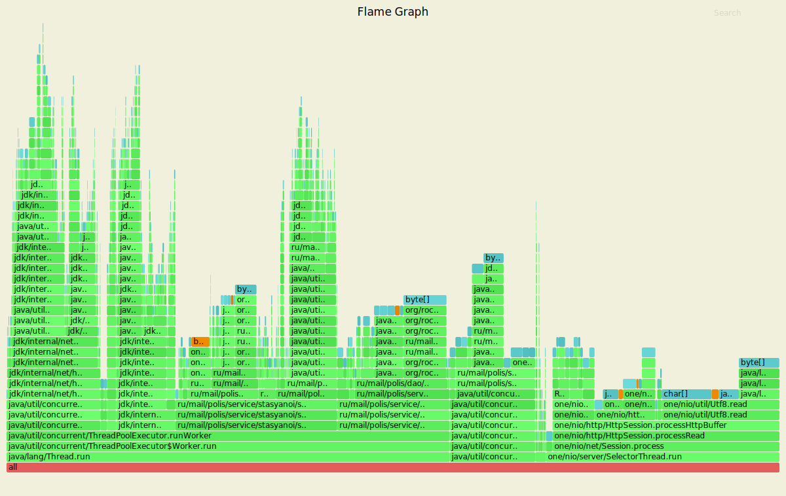
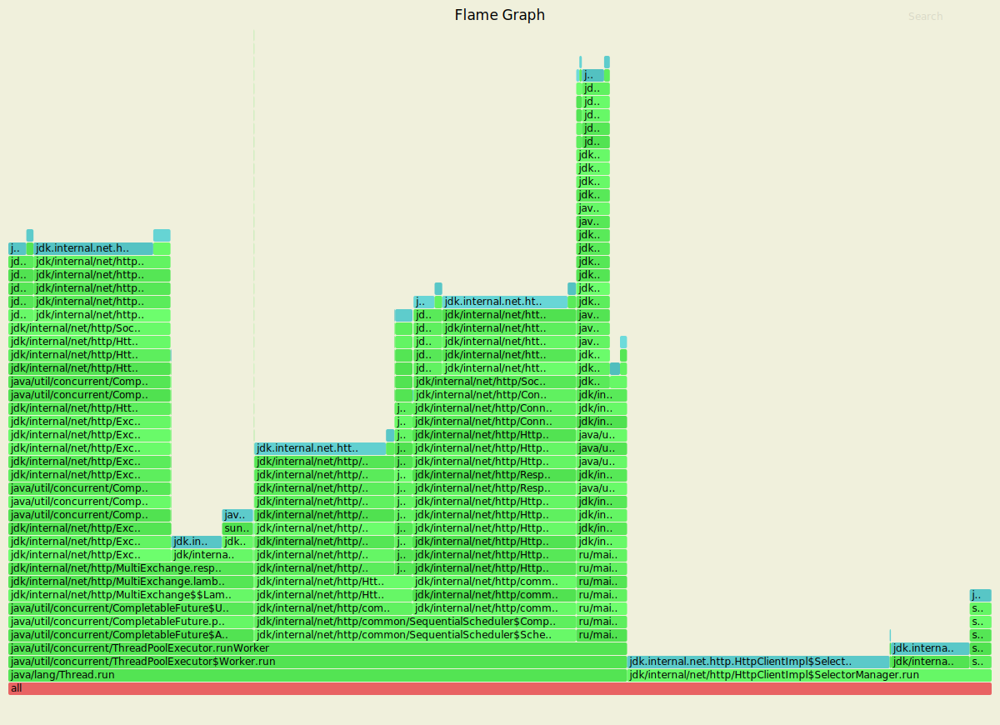

В рамках использования утилиты wrk2|profiler сервер имеет следующие показатели для put.
---------------------------------------------------------------------------------------

Running 50s test @ http://localhost:8080

  2 threads and 10 connections

  Thread calibration: mean lat.: 2.334ms, rate sampling interval: 10ms

  Thread calibration: mean lat.: 2.284ms, rate sampling interval: 10ms

    Thread Stats   Avg      Stdev     Max   +/- Stdev
    Latency     2.48ms  697.60us  17.78ms   71.85%
    Req/Sec   527.00     88.11     0.89k    79.36%
  
  Latency Distribution (HdrHistogram - Recorded Latency)
    
    50.000%    2.44ms
    75.000%    2.88ms
    90.000%    3.30ms
    99.000%    4.28ms
    99.900%    7.04ms
    99.990%   10.46ms
    99.999%   17.79ms
    100.000%   17.79ms

    
Скрипт PUT
----------------------------------------------------------------

    rm wrkLogsPut1.txt
    rm flamePutCpu1.svg     
    rm flamePutAlloc1.svg 
    rm flamePutLock1.svg
    ../../wrk2/wrk -c10 -d50s -R1000 -s ../../wrk2/scripts/put.lua --u_latency http://localhost:8080 > wrkLogsPut1.txt &
    sleep 10s
    echo "start analitics"
    ../../async-profiler-1.8.1-linux-x64/profiler.sh -d 10 -e cpu -f flamePutCpu1.svg $(lsof -t -i :8080 -s TCP:LISTEN) 
    ../../async-profiler-1.8.1-linux-x64/profiler.sh -d 10 -e alloc -f flamePutAlloc1.svg $(lsof -t -i :8080 -s TCP:LISTEN) 
    ../../async-profiler-1.8.1-linux-x64/profiler.sh -d 10 -e lock -f flamePutLock1.svg $(lsof -t -i :8080 -s TCP:LISTEN)
    echo "end analitics"
    sleep 10s

----------------------------------------------------------------
CPU put
----------------------------------------------------

------------------------------------------------------
ALLOC put
----------------------------------------------------

----------------------------------------------------
LOCK put
----------------------------------------------------

В рамках использования утилиты wrk2|profiler сервер имеет следующие показатели для get.
---------------------------------------------------------------------------------------

Running 50s test @ http://localhost:8080
 
  2 threads and 10 connections
 
  Thread calibration: mean lat.: 2.057ms, rate sampling interval: 10ms
 
  Thread calibration: mean lat.: 2.036ms, rate sampling interval: 10ms
 
    Thread Stats   Avg      Stdev     Max   +/- Stdev
    Latency     2.24ms  656.04us  15.25ms   71.73%
    Req/Sec   527.13     87.23     1.00k    79.12%
  
  Latency Distribution (HdrHistogram - Recorded Latency)
 
    50.000%    2.21ms
    75.000%    2.62ms
    90.000%    3.03ms
    99.000%    3.97ms
    99.900%    6.27ms
    99.990%    8.65ms
    99.999%   15.26ms
    100.000%   15.26ms

Скрипт GET
----------------------------------------------------------------

    rm wrkLogsGet1.txt
    rm flameGetCpu1.svg 
    rm flameGetAlloc1.svg  
    rm flameGetLock1.svg 
    ../../wrk2/wrk -c10 -d50s -R1000 -s ../../wrk2/scripts/get.lua --u_latency http://localhost:8080 > wrkLogsGet1.txt &
    sleep 10s
    echo "start analitics"
    ../../async-profiler-1.8.1-linux-x64/profiler.sh -d 10 -e cpu -f flameGetCpu1.svg $(lsof -t -i :8080 -s TCP:LISTEN) 
    ../../async-profiler-1.8.1-linux-x64/profiler.sh -d 10 -e alloc -f flameGetAlloc1.svg $(lsof -t -i :8080 -s TCP:LISTEN) 
    ../../async-profiler-1.8.1-linux-x64/profiler.sh -d 10 -e lock -f flameGetLock1.svg $(lsof -t -i :8080 -s TCP:LISTEN) 
    echo "end analitics"

----------------------------------------------------------------
CPU get
----------------------------------------------------

------------------------------------------------------
ALLOC get
----------------------------------------------------

----------------------------------------------------
LOCK get
----------------------------------------------------

Вывод (этап 6):

В рамках нагрузочного тестирования для PUT/GET

№1 Потоков - 2 

№2 Соединений - 10

№3 Продолжительность - 50 секунд

№4 Количество запросов (Rate) - 1000

1) Put
   
    
    Thread Stats   Avg      Stdev     Max   +/- Stdev
    Latency     2.24ms  656.04us  15.25ms   71.73%
    Req/Sec   527.13     87.23     1.00k    79.12%
    
  Latency Distribution (HdrHistogram - Recorded Latency)
  
    99.900%    7.04ms
    99.990%   10.46ms
    99.999%   17.79ms

2) Get

    
    Thread Stats   Avg      Stdev     Max   +/- Stdev
    Latency     1.64ms  511.21us   6.62ms   69.67%
    Req/Sec   526.87     73.48     0.89k    78.40%
 
  Latency Distribution (HdrHistogram - Recorded Latency)
 
    99.900%    6.27ms
    99.990%    8.65ms
    99.999%   15.26ms

РЕЗУЛЬТАТЫ 5-ГО ЭТАПА:

№1 Потоков - 2 

№2 Соединений - 10

№3 Продолжительность - 50 секунд

№4 Количество запросов (Rate) - 1000

1) Put
   
    
    Thread Stats   Avg      Stdev     Max   +/- Stdev
    Latency     1.83ms  460.40us   5.80ms   67.62%
    Req/Sec   527.83     81.91     0.89k    70.91%
    
  Latency Distribution (HdrHistogram - Recorded Latency)
  
    99.900%    3.90ms
    99.990%    5.09ms
    99.999%    5.80ms

2) Get

    
    Thread Stats   Avg      Stdev     Max   +/- Stdev
    Latency     1.64ms  511.21us   6.62ms   69.67%
    Req/Sec   526.87     73.48     0.89k    78.40%
 
  Latency Distribution (HdrHistogram - Recorded Latency)
 
    99.900%    3.92ms
    99.990%    5.82ms
    99.999%    6.63ms

Функционал  для работы с новым клиентом требует дополнительной вычислительной мощности - 
из-за этого средняя задержка вырастает на 20% для put и не возрастает для get.
На Latency Distribution можно увидеть, что 99.900% задержек на 5-м этапе в 
2 раза меньше чем тот же показатель на 6 этапе. Можно сделать вывод, 
что логика посыла запросов через новый клиент сильно влияет на работу сервера.

Нагрузка на 5 и 6 этапе использовалась одинаковая.  
