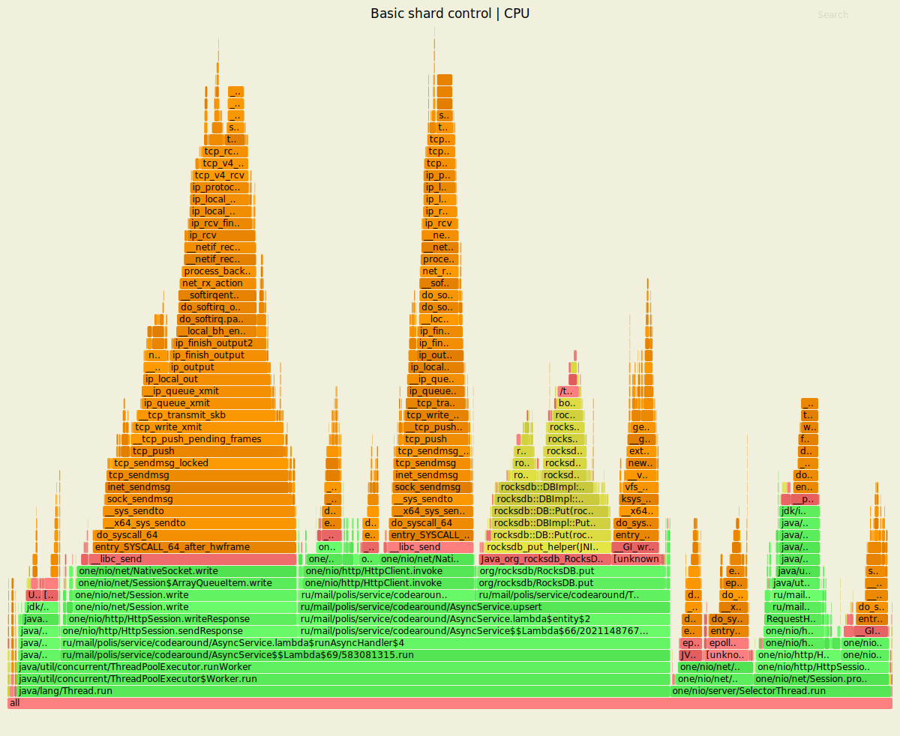
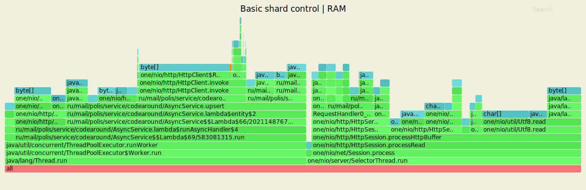
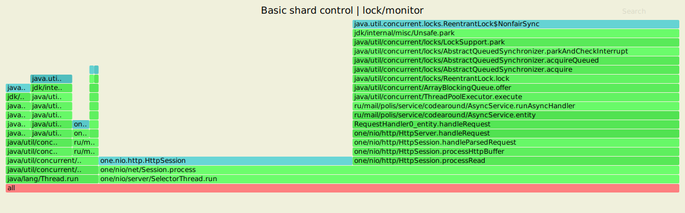
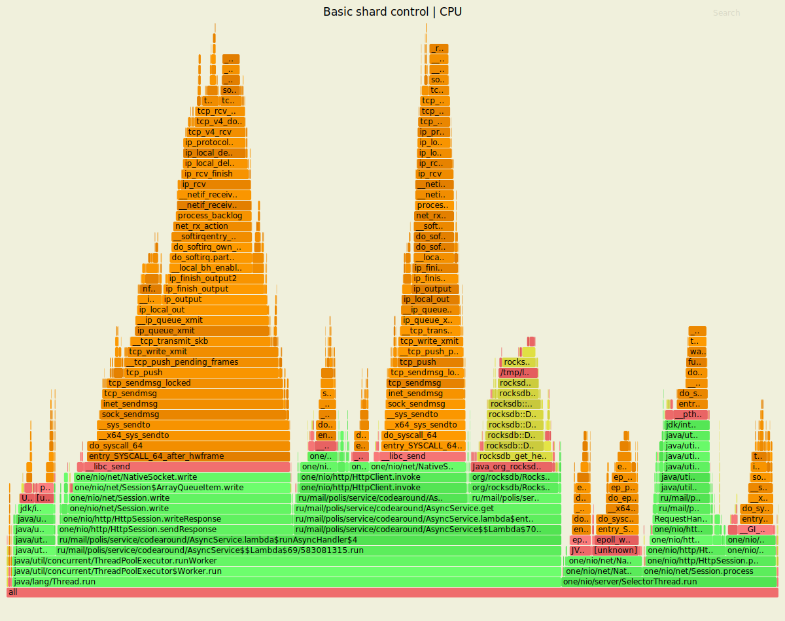
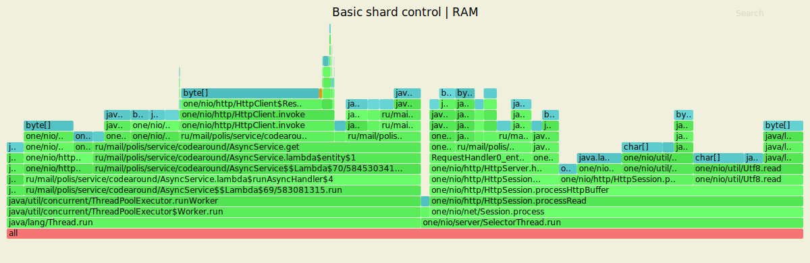
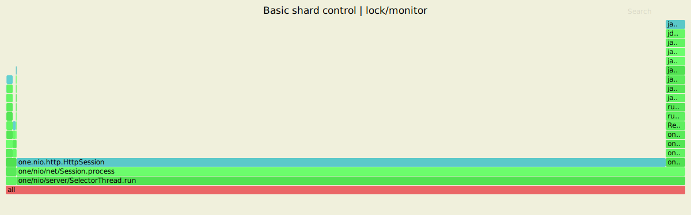

# <ins>Дополнительный этап</ins> <br/>Наблюдение и анализ производительности highload-кластера в вариативных стресс-тестах с использованием Яндекс.Overload и Яндекс.Танк  
**Система и программные средства** 
| | |
|-|-|
| ОС | Ubuntu Linux 18.04 LTS x64-bit |
| ЦПУ | Intel(R) Celeron(R) N4000 CPU @ 1.10GHz |
| Объём RAM | 8 ГБ |
| Количество ядер ЦПУ | 2 |
| Тип дисковой памяти | HDD |
| [Яндекс.Overload](https://overload.yandex.net/) | <данные о версии не предоставлены> |
| [Яндекс.Танк](https://hub.docker.com/r/direvius/yandex-tank/) | <текущая публикация образа на <em>dockerhub</em>, данные о версии не предоставлены> |

В рамках задания, дополняющего обязательные этапы курсового проекта, проведена серия нагрузочных испытаний highload-сервера на основе сервиса тестовой аналитики Яндекс.Overload и специализированного клиента Яндекс.Танк. Объект тестирования - кластер из 3 трёх узлов с реализацией синхронного клиента <em>one-nio</em>, воспроизводящей результат этапа №5. В соответствии с [актуальными требованиями](https://github.com/polis-mail-ru/2019-highload-dht#этап-7-нагрузочное-тестирование-deadline-2019-11-23) для получения и анализа статистики быстродействия подготовлены программные генераторы запросов, ориентированные на поддержку 5 различных режимов подачи и обработки запросов на выделенном узле кластера:<br/>

1) `PUT` с уникальными ключами <br/>
2) `PUT` с частичной перезаписью ключей (вероятность 10%) <br/>
3) `GET` для чтения существующих ключей в условиях равномерного распределения <br/>
4) `GET` с учётом тенденции к преобладанию запросов на выдачу недавно добавленных ключей <br/>
5) комбинация `PUT`/`GET` с эквивалентными (либо предельно близкими) долями запросов в структуре пула генерации (для `GET` предусмотрено чтение на основе существующих ключей в условиях обеспечения равномерного распределения) <br/>

Для определения стабильной по длительности задержки в ходе обработки запросов в каждом из режимов проведены установочные сессии Яндекс.Танк с линейным ростом нагрузки в течение единого заданного интервала:

```
# load profile section in 'load.yaml' file

load_profile:
     load_type: rps
     schedule: line(1, 10000, 5m)
```

Обзор результатов применительно к конкретным режимам испытаний приведён далее.  
**Команды <em>wrk2</em>**<br/>

<p></p>

<ins><em>wrk2</em> / PUT / basic sharding</ins>
```
wrk -t2 -c64 -d7m -s src/profiling/wrk_scripts/put.lua -R10000 --latency http://127.0.0.1:8080
```

<ins><em>wrk2</em> / GET / basic sharding</ins>
```
wrk -t2 -c64 -d7m -s src/profiling/wrk_scripts/get.lua -R10000 --latency http://127.0.0.1:8080
```

<ins><em>wrk2</em> / PUT / replication</ins>
```
wrk -t2 -c64 -d7m -s src/profiling/wrk_scripts/put.lua -R5000 --latency http://127.0.0.1:8080
```

<ins><em>wrk2</em> / GET / replication</ins>
```
wrk -t2 -c64 -d7m -s src/profiling/wrk_scripts/get.lua -R5000 --latency http://127.0.0.1:8080
```

**Команды <em>async-profiler</em>**<br/>

<p></p>

<ins><em>async-profiler</em> / cpu</ins>
```
./profiler.sh -d 60 -e cpu -f /path/to/output/folder/flame_output_cpu.svg <server_process_pid>
```

<ins><em>async-profiler</em> / alloc</ins>
```
./profiler.sh -d 60 -e alloc -f /path/to/output/folder/flame_output_alloc.svg <server_process_pid>
```

<ins><em>async-profiler</em> / lock</ins>
```
./profiler.sh -d 60 -e lock -f /path/to/output/folder/flame_output_lock.svg <server_pid>
```

Результаты измерений и сравнение этапных конфигураций кластера приведены далее.

### 1. Добавление/изменение записей (PUT)

<ins><em>wrk2</em> outputs / basic sharding</ins>  
```
max@max-Inspiron-15-3573:~/hackdht$ wrk -t2 -c64 -d7m -s src/profiling/wrk_scripts/put.lua -R10000 --latency http://127.0.0.1:8080
Running 7m test @ http://127.0.0.1:8080
  2 threads and 64 connections
  Thread calibration: mean lat.: 799.709ms, rate sampling interval: 2326ms
  Thread calibration: mean lat.: 804.702ms, rate sampling interval: 2433ms
  Thread Stats   Avg      Stdev     Max   +/- Stdev
    Latency     5.43ms   14.70ms 272.13ms   96.90%
    Req/Sec     5.00k    51.11     5.46k    92.44%
  Latency Distribution (HdrHistogram - Recorded Latency)
 50.000%    2.76ms
 75.000%    3.81ms
 90.000%    6.69ms
 99.000%   87.42ms
 99.900%  183.42ms
 99.990%  224.00ms
 99.999%  258.30ms
100.000%  272.38ms

  Detailed Percentile spectrum:
       Value   Percentile   TotalCount 1/(1-Percentile)

       0.100     0.000000            1         1.00
       1.238     0.100000       410712         1.11
       1.743     0.200000       820161         1.25
       2.125     0.300000      1230426         1.43
       2.447     0.400000      1641444         1.67
       2.759     0.500000      2050806         2.00
       2.925     0.550000      2255987         2.22
       3.105     0.600000      2462100         2.50
       3.301     0.650000      2665682         2.86
       3.529     0.700000      2870918         3.33
       3.805     0.750000      3076515         4.00
       3.973     0.775000      3178580         4.44
       4.175     0.800000      3281629         5.00
       4.423     0.825000      3382938         5.71
       4.763     0.850000      3485497         6.67
       5.323     0.875000      3588041         8.00
       5.835     0.887500      3639385         8.89
       6.691     0.900000      3690440        10.00
       7.823     0.912500      3741665        11.43
       9.071     0.925000      3792933        13.33
      10.599     0.937500      3844275        16.00
      11.535     0.943750      3869725        17.78
      12.647     0.950000      3895464        20.00
      13.967     0.956250      3920998        22.86
      15.839     0.962500      3946681        26.67
      19.855     0.968750      3972237        32.00
      24.623     0.971875      3985047        35.56
      31.103     0.975000      3997867        40.00
      39.199     0.978125      4010713        45.71
      48.735     0.981250      4023490        53.33
      60.703     0.984375      4036333        64.00
      67.583     0.985938      4042736        71.11
      75.135     0.987500      4049136        80.00
      82.751     0.989062      4055527        91.43
      90.495     0.990625      4061943       106.67
      98.431     0.992188      4068343       128.00
     102.271     0.992969      4071585       142.22
     106.047     0.993750      4074747       160.00
     111.295     0.994531      4077948       182.86
     118.527     0.995313      4081168       213.33
     126.911     0.996094      4084370       256.00
     131.583     0.996484      4085954       284.44
     137.343     0.996875      4087571       320.00
     143.871     0.997266      4089174       365.71
     151.807     0.997656      4090772       426.67
     160.255     0.998047      4092381       512.00
     164.223     0.998242      4093173       568.89
     168.319     0.998437      4093966       640.00
     173.183     0.998633      4094781       731.43
     178.431     0.998828      4095572       853.33
     184.063     0.999023      4096371      1024.00
     187.007     0.999121      4096765      1137.78
     189.823     0.999219      4097177      1280.00
     193.279     0.999316      4097567      1462.86
     196.863     0.999414      4097971      1706.67
     200.319     0.999512      4098365      2048.00
     202.111     0.999561      4098579      2275.56
     204.031     0.999609      4098771      2560.00
     206.079     0.999658      4098974      2925.71
     208.383     0.999707      4099170      3413.33
     211.071     0.999756      4099366      4096.00
     212.863     0.999780      4099469      4551.11
     214.655     0.999805      4099567      5120.00
     216.575     0.999829      4099668      5851.43
     218.623     0.999854      4099767      6826.67
     221.567     0.999878      4099869      8192.00
     222.847     0.999890      4099919      9102.22
     224.511     0.999902      4099969     10240.00
     226.175     0.999915      4100018     11702.86
     228.351     0.999927      4100070     13653.33
     231.039     0.999939      4100122     16384.00
     232.447     0.999945      4100143     18204.44
     234.111     0.999951      4100168     20480.00
     236.287     0.999957      4100193     23405.71
     238.591     0.999963      4100217     27306.67
     241.663     0.999969      4100242     32768.00
     243.327     0.999973      4100255     36408.89
     244.607     0.999976      4100267     40960.00
     246.271     0.999979      4100280     46811.43
     248.831     0.999982      4100292     54613.33
     251.519     0.999985      4100305     65536.00
     252.543     0.999986      4100311     72817.78
     254.719     0.999988      4100317     81920.00
     257.023     0.999989      4100324     93622.86
     259.583     0.999991      4100330    109226.67
     260.863     0.999992      4100337    131072.00
     261.375     0.999993      4100339    145635.56
     262.399     0.999994      4100342    163840.00
     263.935     0.999995      4100346    187245.71
     264.959     0.999995      4100350    218453.33
     265.727     0.999996      4100353    262144.00
     265.727     0.999997      4100353    291271.11
     266.751     0.999997      4100355    327680.00
     267.775     0.999997      4100357    374491.43
     268.031     0.999998      4100358    436906.67
     268.287     0.999998      4100360    524288.00
     268.287     0.999998      4100360    582542.22
     268.543     0.999998      4100361    655360.00
     269.567     0.999999      4100362    748982.86
     270.591     0.999999      4100363    873813.33
     271.359     0.999999      4100364   1048576.00
     271.359     0.999999      4100364   1165084.44
     271.359     0.999999      4100364   1310720.00
     271.615     0.999999      4100365   1497965.71
     271.615     0.999999      4100365   1747626.67
     271.871     1.000000      4100366   2097152.00
     271.871     1.000000      4100366   2330168.89
     271.871     1.000000      4100366   2621440.00
     271.871     1.000000      4100366   2995931.43
     271.871     1.000000      4100366   3495253.33
     272.383     1.000000      4100367   4194304.00
     272.383     1.000000      4100367          inf
#[Mean    =        5.431, StdDeviation   =       14.704]
#[Max     =      272.128, Total count    =      4100367]
#[Buckets =           27, SubBuckets     =         2048]
----------------------------------------------------------
  4189947 requests in 7.00m, 331.65MB read
Requests/sec:   9976.03
Transfer/sec:    808.60KB
```
<ins><em>wrk2</em> outputs / replication</ins>  
```
max@max-Inspiron-15-3573:~/hack-dht$ wrk -t2 -c64 -d7m -s src/profiling/wrk_scripts/put.lua -R5000 --latency http://127.0.0.1:8080
Running 7m test @ http://127.0.0.1:8080
  2 threads and 64 connections
  Thread calibration: mean lat.: 829.817ms, rate sampling interval: 2074ms
  Thread calibration: mean lat.: 829.919ms, rate sampling interval: 2074ms
  Thread Stats   Avg      Stdev     Max   +/- Stdev
    Latency    18.28ms   63.60ms 727.55ms   93.31%
    Req/Sec     2.50k    68.60     2.83k    88.32%
  Latency Distribution (HdrHistogram - Recorded Latency)
 50.000%    1.73ms
 75.000%    2.40ms
 90.000%   28.61ms
 99.000%  306.43ms
 99.900%  645.63ms
 99.990%  701.44ms
 99.999%  720.38ms
100.000%  728.06ms

  Detailed Percentile spectrum:
       Value   Percentile   TotalCount 1/(1-Percentile)

       0.277     0.000000            1         1.00
       0.923     0.100000       205870         1.11
       1.158     0.200000       411188         1.25
       1.350     0.300000       616366         1.43
       1.534     0.400000       821769         1.67
       1.728     0.500000      1026684         2.00
       1.833     0.550000      1129591         2.22
       1.946     0.600000      1231633         2.50
       2.073     0.650000      1334833         2.86
       2.217     0.700000      1436866         3.33
       2.401     0.750000      1539667         4.00
       2.527     0.775000      1591117         4.44
       2.707     0.800000      1642352         5.00
       3.105     0.825000      1693368         5.71
       5.575     0.850000      1744703         6.67
      14.231     0.875000      1796011         8.00
      19.743     0.887500      1821691         8.89
      28.607     0.900000      1847337        10.00
      43.071     0.912500      1872959        11.43
      66.815     0.925000      1898635        13.33
      90.751     0.937500      1924312        16.00
     105.855     0.943750      1937129        17.78
     124.351     0.950000      1949946        20.00
     143.743     0.956250      1962757        22.86
     161.663     0.962500      1975598        26.67
     183.423     0.968750      1988448        32.00
     196.095     0.971875      1994858        35.56
     209.023     0.975000      2001245        40.00
     227.583     0.978125      2007665        45.71
     250.495     0.981250      2014108        53.33
     271.615     0.984375      2020514        64.00
     283.647     0.985938      2023801        71.11
     289.023     0.987500      2026980        80.00
     300.543     0.989062      2030159        91.43
     309.503     0.990625      2033322       106.67
     336.127     0.992188      2036535       128.00
     367.871     0.992969      2038129       142.22
     404.735     0.993750      2039728       160.00
     443.647     0.994531      2041337       182.86
     482.815     0.995313      2042935       213.33
     522.239     0.996094      2044543       256.00
     541.183     0.996484      2045349       284.44
     559.615     0.996875      2046148       320.00
     577.535     0.997266      2046943       365.71
     595.967     0.997656      2047757       426.67
     611.327     0.998047      2048570       512.00
     618.495     0.998242      2048964       568.89
     625.663     0.998437      2049376       640.00
     632.319     0.998633      2049757       731.43
     639.487     0.998828      2050170       853.33
     646.655     0.999023      2050551      1024.00
     650.751     0.999121      2050752      1137.78
     655.359     0.999219      2050969      1280.00
     659.967     0.999316      2051166      1462.86
     664.575     0.999414      2051355      1706.67
     669.695     0.999512      2051554      2048.00
     672.767     0.999561      2051671      2275.56
     675.327     0.999609      2051756      2560.00
     678.911     0.999658      2051871      2925.71
     682.495     0.999707      2051969      3413.33
     686.079     0.999756      2052063      4096.00
     688.639     0.999780      2052115      4551.11
     690.687     0.999805      2052156      5120.00
     692.735     0.999829      2052205      5851.43
     695.807     0.999854      2052259      6826.67
     698.879     0.999878      2052310      8192.00
     700.415     0.999890      2052334      9102.22
     702.463     0.999902      2052362     10240.00
     703.999     0.999915      2052385     11702.86
     706.047     0.999927      2052406     13653.33
     709.119     0.999939      2052431     16384.00
     710.655     0.999945      2052445     18204.44
     712.191     0.999951      2052459     20480.00
     713.727     0.999957      2052473     23405.71
     714.239     0.999963      2052480     27306.67
     715.775     0.999969      2052494     32768.00
     716.287     0.999973      2052499     36408.89
     716.799     0.999976      2052505     40960.00
     717.311     0.999979      2052514     46811.43
     718.335     0.999982      2052520     54613.33
     718.847     0.999985      2052525     65536.00
     719.359     0.999986      2052527     72817.78
     719.871     0.999988      2052530     81920.00
     720.383     0.999989      2052534     93622.86
     721.919     0.999991      2052537    109226.67
     722.431     0.999992      2052541    131072.00
     722.431     0.999993      2052541    145635.56
     722.943     0.999994      2052543    163840.00
     723.967     0.999995      2052545    187245.71
     724.991     0.999995      2052546    218453.33
     726.015     0.999996      2052549    262144.00
     726.015     0.999997      2052549    291271.11
     726.015     0.999997      2052549    327680.00
     726.527     0.999997      2052551    374491.43
     726.527     0.999998      2052551    436906.67
     727.551     0.999998      2052554    524288.00
     727.551     0.999998      2052554    582542.22
     727.551     0.999998      2052554    655360.00
     727.551     0.999999      2052554    748982.86
     727.551     0.999999      2052554    873813.33
     727.551     0.999999      2052554   1048576.00
     727.551     0.999999      2052554   1165084.44
     727.551     0.999999      2052554   1310720.00
     727.551     0.999999      2052554   1497965.71
     727.551     0.999999      2052554   1747626.67
     728.063     1.000000      2052555   2097152.00
     728.063     1.000000      2052555          inf
#[Mean    =       18.285, StdDeviation   =       63.598]
#[Max     =      727.552, Total count    =      2052555]
#[Buckets =           27, SubBuckets     =         2048]
----------------------------------------------------------
  2099633 requests in 7.00m, 134.16MB read
Requests/sec:   4999.13
Transfer/sec:    327.09KB
```
Динамика быстродействия узлов кластера, определённая добавлением контроля реплик, имеет явный негативный уклон на всём множестве релевантных метрик. При внушительном (почти в 3,4 раза) увеличении средней задержки добавления/изменения данных интенсивность обработки запросов составила половину от результата, полученного в первоначальной реализации шардирования. Признаки значительного ухудшения производительности прослеживаются и в распределении времён отклика: несмотря на локальное (приблизительно 37%) снижение среднего интервала ожидания, достигаемое по итогам обслуживания трёх четвертей запросов, кластер с поддержкой хранения реплик критически (более чем в 2,7 раза в случае с максимальным по продолжительнсти ответом) уступает результатам испытаний базовой конфигурации, охватывающим остальные 25% текущего распределения.<br/>            
<ins>Flamegraph-анализ</ins><br/>  


<p align="center">Рис.1. Выделение ресурса CPU при симулировании PUT-запросов (<em>basic sharding</em>)</p>


<p align="center">Рис.2. Выделение ресурса CPU при симулировании PUT-запросов (<em>replication</em>)</p>

В структуре профилей процессорного времени для сравниваемых конфигураций не прослеживается иных качественных различий, чем поддержка вызовов метода <em>upsertWithMultipleNodes</em> в операциях кластера с репликами. Сравнение профилей показывает, что основную нагрузку на вычислительный ресурс продолжают обеспечивать выполнение <em>ThreadPool</em>-потоков, реализация асинхронной обработки запросов через <em>runAsyncHandler</em>, а также операции записи результатов в сокет. Алгоритмическое усложнение и повышение длительности процедуры добавления/модификации записей в условиях перманентной репликации данных в кластере с несколькими узлами (при выполнении <em>upsertWithMultipleNodes</em>) следует рассматривать как решающий фактор кратного ухудшения быстродействия исходя из вышеприведённой статистики тестов. 


<p align="center">Рис.3. Выделение ресурса RAM при симулировании PUT-запросов (<em>basic sharding</em>)</p>


<p align="center">Рис.4. Выделение ресурса RAM при симулировании PUT-запросов (<em>replication</em>)</p>

Изменения в структуре процессов, протекающих на узлах кластера с хранением реплик, однозначно различимы и в разрезе аллокаций. Как и рассмотренный ранее профиль процессора, представление событий памяти позволяет зафиксировать вызовы <em>upsertWithMultipleNodes</em> в числе триггеров операций с данным ресурсом.       


<p align="center">Рис.5. Профиль lock/monitor при симулировании PUT-запросов (<em>basic sharding</em>)</p>


<p align="center">Рис.6. Профиль lock/monitor при симулировании PUT-запросов (<em>replication</em>)</p>
Анализ взаимоисключений на уровне потоков осложнён неоптимальной визуализацией элементов каждого из приведённых профилей. Принимая во внимание промежуточные результаты анализа, можно предположить, что релевантные изменения в управлении совместным доступом аналогичны влиянию единственного фактора, иллюстрируемого предыдущими результатами профилирования, т.е. реализаций <em>upsertWithMultipleNodes</em> в конфигурации с контролем реплик.<br/>                

### 2. Чтение записей (GET)

<ins><em>wrk2</em> outputs / basic sharding</ins>  
```
max@max-Inspiron-15-3573:~/hackdht$ wrk -t2 -c64 -d7m -s src/profiling/wrk_scripts/get.lua -R10000 --latency http://127.0.0.1:8080
Running 7m test @ http://127.0.0.1:8080
  2 threads and 64 connections
  Thread calibration: mean lat.: 52.094ms, rate sampling interval: 429ms
  Thread calibration: mean lat.: 22.398ms, rate sampling interval: 188ms
  Thread Stats   Avg      Stdev     Max   +/- Stdev
    Latency     3.98ms   14.30ms 591.36ms   98.75%
    Req/Sec     5.01k   176.33     6.95k    94.22%
  Latency Distribution (HdrHistogram - Recorded Latency)
 50.000%    2.58ms
 75.000%    3.52ms
 90.000%    4.79ms
 99.000%   23.39ms
 99.900%  191.49ms
 99.990%  526.34ms
 99.999%  579.58ms
100.000%  591.87ms

  Detailed Percentile spectrum:
       Value   Percentile   TotalCount 1/(1-Percentile)

       0.100     0.000000            6         1.00
       1.071     0.100000       409747         1.11
       1.523     0.200000       819463         1.25
       1.906     0.300000      1228255         1.43
       2.253     0.400000      1638765         1.67
       2.583     0.500000      2046910         2.00
       2.751     0.550000      2251295         2.22
       2.925     0.600000      2455768         2.50
       3.109     0.650000      2661280         2.86
       3.305     0.700000      2865294         3.33
       3.523     0.750000      3070260         4.00
       3.645     0.775000      3171977         4.44
       3.783     0.800000      3274739         5.00
       3.943     0.825000      3377098         5.71
       4.139     0.850000      3480591         6.67
       4.395     0.875000      3582114         8.00
       4.563     0.887500      3632332         8.89
       4.791     0.900000      3683956        10.00
       5.119     0.912500      3734977        11.43
       5.687     0.925000      3785845        13.33
       6.791     0.937500      3836968        16.00
       7.499     0.943750      3862465        17.78
       8.247     0.950000      3888079        20.00
       9.031     0.956250      3913812        22.86
       9.895     0.962500      3939287        26.67
      10.959     0.968750      3964763        32.00
      11.623     0.971875      3977647        35.56
      12.367     0.975000      3990404        40.00
      13.247     0.978125      4003206        45.71
      14.303     0.981250      4015974        53.33
      15.735     0.984375      4028724        64.00
      16.751     0.985938      4035123        71.11
      18.239     0.987500      4041504        80.00
      20.943     0.989062      4047915        91.43
      25.343     0.990625      4054286       106.67
      31.119     0.992188      4060676       128.00
      34.559     0.992969      4063881       142.22
      38.847     0.993750      4067080       160.00
      45.023     0.994531      4070267       182.86
      59.103     0.995313      4073459       213.33
      89.023     0.996094      4076659       256.00
     111.039     0.996484      4078257       284.44
     127.999     0.996875      4079854       320.00
     142.847     0.997266      4081460       365.71
     157.183     0.997656      4083050       426.67
     166.143     0.998047      4084651       512.00
     169.727     0.998242      4085456       568.89
     173.183     0.998437      4086254       640.00
     177.407     0.998633      4087048       731.43
     180.863     0.998828      4087854       853.33
     194.047     0.999023      4088650      1024.00
     201.983     0.999121      4089050      1137.78
     208.127     0.999219      4089453      1280.00
     215.935     0.999316      4089849      1462.86
     242.431     0.999414      4090244      1706.67
     300.031     0.999512      4090644      2048.00
     342.271     0.999561      4090844      2275.56
     381.695     0.999609      4091045      2560.00
     415.999     0.999658      4091244      2925.71
     448.511     0.999707      4091445      3413.33
     468.735     0.999756      4091644      4096.00
     478.975     0.999780      4091747      4551.11
     484.095     0.999805      4091843      5120.00
     489.983     0.999829      4091947      5851.43
     495.103     0.999854      4092048      6826.67
     512.511     0.999878      4092143      8192.00
     522.495     0.999890      4092200      9102.22
     526.847     0.999902      4092243     10240.00
     535.551     0.999915      4092298     11702.86
     542.719     0.999927      4092346     13653.33
     551.423     0.999939      4092403     16384.00
     553.983     0.999945      4092420     18204.44
     557.567     0.999951      4092450     20480.00
     559.615     0.999957      4092468     23405.71
     562.687     0.999963      4092493     27306.67
     566.271     0.999969      4092518     32768.00
     567.807     0.999973      4092533     36408.89
     569.343     0.999976      4092543     40960.00
     571.903     0.999979      4092556     46811.43
     574.463     0.999982      4092572     54613.33
     575.487     0.999985      4092581     65536.00
     575.999     0.999986      4092586     72817.78
     578.047     0.999988      4092596     81920.00
     578.559     0.999989      4092599     93622.86
     580.095     0.999991      4092609    109226.67
     580.607     0.999992      4092611    131072.00
     581.631     0.999993      4092614    145635.56
     582.655     0.999994      4092618    163840.00
     584.191     0.999995      4092624    187245.71
     584.191     0.999995      4092624    218453.33
     584.703     0.999996      4092627    262144.00
     585.215     0.999997      4092628    291271.11
     585.727     0.999997      4092630    327680.00
     586.239     0.999997      4092632    374491.43
     586.751     0.999998      4092633    436906.67
     588.799     0.999998      4092635    524288.00
     588.799     0.999998      4092635    582542.22
     589.311     0.999998      4092636    655360.00
     590.335     0.999999      4092637    748982.86
     590.847     0.999999      4092638    873813.33
     591.359     0.999999      4092640   1048576.00
     591.359     0.999999      4092640   1165084.44
     591.359     0.999999      4092640   1310720.00
     591.359     0.999999      4092640   1497965.71
     591.359     0.999999      4092640   1747626.67
     591.871     1.000000      4092642   2097152.00
     591.871     1.000000      4092642          inf
#[Mean    =        3.977, StdDeviation   =       14.305]
#[Max     =      591.360, Total count    =      4092642]
#[Buckets =           27, SubBuckets     =         2048]
----------------------------------------------------------
  4188850 requests in 7.00m, 337.44MB read
  Non-2xx or 3xx responses: 1693
Requests/sec:   9973.48
Transfer/sec:    822.71KB
```
<ins><em>wrk2</em> outputs / replication</ins>  
```
max@max-Inspiron-15-3573:~/hack-dht$ wrk -t2 -c64 -d7m -s src/profiling/wrk_scripts/get.lua -R5000 --latency http://127.0.0.1:8080
Running 7m test @ http://127.0.0.1:8080
  2 threads and 64 connections
  Thread calibration: mean lat.: 422.430ms, rate sampling interval: 1614ms
  Thread calibration: mean lat.: 423.036ms, rate sampling interval: 1615ms
  Thread Stats   Avg      Stdev     Max   +/- Stdev
    Latency     2.05ms    6.22ms 180.74ms   98.57%
    Req/Sec     2.50k    20.54     2.72k    98.81%
  Latency Distribution (HdrHistogram - Recorded Latency)
 50.000%    1.51ms
 75.000%    1.99ms
 90.000%    2.45ms
 99.000%   12.46ms
 99.900%  124.22ms
 99.990%  167.29ms
 99.999%  174.59ms
100.000%  180.86ms

  Detailed Percentile spectrum:
       Value   Percentile   TotalCount 1/(1-Percentile)

       0.243     0.000000            1         1.00
       0.784     0.100000       205176         1.11
       0.988     0.200000       410104         1.25
       1.164     0.300000       615938         1.43
       1.334     0.400000       819742         1.67
       1.507     0.500000      1025001         2.00
       1.596     0.550000      1127085         2.22
       1.689     0.600000      1230388         2.50
       1.783     0.650000      1332200         2.86
       1.884     0.700000      1435353         3.33
       1.993     0.750000      1537207         4.00
       2.053     0.775000      1589582         4.44
       2.115     0.800000      1639508         5.00
       2.185     0.825000      1691935         5.71
       2.259     0.850000      1741879         6.67
       2.347     0.875000      1793810         8.00
       2.397     0.887500      1819293         8.89
       2.453     0.900000      1845042        10.00
       2.515     0.912500      1869924        11.43
       2.591     0.925000      1896020        13.33
       2.685     0.937500      1921458        16.00
       2.745     0.943750      1934013        17.78
       2.821     0.950000      1947007        20.00
       2.917     0.956250      1959708        22.86
       3.051     0.962500      1972465        26.67
       3.267     0.968750      1985228        32.00
       3.455     0.971875      1991575        35.56
       3.791     0.975000      1997974        40.00
       4.411     0.978125      2004379        45.71
       5.479     0.981250      2010787        53.33
       7.335     0.984375      2017185        64.00
       8.479     0.985938      2020391        71.11
       9.903     0.987500      2023591        80.00
      11.367     0.989062      2026795        91.43
      13.287     0.990625      2029999       106.67
      15.583     0.992188      2033203       128.00
      16.751     0.992969      2034806       142.22
      18.383     0.993750      2036395       160.00
      20.623     0.994531      2037998       182.86
      24.495     0.995313      2039595       213.33
      31.471     0.996094      2041199       256.00
      36.639     0.996484      2041999       284.44
      43.583     0.996875      2042797       320.00
      52.863     0.997266      2043597       365.71
      61.823     0.997656      2044399       426.67
      76.543     0.998047      2045200       512.00
      85.951     0.998242      2045597       568.89
      95.615     0.998437      2046000       640.00
     105.087     0.998633      2046400       731.43
     114.303     0.998828      2046799       853.33
     125.695     0.999023      2047199      1024.00
     131.007     0.999121      2047405      1137.78
     135.807     0.999219      2047599      1280.00
     140.927     0.999316      2047804      1462.86
     145.791     0.999414      2048006      1706.67
     150.527     0.999512      2048200      2048.00
     153.087     0.999561      2048304      2275.56
     155.391     0.999609      2048404      2560.00
     157.823     0.999658      2048504      2925.71
     160.383     0.999707      2048599      3413.33
     162.559     0.999756      2048699      4096.00
     163.455     0.999780      2048753      4551.11
     164.095     0.999805      2048800      5120.00
     164.863     0.999829      2048850      5851.43
     165.759     0.999854      2048909      6826.67
     166.399     0.999878      2048949      8192.00
     166.911     0.999890      2048976      9102.22
     167.295     0.999902      2048999     10240.00
     167.935     0.999915      2049029     11702.86
     168.447     0.999927      2049056     13653.33
     168.959     0.999939      2049075     16384.00
     169.471     0.999945      2049092     18204.44
     169.727     0.999951      2049101     20480.00
     169.983     0.999957      2049112     23405.71
     170.495     0.999963      2049128     27306.67
     170.879     0.999969      2049141     32768.00
     171.135     0.999973      2049148     36408.89
     171.263     0.999976      2049151     40960.00
     171.647     0.999979      2049157     46811.43
     172.287     0.999982      2049163     54613.33
     172.671     0.999985      2049168     65536.00
     172.927     0.999986      2049171     72817.78
     173.567     0.999988      2049175     81920.00
     174.335     0.999989      2049178     93622.86
     175.359     0.999991      2049181    109226.67
     176.127     0.999992      2049185    131072.00
     176.127     0.999993      2049185    145635.56
     176.639     0.999994      2049187    163840.00
     177.663     0.999995      2049189    187245.71
     177.791     0.999995      2049190    218453.33
     178.431     0.999996      2049192    262144.00
     178.431     0.999997      2049192    291271.11
     178.559     0.999997      2049193    327680.00
     178.687     0.999997      2049194    374491.43
     179.583     0.999998      2049195    436906.67
     179.711     0.999998      2049196    524288.00
     179.711     0.999998      2049196    582542.22
     179.711     0.999998      2049196    655360.00
     179.967     0.999999      2049197    748982.86
     179.967     0.999999      2049197    873813.33
     180.479     0.999999      2049198   1048576.00
     180.479     0.999999      2049198   1165084.44
     180.479     0.999999      2049198   1310720.00
     180.479     0.999999      2049198   1497965.71
     180.479     0.999999      2049198   1747626.67
     180.863     1.000000      2049199   2097152.00
     180.863     1.000000      2049199          inf
#[Mean    =        2.053, StdDeviation   =        6.218]
#[Max     =      180.736, Total count    =      2049199]
#[Buckets =           27, SubBuckets     =         2048]
----------------------------------------------------------
  2099636 requests in 7.00m, 136.04MB read
Requests/sec:   4999.13
Transfer/sec:    331.69KB
```
Сравнение результатов испытаний в режиме симулирования запросов на чтение даёт основания для выводов, диаметрально противоположных сформулированным в предыдущем разделе. Несмотря на аналогично двукратное падение интенсивности операций над запросами, в текущей конфигурации кластера достигается почти равнозначное (~49%) уменьшение средней задержки и значительно превосходящее первоначальное шардирование улучшение времён отклика. Необходимо отметить, что для подобного эффекта, наблюдаемого на всех охватываемых тестами уровнях распределения, характерна прогрессивная динамика статистической дельты по мере увеличения времени отклика узла (от 44% для 75% запросов до 70%-го прироста быстродействия в случае наибольшей задержки обслуживания).<br/>                  
<ins>Flamegraph-анализ</ins><br/>  


<p align="center">Рис.7. Выделение ресурса CPU при симулировании GET-запросов (<em>basic sharding</em>)</p>


<p align="center">Рис.8. Выделение ресурса CPU при симулировании GET-запросов (<em>replication</em>)</p>                       


<p align="center">Рис.9. Выделение ресурса RAM при симулировании GET-запросов (<em>basic sharding</em>)</p>


<p align="center">Рис.10. Выделение ресурса RAM при симулировании GET-запросов (<em>replication</em>)</p>


<p align="center">Рис.11. Профиль lock/monitor при симулировании GET-запросов (<em>basic sharding</em>)</p>


<p align="center">Рис.12. Профиль lock/monitor при симулировании GET-запросов (<em>replication</em>)</p>

Значительное ускорение операций чтения в кластере с репликацией достигается в условиях обнаружения на текущих профилях метода <em>getWithMultipleNodes</em> с аналогичной обработчику PUT-запросов асинхронной настройкой вызовов. Исходя из статистического превосходства текущей конфигурации (за исключением сравнения оценок интенсивности) и знания алгоритма поиска значений в наборе реплик, можно предположить, что при распределении обработки запросов между узлами (в испытаниях на отчётном этапе их число составило 3) ожидаемое увеличение времени операций на уровне сервера (определение количества и идентификаторов узлов, локализация записи с актуальным значением на основе timestamp-атрибута, синхронизация значений реплик на различных узлах и др.) нивелируется преимуществами асинхронности в обработке данных из реплик и сокращением числа переадресованных запросов с сопутствующими каждой реализации прокси накладными расходами. В этой связи фиксируемый рост быстродействия при поддержке репликаций следует рассматривать как отражающий не только первичные (относящиеся к процедуре генерации и хранения копий), но и расширенные результаты конфигурирования, относимые к контролю взаимодействия компонент кластера.                   
