# <ins>Дополнительный этап</ins> <br/>Наблюдение и анализ производительности highload-кластера в вариативных стресс-тестах с использованием Яндекс.Overload и Яндекс.Танк  
<p>Табл.1. Система и программные средства</p>

| | |
|-|-|
| ОС | Ubuntu Linux 18.04 LTS x64-bit |
| ЦПУ | Intel(R) Celeron(R) N4000 CPU @ 1.10GHz |
| Объём RAM | 8 ГБ |
| Количество ядер ЦПУ | 2 |
| Тип дисковой памяти | HDD |
| [async-profiler](https://github.com/jvm-profiling-tools/async-profiler) | 1.8.1 |
| [Яндекс.Overload](https://overload.yandex.net/) | <данные о версии не предоставлены> |
| [Яндекс.Танк](https://hub.docker.com/r/direvius/yandex-tank/) | <текущая публикация образа на <em>dockerhub</em>, данные о версии не предоставлены> |

В ходе отчётной работы, дополняющей обязательные этапы курсового проекта, проведена серия нагрузочных испытаний highload-сервера на основе сервиса тестовой аналитики Яндекс.Overload и специализированного клиента Яндекс.Танк. Объект тестирования - кластер из 3 трёх узлов с реализацией синхронного клиента <em>one-nio</em>, воспроизводящей результат этапа №5. В соответствии с [актуальными требованиями](https://github.com/polis-mail-ru/2019-highload-dht#этап-7-нагрузочное-тестирование-deadline-2019-11-23) для получения и анализа статистики быстродействия подготовлены программные генераторы запросов, ориентированные на поддержку 5 различных режимов подачи и обработки запросов на выделенном узле кластера:<br/>

1) **PUT** с уникальными ключами <br/>
2) **PUT** с частичной перезаписью ключей (вероятность 10%) <br/>
3) **GET** для чтения существующих ключей в условиях равномерного распределения <br/>
4) **GET** с учётом тенденции к преобладанию запросов на выдачу недавно добавленных ключей <br/>
5) комбинация **PUT**/**GET** с эквивалентными (либо предельно близкими) долями запросов в структуре пула генерации (для **GET** предусмотрено чтение на основе существующих ключей в условиях обеспечения равномерного распределения) <br/>

Для определения стабильной по длительности задержки в ходе обслуживания в каждом из режимов проведены установочные сессии Яндекс.Танк с линейным увеличением интенсивности запросов (<em>rps</em>) в течение единого для всех испытаний интервала времени:

```
# load profile section in 'load.yaml' file

load_profile:
     load_type: rps
     schedule: line(1, 10000, 5m)
```

С учётом предварительно установленных порогов нагрузки (в пределах 7-8 тысяч rps), представляющих отдельные результаты симулирования клиент-серверного обмена с использованием <em>wrk2</em>, в процессе организации тестирования сформирован комплект ammo-файлов с удовлетворяющими специфике перечисленных пунктов HTTP-запросами. В каждый файл данного набора записаны 3000000 запросов, что согласуется с первичной оценкой размера пула, обеспечивающего целевой эффект функционирования Яндекс.Танк в соответствии с определениями факторов нагрузки (300 с ✕ 10000 запросов/с == 3000000 запросов при условии фиксированной отдачи генератора в единицу времени, т.е. при формировании линейно возрастающей нагрузки в практике тестирования часть исходных запросов априори рассматривается в качестве резерва). Следуя порядку проведения и анализа тестов, приведённому в задании, в ходе первого сеанса Яндекс.Танк (продолжительностью 5 мин) в каждом из режимов был достигнут линейный прирост нагрузки на выбранный узел кластера (вплоть до максимального значения 10000 запросов/с и полной реализации ресурса воркеров количеством 100). Выводы об уровне разладки в частотах генерации и подтверждения выполнения запросов приняты как основополагающие при расчётах конфигурационных значений, соответствующих оценкам интенсивности обмена данными в условиях стабильно перерабатываемой нагрузки (на 30% ниже уровня разладки). В этом случае перед запуском генератора в <em>load_profile</em> устанавливалась комбинированная схема создания нагрузки, предусматривающая 5-минутный интервал линейного возрастания <em>rps</em> с последующей стабилизацией новых объёмов данных на стороне сервера на протяжении аналогичного промежутка времени. Результаты поиска частот, определяющих уровни порогового и стабильного обслуживания с учётом тестирования единичного узла кластера, представлены в таблице 2.

<p>Табл.2. Оценки уровней разладки и стабильной реакции сервера в режимах тестирования</p>

| № тестового варианта | Уровень разладки (запросов/с) | Уровень стабильного обслуживания (запросов/с) |
| :-: | :-: | :-: |
| 1 | 4000 | 2700 |
| 2 | 4200 | 2800 |
| 3 | 3100 | 2150 |
| 4 | 3300 | 2200 |
| 5 | 3900 | 2600 |

Для сбора и изучения вспомогательной информации о потреблении ресурсов процессора, памяти и реализации контроля разделяемых данных на уровне потоков в рамках основных испытаний проведены сеансы комплексного профилирования с применением ПО <em>async-profiler</em>, опыт апробации которого был получен на предыдущих этапах подготовки проекта.            

Аналитические комментарии к статистике тестов в различных режимах нагрузки приведены далее.  

### <ins>1. PUT с уникальными ключами</ins> 

\> Результаты в нагрузочной конфигурации [**line**](https://overload.yandex.net/351436#tab=test_data&tags=&plot_groups=main&machines=&metrics=&slider_start=1605628236&slider_end=1605628558)

\> Результаты в конфигурации [**line/const**](https://overload.yandex.net/351439#tab=test_data&tags=&plot_groups=main&machines=&metrics=&slider_start=1605629111&slider_end=1605629711)

Табл 3. Оценки нагрузки и быстродействия в режиме №1 (конфигурация <em>line/const</em>).
| | | 
|-|-|
| Всего ответов, тыс. | ~ 1,215 |
| Доля ответов с кодом успеха (201), % | 100% |
| Средняя задержка сервера, мс | ~ 12,57 |
| Время ожидания ответа в квантилях распределения (98 / 99%), мс | 58 / 75 |

Результаты первого испытания, полученные по достижении уровня стабильного обслуживания на узле кластера (2700 запросов/с), свидетельствуют об успешном выполнении всех запросов на добавление данных в хранилище в течение выбранного интервала. В то же время оценка <em>Latency</em> и график активности воркеров указывают на определённые диспропорции в фактической и заявленной как сбалансированной нагрузках на сервер: регулярное приближение числа воркеров к размеру доступного пула может рассматриваться как индикатор избыточной частоты запросов, оказывающей заведомо негативное влияние на производительность конкретного узла. Согласно релевантной статистике времён отклика, получение ответа на 98% запросов заняло менее 60 мс, на 99% - менее 80 мс.                           

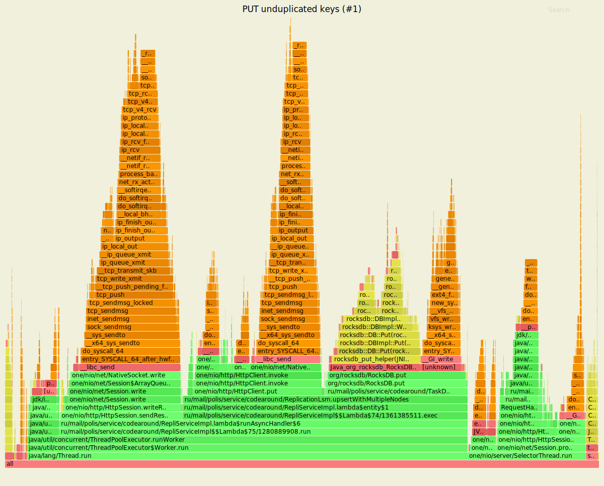
<p align="center">Рис. 1. Профиль CPU в режиме испытаний №1.</p>


<p align="center">Рис. 2. Профиль RAM в режиме испытаний №1.</p>


<p align="center">Рис. 3. Профиль lock/monitor в режиме испытаний №1.</p>

Содержимое визуальных профилей позволяет выявить интенсивные операции вставки данных с поддержкой репликации (метод <em>upsertWithmultipleNodes</em>) и проксирования запросов на другие узлы кластера (<em>invoke</em>) аналогично результатам, достигнутым при использовании в качестве инструмента генерации <em>wrk2</em>.         

### <ins>2. PUT с частичной перезаписью</ins> 

\> Результаты в конфигурации [**line**](https://overload.yandex.net/351588#tab=test_data&tags=&plot_groups=main&machines=&metrics=&slider_start=1605634598&slider_end=1605634914)

\> Результаты в конфигурации [**line/const**](https://overload.yandex.net/351603#tab=test_data&tags=&plot_groups=main&machines=&metrics=&slider_start=1605635188&slider_end=1605635789)

Табл 4. Оценки нагрузки и быстродействия в режиме №2 (конфигурация <em>line/const</em>).
| | | 
|-|-|
| Всего ответов, тыс. | ~ 1,26 |
| Доля ответов с кодом успеха (201), % | 100% |
| Средняя задержка сервера, мс | ~ 8,65 |
| Время ожидания ответа в квантилях распределения (98 / 99%), мс | 47 / 56 |

В сравнении с первым вариантом тестирования в режиме частичной перезаписи наблюдаются как ощутимое снижение средней задержки (более чем на 30%), так и повышение быстродействия, выраженное в оценках времён отклика (на 19% применительно к 98% и на 25% - к 99% выполненных запросов). При возврате успешных результатов в 100% случаев на сервере отмечено снижение критической нагрузки на воркеры, зафиксированной по результатам предыдущей сессии. Как результат, производительность сервера оказалась достаточной для увеличения количественной отдачи обслуживания (общего числа выполненных запросов) примерно на 45000 запросов, что эквивалентно приросту показателя на 3,7%.                

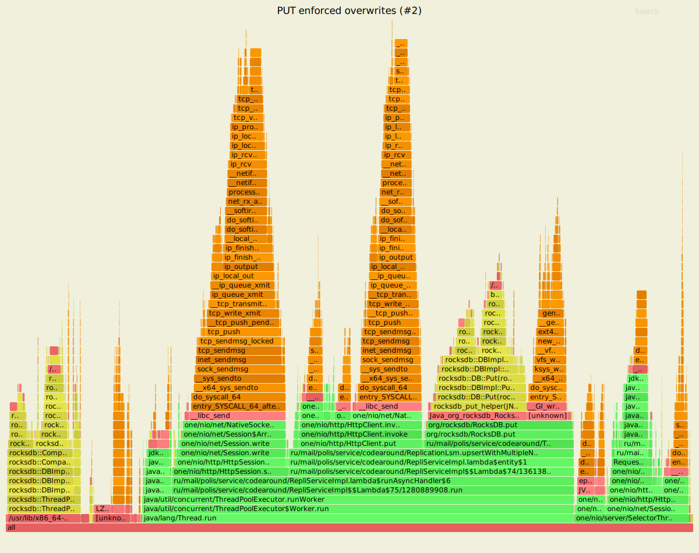
<p align="center">Рис. 4. Профиль CPU в режиме испытаний №2.</p>

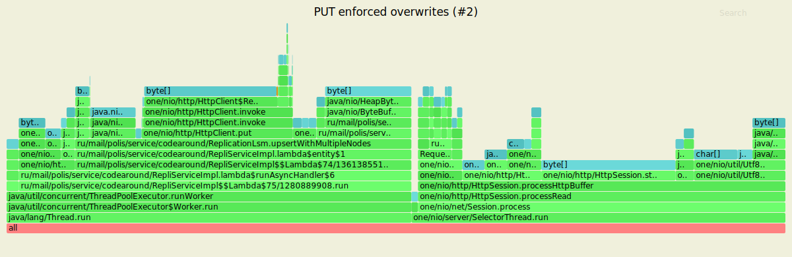
<p align="center">Рис. 5. Профиль RAM в режиме испытаний №2.</p>

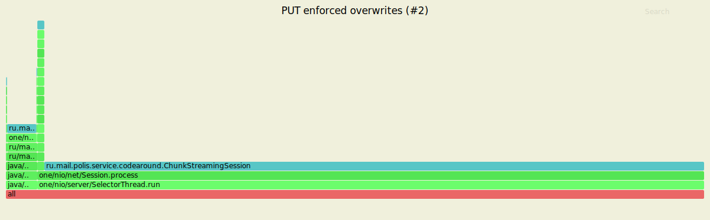
<p align="center">Рис. 6. Профиль lock/monitor в режиме испытаний №2.</p>

Несмотря на отсутствие качественных изменений в результатах профилирования, в качестве предполагаемого фактора, детерминирующего положительную динамику быстродействия относительно варианта №1, возможно привести снижение числа flush-операций для записи поступающих по сети данных на диск. Подобный эффект обеспечивается за счёт нейтрального влияния обновлений на текущую базу индексов хранилища, в то время как каждая операция вставки сопровождается созданием нового индекса и трансформацией существующего B-дерева ([источник из публикации на Stack Overflow](https://stackoverflow.com/a/15412865/12615021)).     

### <ins>3. GET в условиях равномерного распределения</ins> 

\> Результаты в конфигурации [**line**](https://overload.yandex.net/351677#tab=test_data&tags=&plot_groups=main&machines=&metrics=&slider_start=1605639694&slider_end=1605640047)

\> Результаты в конфигурации [**line/const**](https://overload.yandex.net/351696#tab=test_data&tags=&plot_groups=main&machines=&metrics=&slider_start=1605642955&slider_end=1605643573)

Табл 5. Оценки нагрузки и быстродействия в режиме №3 (конфигурация <em>line/const</em>).
| | | 
|-|-|
| Всего ответов, тыс. | ~ 0,956 |
| Доля ответов с кодом успеха (200), % | 100% |
| Средняя задержка сервера, мс | ~ 34,18 |
| Время ожидания ответа в квантилях распределения (98 / 99%), мс | 113 / 130 |

Статистика, относящаяся к первой из сессий в режиме чтения, обнаруживает признаки превосходящей доступные ресурсы узла нагрузки. Визуализация внутренних процессов  фиксирует непрерывную активность всего пула воркеров с момента выхода на уровень постоянной интенсивности входного потока. В этих условиях оценка  <em>Latency</em> оказалась выше 30 мс, а максимальное время ответа в 99% обращений к серверу достигло 130 мс.     

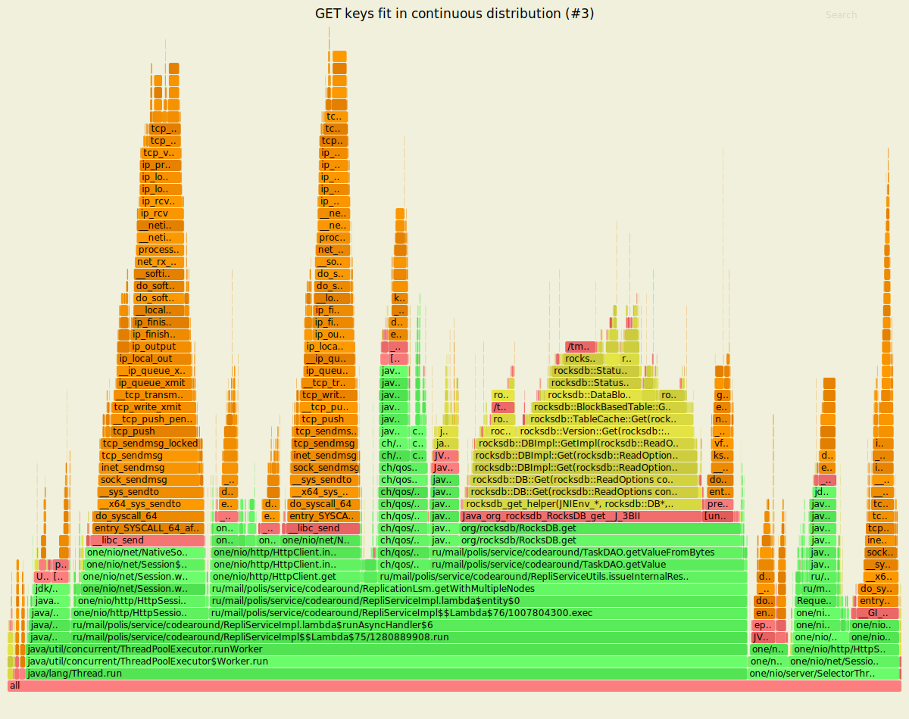
<p align="center">Рис. 7. Профиль CPU в режиме испытаний №3.</p>

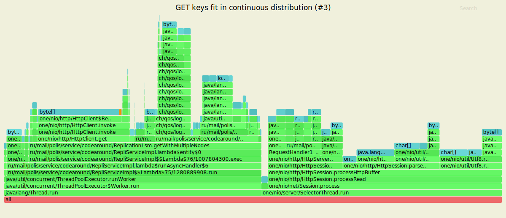
<p align="center">Рис. 8. Профиль RAM в режиме испытаний №3.</p>

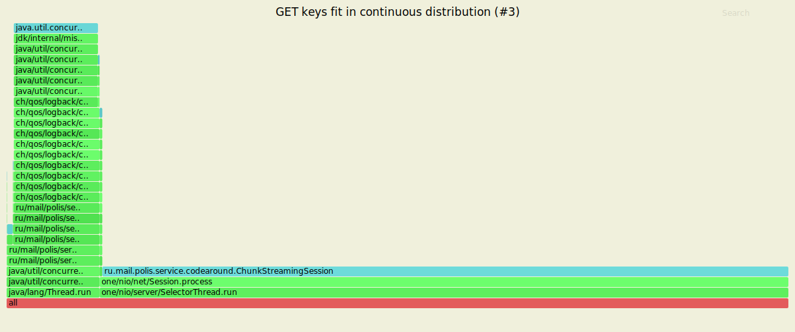
<p align="center">Рис. 9. Профиль lock/monitor в режиме испытаний №3.</p>

В структуре текущих графов, наряду с типичными перемещениями данных между буфером, БД и сокетом, выделяются вызовы локального прокси и логирования операций на уровне экземпляра LSM. С учётом вышеприведённых выводов о несоответствии заданной нагрузки ресурсному потенциалу воркеров и необходимости её понижения фактор генерации логов можно рассматривать как действующий, но не определяющий для обеспечения существенного подъёма производительности при сохранении нагрузочной конфигурации в последующих испытаниях.

### <ins>4. GET с преобладанием доступа к последним включениям/обновлениям записей</ins>

\> Результаты в конфигурации [**line**](https://overload.yandex.net/351618#tab=test_data&tags=&plot_groups=main&machines=&metrics=&slider_start=1605635989&slider_end=1605636350)

\> Результаты в конфигурации [**line/const**](https://overload.yandex.net/351637#tab=test_data&tags=&plot_groups=main&machines=&metrics=&slider_start=1605636665&slider_end=1605637265)

Табл 6. Оценки нагрузки и быстродействия в режиме №4 (конфигурация <em>line/const</em>).
| | | 
|-|-|
| Всего ответов, тыс. | ~ 0,99 |
| Доля ответов с кодом успеха (200), % | 100% |
| Средняя задержка сервера, мс | 32 |
| Время ожидания ответа в квантилях распределения (98 / 99%), мс | 92 / 105 |

В режиме, симулирующем кратковременную (ажиотажную) тенденцию к возрастанию числа запросов на новые записи, установлено заметное улучшение оценок времени ответа в сравнении с результатами предыдущей сессии получения данных (на 18,5% и 19,2% в соответствующих релевантных квантилях распределения). Негативная коррекция средней задержки относительно тестовой опции №3 составила 6,4% при аналогичном исчерпании пула воркеров по достижении уровня константной нагрузки на узел. Исходя из последнего наблюдения следует констатировать проявившуюся в обоих испытаниях с чтением данных экстремальность нагрузки на выбранный сервер, в то время как ход тестирования в режимах создания/обновления записей показал общую готовность той же единицы кластера к стабильному обслуживанию с постоянным rps-фактором.                             
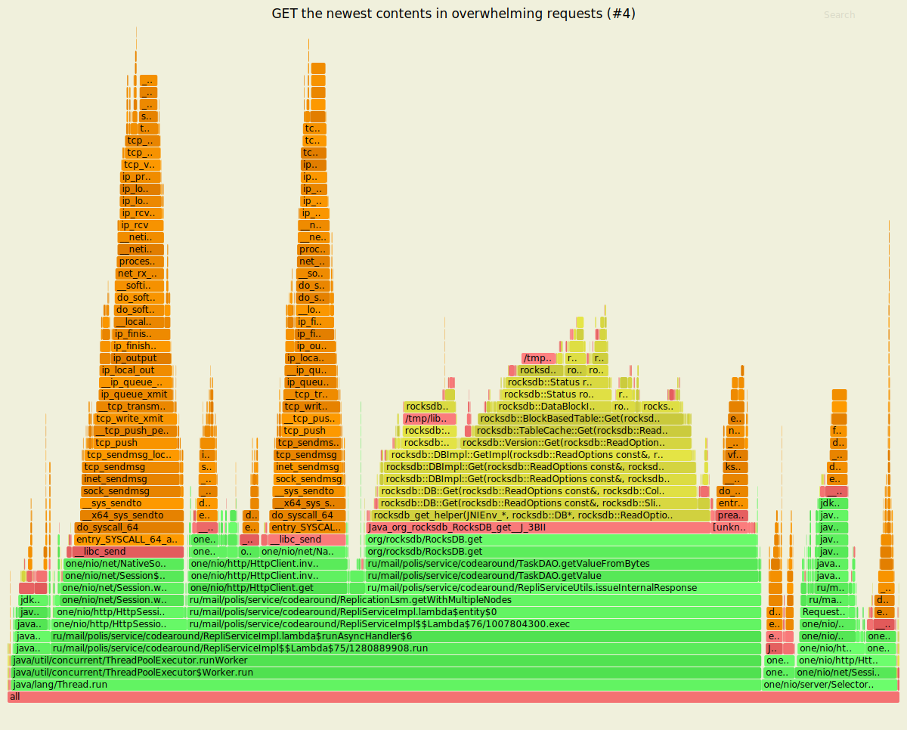
<p align="center">Рис. 10. Профиль CPU в режиме испытаний №4.</p>

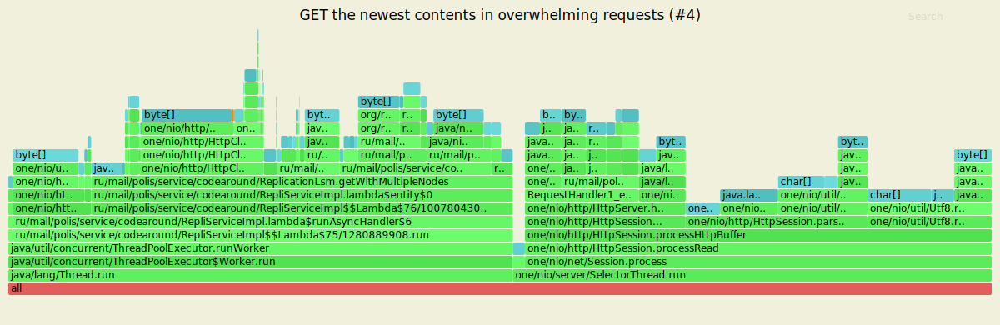
<p align="center">Рис. 11. Профиль RAM в режиме испытаний №4.</p>

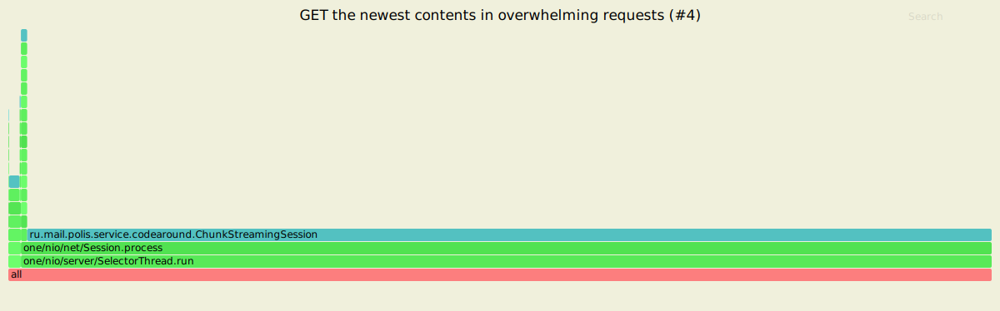
<p align="center">Рис. 12. Профиль lock/monitor в режиме испытаний №4.</p>

Актуальное профилирование воспроизводит основные элементы содержимого графов, полученных за время испытаний в режиме №3, за исключением вызова обработчика для поддержки внутреннего логирования на базе узла. При этом превосходящее быстродействие сервера в текущем контексте возможно отнести, с одной стороны, к следствиям кумуляции последних или недавних по времени появления записей в экземпляре LSM на текущем узле (что, тем не менее, равнозначно не утрате потребности в вызовах прокси, а лишь позволяет предпологать уменьшение их числа) и с другой - к проявлениям эффекта локального кэширования, логически согласующегося с первым вариантом предложенного обоснования.

### <ins>5. PUT/GET-комбинация в текущей сессии обмена данными</ins> 

\> Результаты в конфигурации [**line**](https://overload.yandex.net/351700#tab=test_data&tags=&plot_groups=main&machines=&metrics=&slider_start=1605644168&slider_end=1605644470)

\> Результаты в конфигурации [**line/const**](https://overload.yandex.net/351702#tab=test_data&tags=&plot_groups=main&machines=&metrics=&slider_start=1605644861&slider_end=1605645478)

Табл 7. Оценки нагрузки и быстродействия в режиме №5 (конфигурация <em>line/const</em>).
| | | 
|-|-|
| Всего ответов, тыс. | ~ 1,17 |
| Доли PUT/GET в спектре ответов, % | ~ 49,9 / ~50,1 |
| Ответов по запросам PUT, тыс. | ~ 0,584 |
| Доля ответов с кодом успеха для PUT (201), % | 100% |
| Ответов по запросам GET, тыс. | ~ 0,586 |
| Доля ответов с кодом успеха для GET (200), % | 100% |
| Средняя задержка сервера, мс | ~ 13,58 |
| Время ожидания ответа в квантилях распределения (98 / 99%), мс | 77 / 97 |

Результаты теста с комбинацией чтения и записи показывают близкие к эквивалентным доли запросов с незначительным перевесом вызовов обработчика PUT. Оценка <em>Latency</em> находится на уровне статистики, консолидирующей итоги измерений в режиме №1, дополнением к чему следует рассматривать визуально совпадающие графики использования рабочих потоков - как и в первом испытании, в режиме смешанного обслуживания наблюдаются признаки неравномерно пульсирующей активности воркеров, что, тем не менее, выражается в соответствии предоставляемого ими ресурса константной интенсивности потока запросов. Данный факт определяет готовность сервера к покрытию стабильной нагрузки с удержанием времени отклика ниже 80 мс в квантиле 98% и в пределах 100 мс - в квантиле 99%.

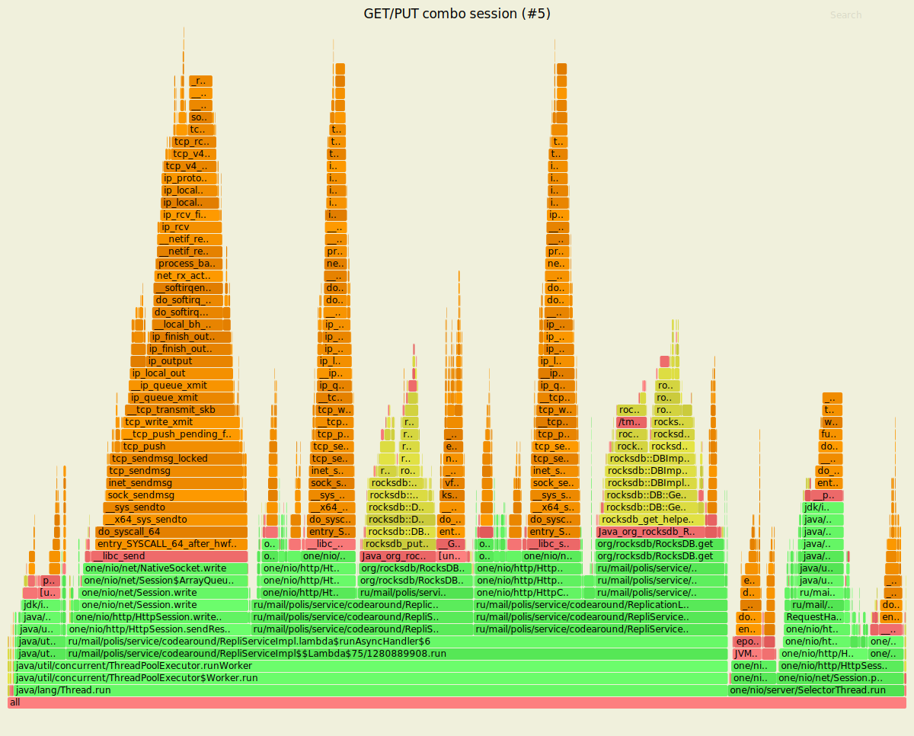
<p align="center">Рис. 13. Профиль CPU в режиме испытаний №5.</p>

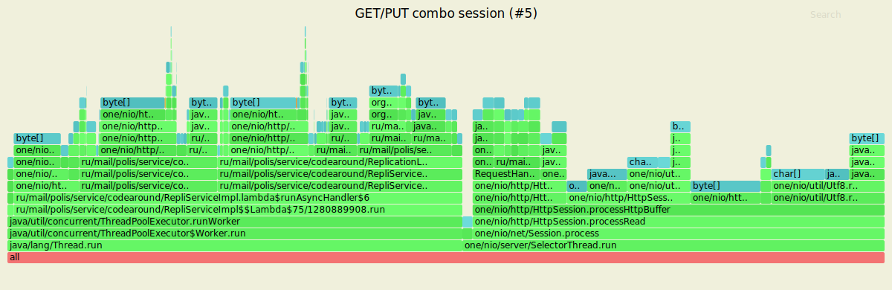
<p align="center">Рис. 14. Профиль RAM в режиме испытаний №5.</p>

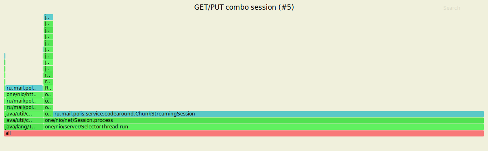
<p align="center">Рис. 15. Профиль lock/monitor в режиме испытаний №5.</p>

Профиль нагрузки на ресурс процессора подтверждает дуализм операций, осуществлённых в ходе тестирования с соответствующим режимом нагрузки (в числе структурных компонент графа представлены вызовы обработчиков <em>getWithMultipleNodes</em> и <em>upsertWithMultipleNodes</em> с поддержкой контроля реплик). Статистически оценённая производительность узла подвергается влиянию превосходящей длительности операций GET (уровень стабильного обслуживания с доведением <em>rps</em> до 2600 ощутимо превышает константную нагрузку в тестах, состоящих исключительно из запросов на чтение), поддающейся балансировке с учётом меньших задержек и времён отклика в режиме с выполнением запросов PUT.         

<p>--------------------------------------------------------------------------------</p>

<em>**Комментарии к личному опыту проведения тестов**</em><br/>

<p>--------------------------------------------------------------------------------</p>
Использование Яндекс.Танк совместно с сервером аналитики Overload послужило источником ценного практического опыта, связанного с апробацией современных технологий  highload-тестов. В отличие от предыдущих заданий, предусматривавших испытания сервера с применением <em>wrk2</em>, для оценки стабильности обслуживания на текущем этапе был выбран инструмент, предоставляющий особую гибкость в конфигурировании режима обмена данными и, как результат, открывающий дополнительные возможности для комплексного исследования характеристик системы. Вариативность опций для выбора режима нагрузки (<em>step-line-const</em>), максимально приближенной к реальной, представляет собой лишь первый пример позитивных впечатлений во время ознакомления с разработкой Яндекса. В действительности не столь и субъективный список достоинств данного ПО существенно шире.<br/>
<ins>Плюсы</ins> 
- развёрнутая и доступная для начинающих QA-инженеров документация к клиентской части (исходя из личных обстоятельств, определённых отсутствием профессионального бэкграунда и, как результат, дилетантским подходом к вопросам качества ПО, рассматриваю один этот факт как достаточный для высокой оценки не только инструмента, но и, прежде всего, вклада активных участников проекта на Github);<br/>
- полнота и однозначность руководств по установке, созданию конфигураций для тестов и настройке взаимодействия клиента с сервером аналитики;<br/>
- информативный консольный интерфейс клиента, лишённый отвлекающих атрибутов и чрезмерной детализации потока данных в реальном времени;
- органичность визуального восприятия консольных выводов, оптимальное позиционирование секций (UX от Яндекса - априори факт, но всё же решил упомянуть отдельно);
- автоматическое переподключение при обнаружении ограничений сетевого доступа;
- обеспечение наблюдения конъюнктуры нагрузки и реакции сервера непосредственно во время тестового сеанса;    
- практичная, непротиворечивая консолидация статистик сеанса в интерфейсе Overload (секции <em>Overview</em>, <em>Extended Analysis</em>, <em>Distributions</em>, <em>Tables</em>);
- исчерпывающий обзор распределения и частот фиксации времён обслуживания в секции <em>Tables</em>. 
