# <ins>Этап 4</ins> <br/>Оценка и анализ производительности сервера с распределённой топологией

**Система и программные средства** 
| | |
|-|-|
| ОС | Ubuntu Linux 18.04 LTS x64-bit |
| ЦПУ | Intel(R) Celeron(R) N4000 CPU @ 1.10GHz |
| Объём RAM | 8 ГБ |
| Количество ядер ЦПУ | 2 |
| [wrk2](https://github.com/giltene/wrk2) | v. 4.0.0 |
| [async-profiler](https://github.com/jvm-profiling-tools/async-profiler) | 1.8.1 |
| [VisualVM](https://visualvm.github.io/) | 2.0.4 |

На очередном этапе разработки highload-приложения получены и исследованы оценки быстродействия сервера, подвергнутого программной модификации в контексте задачи шардирования. Для выполнения распределённых операций единичный сервер, реализовывавший логику HTTP-запросов на предыдущих этапах, заменён на кластер, состоящий из 3 узлов. В рамках текущего анализа предлагается сравнение результатов нагрузочного тестирования с <em>wrk2</em>, а также профилей <em>async-profiler</em> в **нераспределённой (<em>single node</em>)** и **кластерной (<em>multi-node</em>)** топологиях сервера.<br/> Тесты с применением <em>wrk2</em> проведены в виде последовательных сеансов подачи PUT- и GET-запросов в течение фиксированного периода (7 минут) обмена данными с пулом клиентов (число клиентов (соединений с сервером) в каждой конфигурации установлено равным 64, количество параллельных потоков - 2 по числу ядер процессора). Интенсивность формирования / отправки запросов каждого вида (<em>Rate</em>) в топологии с единственным узлом задана равной 15000 запросов/с, в кластере - 10000 запросов/с исходя из предварительных выводов о нагрузке, при которой фактическая производительность генератора запросов стабилизируется на максимально близких относительно уровня <em>Rate</em> значениях.

**Команды <em>wrk2</em>**<br/>

<p></p>

<ins><em>wrk2</em> / PUT / single node</ins>
```
wrk -t2 -c64 -d7m -s src/profiling/wrk_scripts/put.lua -R15000 --latency http://127.0.0.1:8080
```

<ins><em>wrk2</em> / GET / single node</ins>
```
wrk -t2 -c64 -d7m -s src/profiling/wrk_scripts/get.lua -R15000 --latency http://127.0.0.1:8080
```

<ins><em>wrk2</em> / PUT / multi-node</ins>
```
wrk -t2 -c64 -d7m -s src/profiling/wrk_scripts/put.lua -R10000 --latency http://127.0.0.1:8080
```

<ins><em>wrk2</em> / GET / multi-node</ins>
```
wrk -t2 -c64 -d7m -s src/profiling/wrk_scripts/get.lua -R10000 --latency http://127.0.0.1:8080
```

**Команды <em>async-profiler</em>**<br/>

<p></p>

<ins><em>async-profiler</em> / cpu</ins>
```
./profiler.sh -d 60 -e cpu -f /path/to/output/folder/flame_output_cpu.svg <server_process_pid>
```

<ins><em>async-profiler</em> / alloc</ins>
```
./profiler.sh -d 60 -e alloc -f /path/to/output/folder/flame_output_alloc.svg <server_process_pid>
```

<ins><em>async-profiler</em> / lock</ins>
```
./profiler.sh -d 60 -e lock -f /path/to/output/folder/flame_output_lock.svg <server_pid>
```

Результаты измерений и сравнение этапных реализаций сервера приведены далее.

### 1. Добавление/изменение записей (PUT)

<ins><em>wrk2</em> outputs / single node</ins>  
```
max@max-Inspiron-15-3573:~/hackdht$ wrk -t2 -c64 -d7m -s src/profiling/wrk_scripts/put.lua -R15000 --latency http://127.0.0.1:8080
Running 7m test @ http://127.0.0.1:8080
  2 threads and 64 connections
  Thread calibration: mean lat.: 7.287ms, rate sampling interval: 24ms
  Thread calibration: mean lat.: 13.080ms, rate sampling interval: 90ms
  Thread Stats   Avg      Stdev     Max   +/- Stdev
    Latency     4.14ms   12.24ms 248.58ms   97.11%
    Req/Sec     7.64k     1.02k   16.39k    87.30%
  Latency Distribution (HdrHistogram - Recorded Latency)
 50.000%    2.16ms
 75.000%    2.98ms
 90.000%    4.60ms
 99.000%   57.22ms
 99.900%  167.17ms
 99.990%  206.08ms
 99.999%  223.49ms
100.000%  248.70ms

  Detailed Percentile spectrum:
       Value   Percentile   TotalCount 1/(1-Percentile)
       0.096     0.000000            1         1.00
       0.977     0.100000       615919         1.11
       1.310     0.200000      1230927         1.25
       1.606     0.300000      1844335         1.43
       1.887     0.400000      2460286         1.67
       2.161     0.500000      3075944         2.00
       2.299     0.550000      3381353         2.22
       2.445     0.600000      3690330         2.50
       2.599     0.650000      3996270         2.86
       2.773     0.700000      4305916         3.33
       2.977     0.750000      4612712         4.00
       3.097     0.775000      4765856         4.44
       3.237     0.800000      4918983         5.00
       3.407     0.825000      5072725         5.71
       3.627     0.850000      5225732         6.67
       3.951     0.875000      5379620         8.00
       4.203     0.887500      5456847         8.89
       4.599     0.900000      5533270        10.00
       5.387     0.912500      5609681        11.43
       6.719     0.925000      5686609        13.33
       8.311     0.937500      5763379        16.00
       9.255     0.943750      5801799        17.78
      10.343     0.950000      5840178        20.00
      11.631     0.956250      5878713        22.86
      13.223     0.962500      5917181        26.67
      15.311     0.968750      5955465        32.00
      16.799     0.971875      5974728        35.56
      18.879     0.975000      5993953        40.00
      21.935     0.978125      6013144        45.71
      26.527     0.981250      6032297        53.33
      32.671     0.984375      6051529        64.00
      36.383     0.985938      6061140        71.11
      41.663     0.987500      6070723        80.00
      50.591     0.989062      6080332        91.43
      62.303     0.990625      6089949       106.67
      72.447     0.992188      6099560       128.00
      78.527     0.992969      6104362       142.22
      86.719     0.993750      6109156       160.00
      97.791     0.994531      6113936       182.86
     109.375     0.995313      6118743       213.33
     121.599     0.996094      6123559       256.00
     128.127     0.996484      6125951       284.44
     134.399     0.996875      6128371       320.00
     139.263     0.997266      6130766       365.71
     143.871     0.997656      6133212       426.67
     149.119     0.998047      6135550       512.00
     152.447     0.998242      6136780       568.89
     156.031     0.998437      6137947       640.00
     159.743     0.998633      6139184       731.43
     163.327     0.998828      6140355       853.33
     167.807     0.999023      6141561      1024.00
     170.239     0.999121      6142157      1137.78
     172.799     0.999219      6142762      1280.00
     175.871     0.999316      6143358      1462.86
     178.943     0.999414      6143950      1706.67
     183.039     0.999512      6144556      2048.00
     185.215     0.999561      6144873      2275.56
     187.263     0.999609      6145160      2560.00
     189.823     0.999658      6145463      2925.71
     192.255     0.999707      6145756      3413.33
     194.815     0.999756      6146057      4096.00
     196.607     0.999780      6146207      4551.11
     198.143     0.999805      6146360      5120.00
     200.319     0.999829      6146508      5851.43
     201.855     0.999854      6146652      6826.67
     204.031     0.999878      6146802      8192.00
     205.439     0.999890      6146876      9102.22
     206.207     0.999902      6146953     10240.00
     207.103     0.999915      6147027     11702.86
     207.999     0.999927      6147101     13653.33
     208.895     0.999939      6147180     16384.00
     209.279     0.999945      6147213     18204.44
     209.535     0.999951      6147251     20480.00
     210.047     0.999957      6147302     23405.71
     210.431     0.999963      6147332     27306.67
     211.071     0.999969      6147363     32768.00
     211.583     0.999973      6147388     36408.89
     212.351     0.999976      6147400     40960.00
     213.631     0.999979      6147421     46811.43
     214.655     0.999982      6147438     54613.33
     216.447     0.999985      6147457     65536.00
     217.343     0.999986      6147467     72817.78
     219.135     0.999988      6147475     81920.00
     222.463     0.999989      6147485     93622.86
     224.895     0.999991      6147494    109226.67
     227.839     0.999992      6147504    131072.00
     228.735     0.999993      6147509    145635.56
     229.759     0.999994      6147513    163840.00
     230.399     0.999995      6147518    187245.71
     232.191     0.999995      6147523    218453.33
     233.471     0.999996      6147527    262144.00
     233.855     0.999997      6147529    291271.11
     235.647     0.999997      6147532    327680.00
     236.415     0.999997      6147534    374491.43
     237.439     0.999998      6147536    436906.67
     239.103     0.999998      6147539    524288.00
     239.871     0.999998      6147540    582542.22
     240.127     0.999998      6147541    655360.00
     240.767     0.999999      6147542    748982.86
     241.919     0.999999      6147545    873813.33
     241.919     0.999999      6147545   1048576.00
     241.919     0.999999      6147545   1165084.44
     242.047     0.999999      6147546   1310720.00
     242.047     0.999999      6147546   1497965.71
     243.455     0.999999      6147547   1747626.67
     244.863     1.000000      6147548   2097152.00
     244.863     1.000000      6147548   2330168.89
     244.863     1.000000      6147548   2621440.00
     244.863     1.000000      6147548   2995931.43
     247.167     1.000000      6147549   3495253.33
     247.167     1.000000      6147549   4194304.00
     247.167     1.000000      6147549   4660337.78
     247.167     1.000000      6147549   5242880.00
     247.167     1.000000      6147549   5991862.86
     248.703     1.000000      6147550   6990506.67
     248.703     1.000000      6147550          inf
#[Mean    =        4.136, StdDeviation   =       12.244]
#[Max     =      248.576, Total count    =      6147550]
#[Buckets =           27, SubBuckets     =         2048]
----------------------------------------------------------
  6291887 requests in 7.00m, 402.03MB read
Requests/sec:  14980.69
Transfer/sec:      0.96MB
```
<ins><em>wrk2</em> outputs / multi-node</ins>  
```
max@max-Inspiron-15-3573:~/hackdht$ wrk -t2 -c64 -d7m -s src/profiling/wrk_scripts/put.lua -R10000 --latency http://127.0.0.1:8080
Running 7m test @ http://127.0.0.1:8080
  2 threads and 64 connections
  Thread calibration: mean lat.: 799.709ms, rate sampling interval: 2326ms
  Thread calibration: mean lat.: 804.702ms, rate sampling interval: 2433ms
  Thread Stats   Avg      Stdev     Max   +/- Stdev
    Latency     5.43ms   14.70ms 272.13ms   96.90%
    Req/Sec     5.00k    51.11     5.46k    92.44%
  Latency Distribution (HdrHistogram - Recorded Latency)
 50.000%    2.76ms
 75.000%    3.81ms
 90.000%    6.69ms
 99.000%   87.42ms
 99.900%  183.42ms
 99.990%  224.00ms
 99.999%  258.30ms
100.000%  272.38ms

  Detailed Percentile spectrum:
       Value   Percentile   TotalCount 1/(1-Percentile)

       0.100     0.000000            1         1.00
       1.238     0.100000       410712         1.11
       1.743     0.200000       820161         1.25
       2.125     0.300000      1230426         1.43
       2.447     0.400000      1641444         1.67
       2.759     0.500000      2050806         2.00
       2.925     0.550000      2255987         2.22
       3.105     0.600000      2462100         2.50
       3.301     0.650000      2665682         2.86
       3.529     0.700000      2870918         3.33
       3.805     0.750000      3076515         4.00
       3.973     0.775000      3178580         4.44
       4.175     0.800000      3281629         5.00
       4.423     0.825000      3382938         5.71
       4.763     0.850000      3485497         6.67
       5.323     0.875000      3588041         8.00
       5.835     0.887500      3639385         8.89
       6.691     0.900000      3690440        10.00
       7.823     0.912500      3741665        11.43
       9.071     0.925000      3792933        13.33
      10.599     0.937500      3844275        16.00
      11.535     0.943750      3869725        17.78
      12.647     0.950000      3895464        20.00
      13.967     0.956250      3920998        22.86
      15.839     0.962500      3946681        26.67
      19.855     0.968750      3972237        32.00
      24.623     0.971875      3985047        35.56
      31.103     0.975000      3997867        40.00
      39.199     0.978125      4010713        45.71
      48.735     0.981250      4023490        53.33
      60.703     0.984375      4036333        64.00
      67.583     0.985938      4042736        71.11
      75.135     0.987500      4049136        80.00
      82.751     0.989062      4055527        91.43
      90.495     0.990625      4061943       106.67
      98.431     0.992188      4068343       128.00
     102.271     0.992969      4071585       142.22
     106.047     0.993750      4074747       160.00
     111.295     0.994531      4077948       182.86
     118.527     0.995313      4081168       213.33
     126.911     0.996094      4084370       256.00
     131.583     0.996484      4085954       284.44
     137.343     0.996875      4087571       320.00
     143.871     0.997266      4089174       365.71
     151.807     0.997656      4090772       426.67
     160.255     0.998047      4092381       512.00
     164.223     0.998242      4093173       568.89
     168.319     0.998437      4093966       640.00
     173.183     0.998633      4094781       731.43
     178.431     0.998828      4095572       853.33
     184.063     0.999023      4096371      1024.00
     187.007     0.999121      4096765      1137.78
     189.823     0.999219      4097177      1280.00
     193.279     0.999316      4097567      1462.86
     196.863     0.999414      4097971      1706.67
     200.319     0.999512      4098365      2048.00
     202.111     0.999561      4098579      2275.56
     204.031     0.999609      4098771      2560.00
     206.079     0.999658      4098974      2925.71
     208.383     0.999707      4099170      3413.33
     211.071     0.999756      4099366      4096.00
     212.863     0.999780      4099469      4551.11
     214.655     0.999805      4099567      5120.00
     216.575     0.999829      4099668      5851.43
     218.623     0.999854      4099767      6826.67
     221.567     0.999878      4099869      8192.00
     222.847     0.999890      4099919      9102.22
     224.511     0.999902      4099969     10240.00
     226.175     0.999915      4100018     11702.86
     228.351     0.999927      4100070     13653.33
     231.039     0.999939      4100122     16384.00
     232.447     0.999945      4100143     18204.44
     234.111     0.999951      4100168     20480.00
     236.287     0.999957      4100193     23405.71
     238.591     0.999963      4100217     27306.67
     241.663     0.999969      4100242     32768.00
     243.327     0.999973      4100255     36408.89
     244.607     0.999976      4100267     40960.00
     246.271     0.999979      4100280     46811.43
     248.831     0.999982      4100292     54613.33
     251.519     0.999985      4100305     65536.00
     252.543     0.999986      4100311     72817.78
     254.719     0.999988      4100317     81920.00
     257.023     0.999989      4100324     93622.86
     259.583     0.999991      4100330    109226.67
     260.863     0.999992      4100337    131072.00
     261.375     0.999993      4100339    145635.56
     262.399     0.999994      4100342    163840.00
     263.935     0.999995      4100346    187245.71
     264.959     0.999995      4100350    218453.33
     265.727     0.999996      4100353    262144.00
     265.727     0.999997      4100353    291271.11
     266.751     0.999997      4100355    327680.00
     267.775     0.999997      4100357    374491.43
     268.031     0.999998      4100358    436906.67
     268.287     0.999998      4100360    524288.00
     268.287     0.999998      4100360    582542.22
     268.543     0.999998      4100361    655360.00
     269.567     0.999999      4100362    748982.86
     270.591     0.999999      4100363    873813.33
     271.359     0.999999      4100364   1048576.00
     271.359     0.999999      4100364   1165084.44
     271.359     0.999999      4100364   1310720.00
     271.615     0.999999      4100365   1497965.71
     271.615     0.999999      4100365   1747626.67
     271.871     1.000000      4100366   2097152.00
     271.871     1.000000      4100366   2330168.89
     271.871     1.000000      4100366   2621440.00
     271.871     1.000000      4100366   2995931.43
     271.871     1.000000      4100366   3495253.33
     272.383     1.000000      4100367   4194304.00
     272.383     1.000000      4100367          inf
#[Mean    =        5.431, StdDeviation   =       14.704]
#[Max     =      272.128, Total count    =      4100367]
#[Buckets =           27, SubBuckets     =         2048]
----------------------------------------------------------
  4189947 requests in 7.00m, 331.65MB read
Requests/sec:   9976.03
Transfer/sec:    808.60KB
```
В ходе нагрузочных испытаний с добавлением/изменением записей отдельный сервер продемонстрировал более высокую производительность по всем релевантным показателям. При средней задержке чуть более 4 мс данная конфигурация поддерживала интенсивность операций на уровне 7600 запросов/с, что существенно превосходит результат, достигнутый в реализации шардирования (5000 запросов/с). Оценивая статистику распределения времён отклика, следует отметить близость значений, полученных для каждого из охватываемых <em>wrk2</em> квантилей.<br/>            
<ins>Flamegraph-анализ</ins><br/>  

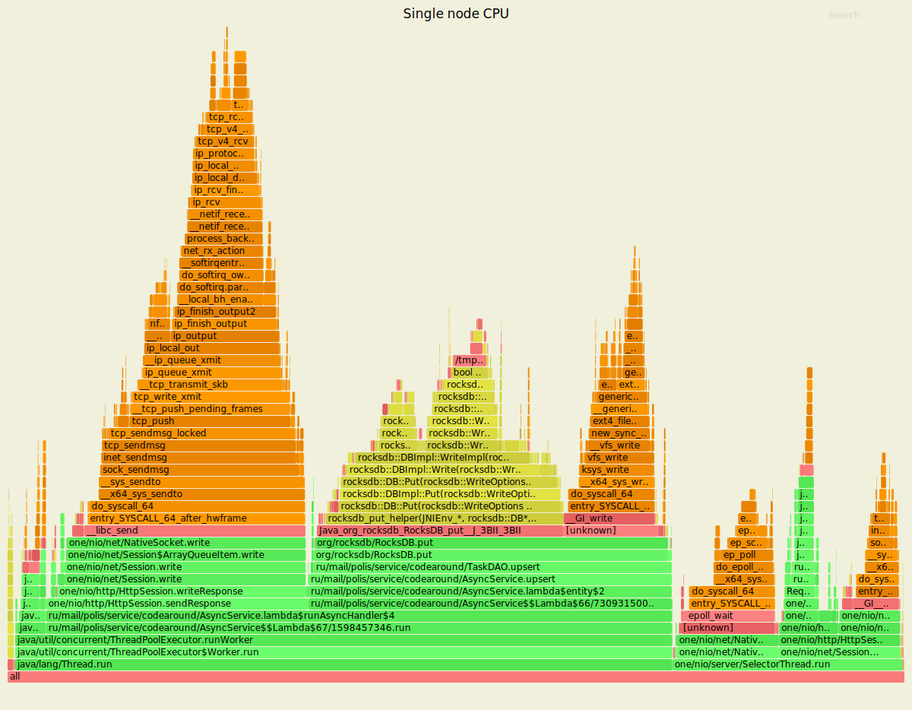
<p align="center">Рис.1. Выделение ресурса CPU при симулировании PUT-запросов (single node)</p>

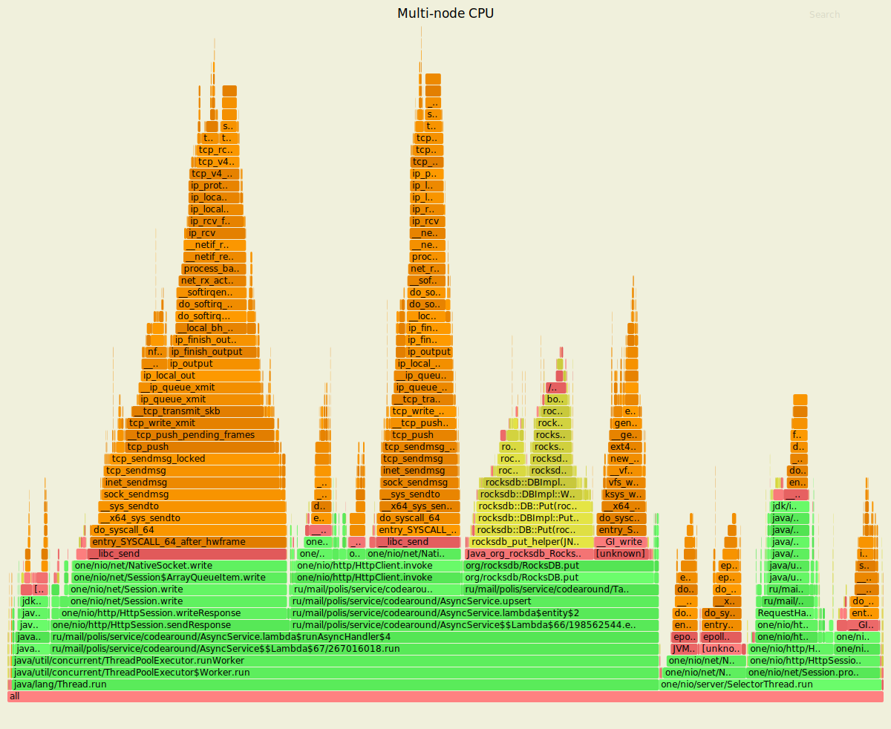
<p align="center">Рис.2. Выделение ресурса CPU при симулировании PUT-запросов (multi-node)</p>

Сравнивая профили операций CPU, необходимо выделить существенное изменение, наблюдаемое в кластерной конфигурации - появление на соответствующем её узлу графе элементов, связанных с вызовами метода проксирования (<em>invoke</em>) в структуре класса <em>AsyncService</em>. Данный метод осуществляет дальнейшую адресацию запроса в пределах кластера при обнаружении несоответствия ID текущего и целевого (обслуживающего запросы по конкретному ключу) узла-обработчика. Поддержка подобной схемы создаёт предпосылки возрастания временн<em>ы</em>х издержек в процессе выполнения логики запроса, что находит отражение в ухудшении статистики быстродействия относительно топологии с одним узлом.                                             

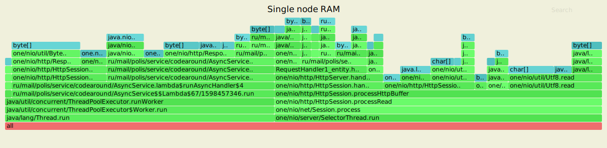
<p align="center">Рис.3. Выделение ресурса RAM при симулировании PUT-запросов (single node)</p>

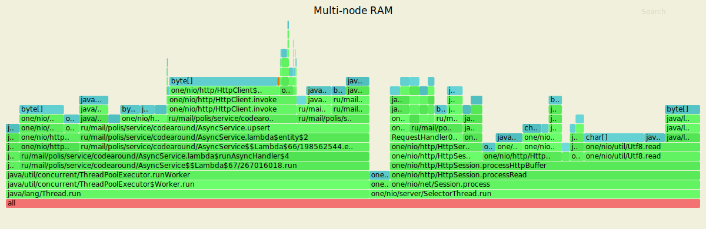
<p align="center">Рис.4. Выделение ресурса RAM при симулировании PUT-запросов (multi-node)</p>

Структура аллокаций в обеих топологиях не демонстрирует релевантных различий: основными факторами выделения памяти, как и в мониторинге на предыдущем этапе, определены хранение объектов <em>ThreadPoolExecutor</em>, размещение данных из буфера и преобразование их типов.                   

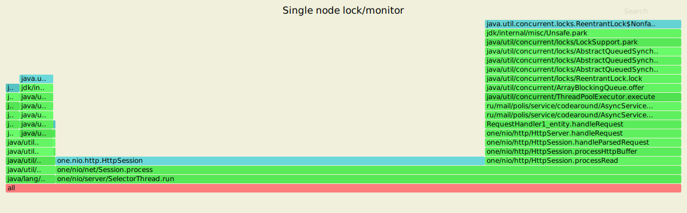
<p align="center">Рис.5. Профиль lock/monitor при симулировании PUT-запросов (single node)</p>

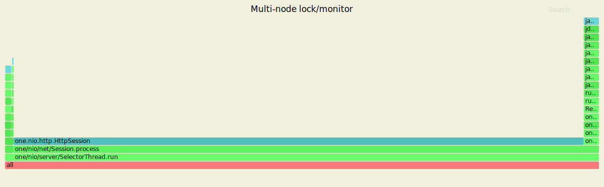
<p align="center">Рис.6. Профиль lock/monitor при симулировании PUT-запросов (multi-node)</p>

Потокобезопасность в обоих вариантах топологии достигается путём контроля доступа к разделяемым данным внутри <em>ArrayBlockingQueue</em>. Фактором взаимоисключающего характера операций является использование экземпляра <em>ReentrantLock</em> на входе в очередь в связке с реализацией <em>AbstractQueueSynchronizer</em>.<br/>               

### 2. Чтение записей (GET)

<ins><em>wrk2</em> outputs / single node</ins>  
```
max@max-Inspiron-15-3573:~/hackdht$ wrk -t2 -c64 -d7m -s src/profiling/wrk_scripts/get.lua -R15000 --latency http://127.0.0.1:8080
Running 7m test @ http://127.0.0.1:8080
  2 threads and 64 connections
  Thread calibration: mean lat.: 2.766ms, rate sampling interval: 10ms
  Thread calibration: mean lat.: 3.178ms, rate sampling interval: 10ms
  Thread Stats   Avg      Stdev     Max   +/- Stdev
    Latency     2.48ms    3.07ms  97.47ms   94.85%
    Req/Sec     7.93k     1.56k   21.00k    79.73%
  Latency Distribution (HdrHistogram - Recorded Latency)
 50.000%    1.95ms
 75.000%    2.65ms
 90.000%    3.59ms
 99.000%   14.06ms
 99.900%   43.90ms
 99.990%   74.24ms
 99.999%   87.17ms
100.000%   97.54ms

  Detailed Percentile spectrum:
       Value   Percentile   TotalCount 1/(1-Percentile)

       0.087     0.000000            1         1.00
       0.907     0.100000       614773         1.11
       1.213     0.200000      1230415         1.25
       1.471     0.300000      1846593         1.43
       1.709     0.400000      2459624         1.67
       1.945     0.500000      3074745         2.00
       2.065     0.550000      3381658         2.22
       2.191     0.600000      3690048         2.50
       2.327     0.650000      3999088         2.86
       2.477     0.700000      4306724         3.33
       2.649     0.750000      4613130         4.00
       2.747     0.775000      4767341         4.44
       2.855     0.800000      4920594         5.00
       2.979     0.825000      5074017         5.71
       3.127     0.850000      5226690         6.67
       3.317     0.875000      5379532         8.00
       3.439     0.887500      5456293         8.89
       3.591     0.900000      5533690        10.00
       3.789     0.912500      5609958        11.43
       4.077     0.925000      5686514        13.33
       4.583     0.937500      5763630        16.00
       5.055     0.943750      5801871        17.78
       5.723     0.950000      5840244        20.00
       6.491     0.956250      5878690        22.86
       7.339     0.962500      5917188        26.67
       8.295     0.968750      5955475        32.00
       8.831     0.971875      5974780        35.56
       9.431     0.975000      5994081        40.00
      10.135     0.978125      6013266        45.71
      10.935     0.981250      6032321        53.33
      11.831     0.984375      6051627        64.00
      12.351     0.985938      6061164        71.11
      12.943     0.987500      6070837        80.00
      13.599     0.989062      6080415        91.43
      14.375     0.990625      6090029       106.67
      15.295     0.992188      6099570       128.00
      15.871     0.992969      6104415       142.22
      16.527     0.993750      6109175       160.00
      17.359     0.994531      6114010       182.86
      18.431     0.995313      6118765       213.33
      20.143     0.996094      6123572       256.00
      21.487     0.996484      6125975       284.44
      23.343     0.996875      6128379       320.00
      25.935     0.997266      6130771       365.71
      29.039     0.997656      6133178       426.67
      32.591     0.998047      6135577       512.00
      34.623     0.998242      6136783       568.89
      36.575     0.998437      6137987       640.00
      38.527     0.998633      6139174       731.43
      41.343     0.998828      6140392       853.33
      44.255     0.999023      6141589      1024.00
      45.919     0.999121      6142183      1137.78
      47.583     0.999219      6142783      1280.00
      49.503     0.999316      6143387      1462.86
      51.679     0.999414      6143978      1706.67
      53.919     0.999512      6144586      2048.00
      55.327     0.999561      6144880      2275.56
      57.215     0.999609      6145178      2560.00
      60.159     0.999658      6145477      2925.71
      63.519     0.999707      6145778      3413.33
      67.071     0.999756      6146080      4096.00
      68.543     0.999780      6146233      4551.11
      69.823     0.999805      6146381      5120.00
      70.911     0.999829      6146528      5851.43
      72.063     0.999854      6146679      6826.67
      73.151     0.999878      6146831      8192.00
      73.727     0.999890      6146904      9102.22
      74.367     0.999902      6146983     10240.00
      75.071     0.999915      6147054     11702.86
      75.967     0.999927      6147130     13653.33
      76.863     0.999939      6147207     16384.00
      77.503     0.999945      6147242     18204.44
      78.143     0.999951      6147278     20480.00
      79.167     0.999957      6147316     23405.71
      80.191     0.999963      6147353     27306.67
      81.599     0.999969      6147391     32768.00
      82.495     0.999973      6147411     36408.89
      83.135     0.999976      6147428     40960.00
      83.775     0.999979      6147447     46811.43
      84.479     0.999982      6147467     54613.33
      85.311     0.999985      6147485     65536.00
      85.631     0.999986      6147494     72817.78
      86.143     0.999988      6147503     81920.00
      86.847     0.999989      6147513     93622.86
      87.423     0.999991      6147523    109226.67
      87.935     0.999992      6147532    131072.00
      88.255     0.999993      6147536    145635.56
      88.767     0.999994      6147542    163840.00
      88.959     0.999995      6147546    187245.71
      89.343     0.999995      6147550    218453.33
      90.047     0.999996      6147555    262144.00
      90.239     0.999997      6147558    291271.11
      90.431     0.999997      6147560    327680.00
      90.495     0.999997      6147562    374491.43
      91.071     0.999998      6147564    436906.67
      91.583     0.999998      6147567    524288.00
      91.711     0.999998      6147568    582542.22
      91.903     0.999998      6147569    655360.00
      92.095     0.999999      6147570    748982.86
      92.351     0.999999      6147571    873813.33
      93.247     0.999999      6147573   1048576.00
      93.247     0.999999      6147573   1165084.44
      93.503     0.999999      6147574   1310720.00
      93.503     0.999999      6147574   1497965.71
      95.743     0.999999      6147575   1747626.67
      96.575     1.000000      6147576   2097152.00
      96.575     1.000000      6147576   2330168.89
      96.575     1.000000      6147576   2621440.00
      96.575     1.000000      6147576   2995931.43
      97.279     1.000000      6147577   3495253.33
      97.279     1.000000      6147577   4194304.00
      97.279     1.000000      6147577   4660337.78
      97.279     1.000000      6147577   5242880.00
      97.279     1.000000      6147577   5991862.86
      97.535     1.000000      6147578   6990506.67
      97.535     1.000000      6147578          inf
#[Mean    =        2.482, StdDeviation   =        3.072]
#[Max     =       97.472, Total count    =      6147578]
#[Buckets =           27, SubBuckets     =         2048]
----------------------------------------------------------
  6291914 requests in 7.00m, 411.91MB read
Requests/sec:  14977.57
Transfer/sec:      0.98MB
```
<ins><em>wrk2</em> outputs / multi-node</ins>  
```
max@max-Inspiron-15-3573:~/hackdht$ wrk -t2 -c64 -d7m -s src/profiling/wrk_scripts/get.lua -R10000 --latency http://127.0.0.1:8080
Running 7m test @ http://127.0.0.1:8080
  2 threads and 64 connections
  Thread calibration: mean lat.: 52.094ms, rate sampling interval: 429ms
  Thread calibration: mean lat.: 22.398ms, rate sampling interval: 188ms
  Thread Stats   Avg      Stdev     Max   +/- Stdev
    Latency     3.98ms   14.30ms 591.36ms   98.75%
    Req/Sec     5.01k   176.33     6.95k    94.22%
  Latency Distribution (HdrHistogram - Recorded Latency)
 50.000%    2.58ms
 75.000%    3.52ms
 90.000%    4.79ms
 99.000%   23.39ms
 99.900%  191.49ms
 99.990%  526.34ms
 99.999%  579.58ms
100.000%  591.87ms

  Detailed Percentile spectrum:
       Value   Percentile   TotalCount 1/(1-Percentile)

       0.100     0.000000            6         1.00
       1.071     0.100000       409747         1.11
       1.523     0.200000       819463         1.25
       1.906     0.300000      1228255         1.43
       2.253     0.400000      1638765         1.67
       2.583     0.500000      2046910         2.00
       2.751     0.550000      2251295         2.22
       2.925     0.600000      2455768         2.50
       3.109     0.650000      2661280         2.86
       3.305     0.700000      2865294         3.33
       3.523     0.750000      3070260         4.00
       3.645     0.775000      3171977         4.44
       3.783     0.800000      3274739         5.00
       3.943     0.825000      3377098         5.71
       4.139     0.850000      3480591         6.67
       4.395     0.875000      3582114         8.00
       4.563     0.887500      3632332         8.89
       4.791     0.900000      3683956        10.00
       5.119     0.912500      3734977        11.43
       5.687     0.925000      3785845        13.33
       6.791     0.937500      3836968        16.00
       7.499     0.943750      3862465        17.78
       8.247     0.950000      3888079        20.00
       9.031     0.956250      3913812        22.86
       9.895     0.962500      3939287        26.67
      10.959     0.968750      3964763        32.00
      11.623     0.971875      3977647        35.56
      12.367     0.975000      3990404        40.00
      13.247     0.978125      4003206        45.71
      14.303     0.981250      4015974        53.33
      15.735     0.984375      4028724        64.00
      16.751     0.985938      4035123        71.11
      18.239     0.987500      4041504        80.00
      20.943     0.989062      4047915        91.43
      25.343     0.990625      4054286       106.67
      31.119     0.992188      4060676       128.00
      34.559     0.992969      4063881       142.22
      38.847     0.993750      4067080       160.00
      45.023     0.994531      4070267       182.86
      59.103     0.995313      4073459       213.33
      89.023     0.996094      4076659       256.00
     111.039     0.996484      4078257       284.44
     127.999     0.996875      4079854       320.00
     142.847     0.997266      4081460       365.71
     157.183     0.997656      4083050       426.67
     166.143     0.998047      4084651       512.00
     169.727     0.998242      4085456       568.89
     173.183     0.998437      4086254       640.00
     177.407     0.998633      4087048       731.43
     180.863     0.998828      4087854       853.33
     194.047     0.999023      4088650      1024.00
     201.983     0.999121      4089050      1137.78
     208.127     0.999219      4089453      1280.00
     215.935     0.999316      4089849      1462.86
     242.431     0.999414      4090244      1706.67
     300.031     0.999512      4090644      2048.00
     342.271     0.999561      4090844      2275.56
     381.695     0.999609      4091045      2560.00
     415.999     0.999658      4091244      2925.71
     448.511     0.999707      4091445      3413.33
     468.735     0.999756      4091644      4096.00
     478.975     0.999780      4091747      4551.11
     484.095     0.999805      4091843      5120.00
     489.983     0.999829      4091947      5851.43
     495.103     0.999854      4092048      6826.67
     512.511     0.999878      4092143      8192.00
     522.495     0.999890      4092200      9102.22
     526.847     0.999902      4092243     10240.00
     535.551     0.999915      4092298     11702.86
     542.719     0.999927      4092346     13653.33
     551.423     0.999939      4092403     16384.00
     553.983     0.999945      4092420     18204.44
     557.567     0.999951      4092450     20480.00
     559.615     0.999957      4092468     23405.71
     562.687     0.999963      4092493     27306.67
     566.271     0.999969      4092518     32768.00
     567.807     0.999973      4092533     36408.89
     569.343     0.999976      4092543     40960.00
     571.903     0.999979      4092556     46811.43
     574.463     0.999982      4092572     54613.33
     575.487     0.999985      4092581     65536.00
     575.999     0.999986      4092586     72817.78
     578.047     0.999988      4092596     81920.00
     578.559     0.999989      4092599     93622.86
     580.095     0.999991      4092609    109226.67
     580.607     0.999992      4092611    131072.00
     581.631     0.999993      4092614    145635.56
     582.655     0.999994      4092618    163840.00
     584.191     0.999995      4092624    187245.71
     584.191     0.999995      4092624    218453.33
     584.703     0.999996      4092627    262144.00
     585.215     0.999997      4092628    291271.11
     585.727     0.999997      4092630    327680.00
     586.239     0.999997      4092632    374491.43
     586.751     0.999998      4092633    436906.67
     588.799     0.999998      4092635    524288.00
     588.799     0.999998      4092635    582542.22
     589.311     0.999998      4092636    655360.00
     590.335     0.999999      4092637    748982.86
     590.847     0.999999      4092638    873813.33
     591.359     0.999999      4092640   1048576.00
     591.359     0.999999      4092640   1165084.44
     591.359     0.999999      4092640   1310720.00
     591.359     0.999999      4092640   1497965.71
     591.359     0.999999      4092640   1747626.67
     591.871     1.000000      4092642   2097152.00
     591.871     1.000000      4092642          inf
#[Mean    =        3.977, StdDeviation   =       14.305]
#[Max     =      591.360, Total count    =      4092642]
#[Buckets =           27, SubBuckets     =         2048]
----------------------------------------------------------
  4188850 requests in 7.00m, 337.44MB read
  Non-2xx or 3xx responses: 1693
Requests/sec:   9973.48
Transfer/sec:    822.71KB
```
Результаты серий с получением данных из хранилища фиксируют существенное ухудшение производительности при переходе к распределённой топологии. При том, что средняя задержки возросла на 1,5 мс (~60%), обработка 0,1% запросов в верхнем сегменте интервалов ожидания заняла время, кратно (до 6 раз в случае наиболее продолжительного ответа) превышающее оценки, установленные для реализации нераспределённого сервера. Как и при тестировании в режиме добавления записей, в процессе обслуживания запросов на чтение интенсивность их выполнения составила около 5000 запросов/с, что заметно уступает результату предыдущего этапа.<br/>                  
<ins>Flamegraph-анализ</ins><br/>  

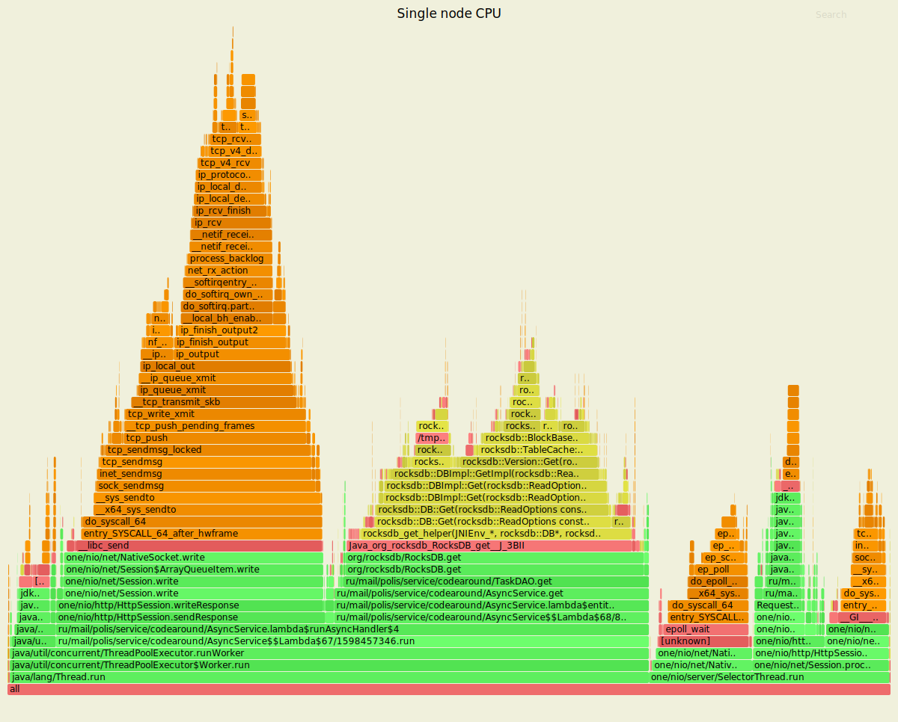
<p align="center">Рис.7. Выделение ресурса CPU при симулировании GET-запросов (single node)</p>

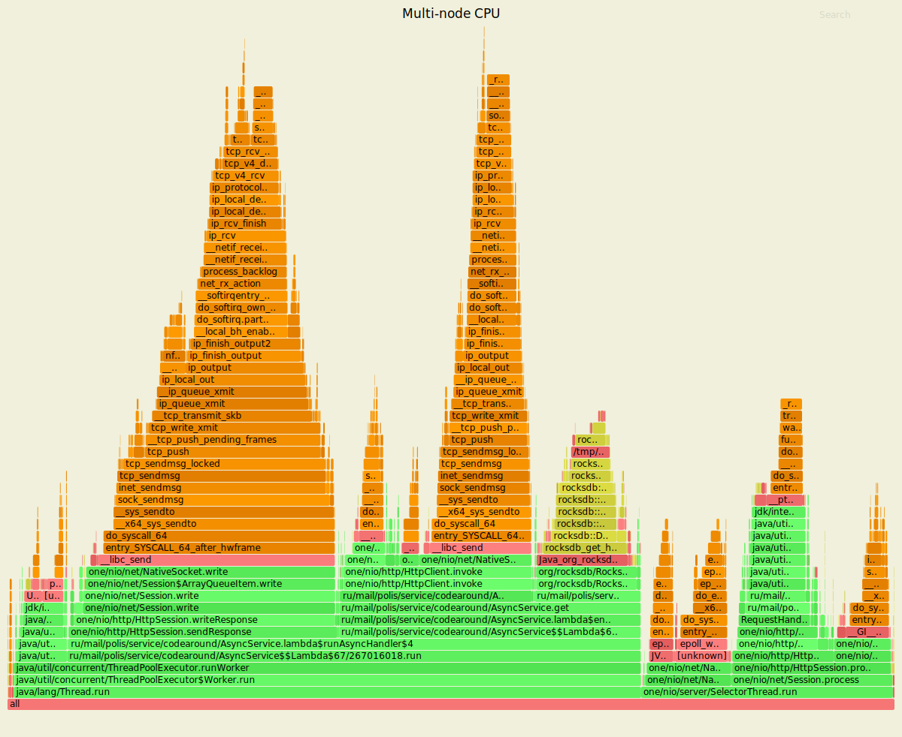
<p align="center">Рис.8. Выделение ресурса CPU при симулировании GET-запросов (multi-node)</p>

Аналогично профилю, полученному в ходе операций с PUT-запросами, в текущей структуре пользователей процессорного времени на узле кластера прослеживается действие метода проксирования <em>invoke</em>. Принимая во внимание значительное снижение производительности чтения в распределённой топологии, эффект проксирования запросов, связанный с дополнительной нагрузкой на аппаратные ресурсы, прежде всего ЦПУ, следует рассматривать как релевантный фактор негативной динамики в условиях роста числа перенаправляемых запросов.            

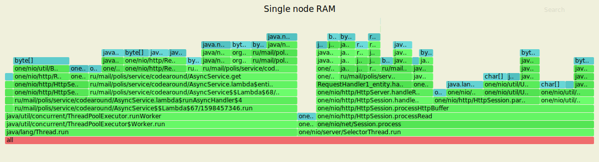
<p align="center">Рис.9. Выделение ресурса RAM при симулировании GET-запросов (single node)</p>

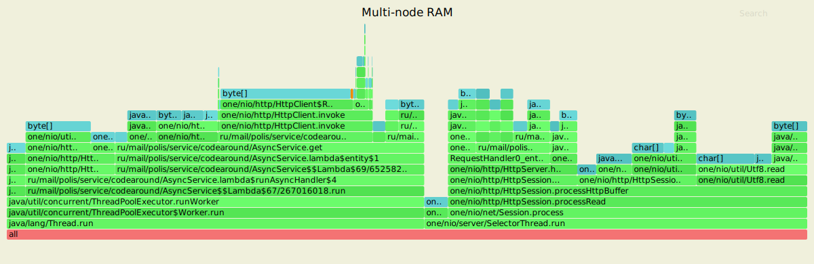
<p align="center">Рис.10. Выделение ресурса RAM при симулировании GET-запросов (multi-node)</p>

Актуальное сравнение триггеров аллокаций идентично их определению в профилях к PUT-запросам. Используя текущие представления, можно утверждать, что различия в топологиях сервера не оказывают влияния на структуру операций, требующих выделения памяти (как минимум на уровне одного узла кластера, подвергнутого профилированию).                   

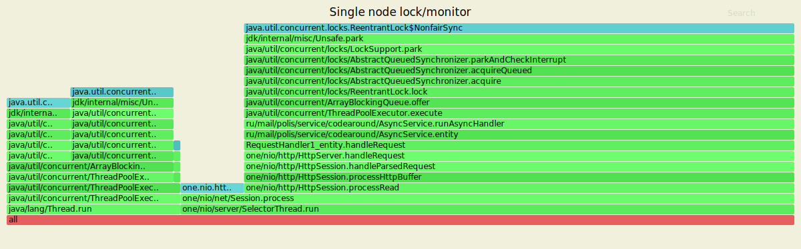
<p align="center">Рис.11. Профиль lock/monitor при симулировании GET-запросов (single node)</p>

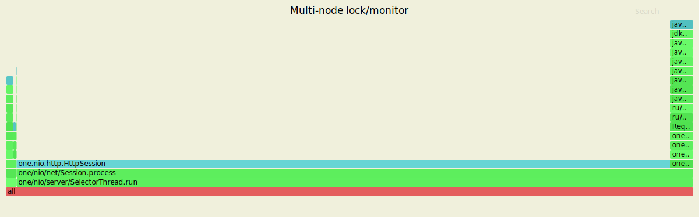
<p align="center">Рис.12. Профиль lock/monitor при симулировании GET-запросов (multi-node)</p>

Контроль асинхронного параллелизма при выполнении запросов на чтение реализуется с использованием того же механизма взаимоисключений, который гарантирует безопасность критической секции в очереди с PUT-запросами (комбинация экземпляров <em>ReentrantLock</em> и <em>AbstractQueueSynchronizer</em>).
