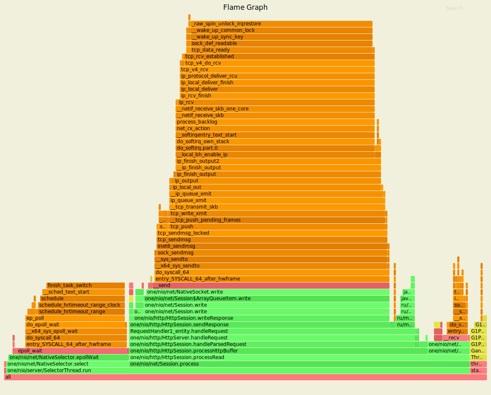
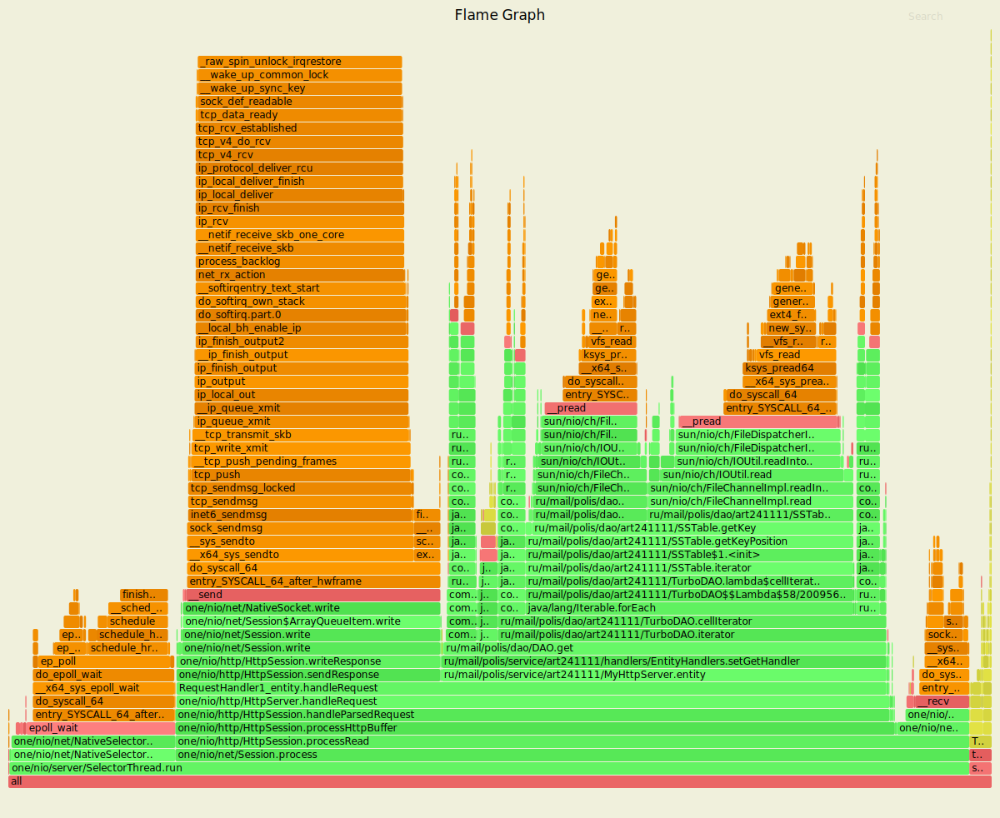

## Анализ полученных результатов
### Запрос PUT 
База данных в данном случает тратит минимум ресурсов.
Основные ресурсы уходят на обработку команд.

### Запрос GET
В данном случае требуется улучшение базы данных, 
так как на работу с БД уходит дополнительно почти 50% ресурсов. 
Достаточно много времени уходит на итерацию по бд и нахождения требуемого значения.

