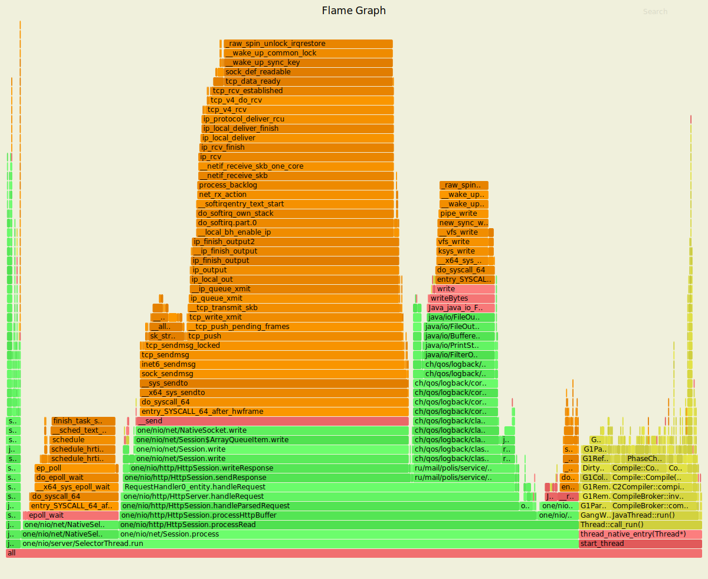
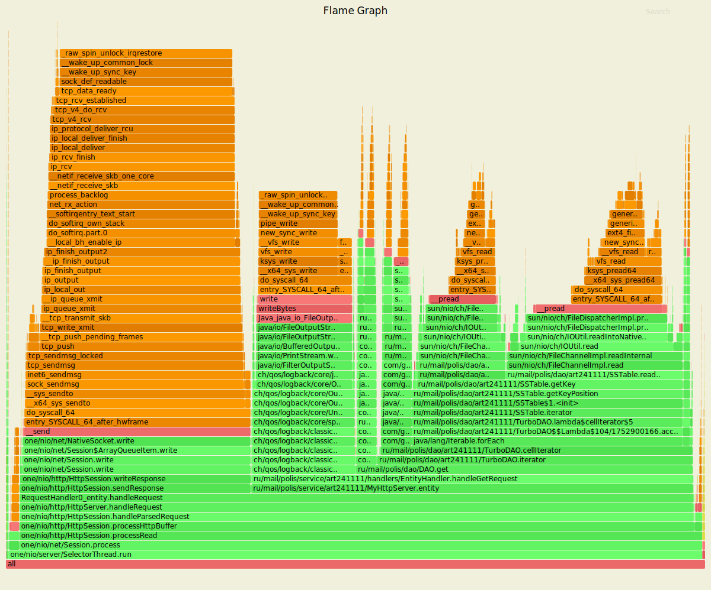
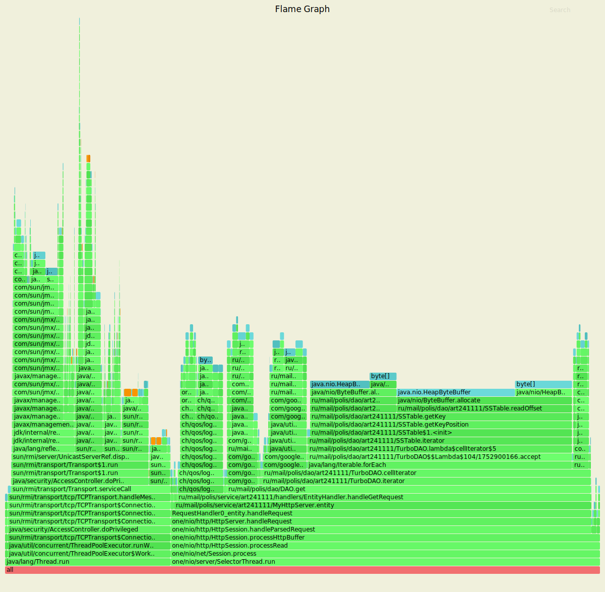

Анализ полученных результатов
================

Without optimization
================
Запрос PUT 
----------------
### Нагрузочное тестирование с помощью wrk в одно соединение
**Запрос:** wrk -t1 -c1 -d5m -R2000 -s put.lua --latency  http://127.0.0.1:8080

Running 5m test @ http://127.0.0.1:8080. 1 threads and 1 connections
  
  Thread calibration: mean lat.: 3.124ms, rate sampling interval: 10ms
  
  Thread Stats |  Avg      |Stdev    | Max    | +/- Stdev
  -------------|-----------|---------|--------|------------
    Latency    | 192.78ms  |884.19ms |  6.45s |   95.10%
    Req/Sec    | 2.18k     |1.04k    | 14.89k |   90.87%

  Latency    |Distribution (HdrHistogram - Recorded Latency)
  -----------|----------------------------------------------
   50.000%   | 1.60ms
   75.000%   | 2.48ms
   90.000%   | 5.52ms
   99.000%   | 5.37s 
   99.900%   | 6.31s 
   99.990%   | 6.43s 
   99.999%   | 6.45s 
   100.000%  |  6.45s 

  **Detailed Percentile spectrum:**
```
     Value   Percentile   TotalCount 1/(1-Percentile)
     0.032     0.000000            1         1.00
     0.477     0.100000        59176         1.11
     0.823     0.200000       118386         1.25
     1.094     0.300000       177597         1.43
     1.333     0.400000       236837         1.67
     1.597     0.500000       295825         2.00
     1.740     0.550000       325473         2.22
     1.895     0.600000       355070         2.50
     2.057     0.650000       384724         2.86
     2.247     0.700000       414327         3.33
     2.481     0.750000       443734         4.00
     2.631     0.775000       458625         4.44
     2.817     0.800000       473277         5.00
     3.067     0.825000       488138         5.71
     3.437     0.850000       502870         6.67
     4.127     0.875000       517668         8.00
     4.691     0.887500       525039         8.89
     5.527     0.900000       532459        10.00
     6.887     0.912500       539833        11.43
     9.703     0.925000       547224        13.33
    43.519     0.937500       554617        16.00
   340.735     0.943750       558314        17.78
   969.215     0.950000       562012        20.00
  1650.687     0.956250       565710        22.86
  2340.863     0.962500       569407        26.67
  3043.327     0.968750       573104        32.00
  3397.631     0.971875       574961        35.56
  3745.791     0.975000       576800        40.00
  4089.855     0.978125       578656        45.71
  4419.583     0.981250       580505        53.33
  4771.839     0.984375       582369        64.00
  4919.295     0.985938       583274        71.11
  5087.231     0.987500       584202        80.00
  5263.359     0.989062       585136        91.43
  5439.487     0.990625       586050       106.67
  5603.327     0.992188       586973       128.00
  5689.343     0.992969       587459       142.22
  5763.071     0.993750       587902       160.00
  5820.415     0.994531       588378       182.86
  5898.239     0.995313       588818       213.33
  5988.351     0.996094       589286       256.00
  6033.407     0.996484       589520       284.44
  6078.463     0.996875       589754       320.00
  6115.327     0.997266       589975       365.71
  6160.383     0.997656       590215       426.67
  6205.439     0.998047       590448       512.00
  6225.919     0.998242       590556       568.89
  6250.495     0.998437       590689       640.00
  6270.975     0.998633       590797       731.43
  6291.455     0.998828       590904       853.33
  6311.935     0.999023       591012      1024.00
  6324.223     0.999121       591076      1137.78
  6336.511     0.999219       591139      1280.00
  6348.799     0.999316       591204      1462.86
  6356.991     0.999414       591246      1706.67
  6369.279     0.999512       591311      2048.00
  6373.375     0.999561       591332      2275.56
  6381.567     0.999609       591375      2560.00
  6385.663     0.999658       591394      2925.71
  6393.855     0.999707       591416      3413.33
  6406.143     0.999756       591453      4096.00
  6410.239     0.999780       591463      4551.11
  6414.335     0.999805       591474      5120.00
  6422.527     0.999829       591505      5851.43
  6422.527     0.999854       591505      6826.67
  6426.623     0.999878       591526      8192.00
  6426.623     0.999890       591526      9102.22
  6430.719     0.999902       591538     10240.00
  6434.815     0.999915       591549     11702.86
  6434.815     0.999927       591549     13653.33
  6438.911     0.999939       591560     16384.00
  6438.911     0.999945       591560     18204.44
  6443.007     0.999951       591572     20480.00
  6443.007     0.999957       591572     23405.71
  6443.007     0.999963       591572     27306.67
  6443.007     0.999969       591572     32768.00
  6447.103     0.999973       591583     36408.89
  6447.103     0.999976       591583     40960.00
  6447.103     0.999979       591583     46811.43
  6447.103     0.999982       591583     54613.33
  6447.103     0.999985       591583     65536.00
  6447.103     0.999986       591583     72817.78
  6447.103     0.999988       591583     81920.00
  6447.103     0.999989       591583     93622.86
  6451.199     0.999991       591589    109226.67
  6451.199     1.000000       591589          inf
```

[Mean    =      192.780, StdDeviation   =      884.188]   
[Max     =     6447.104, Total count    =       591589]  
[Buckets =           27, SubBuckets     =         2048]  


599999 requests in 5.00m, 38.34MB read  
Socket errors: connect 0, read 0, write 0, timeout 4  
Requests/sec:   1999.99  
Transfer/sec:    130.86KB  

###Профилирование CPU под нагрузкой 
**Команда** /profiler.sh -d 60 -f cpu_put.svg -e cpu  3689


### Профилирование ALLOC под нагрузкой 
**Команда** /profiler.sh -d 60 -f alloc_put.svg -e alloc  3689


### Анализ
При рассмотрении профилирования CPU видно, что 80,15% уходит на SelectorThread, 
из них 2% уходит на парсинг запроса, на команду put уходит 14,66%, из них 12,67% уходит
на логгирование, а значит, что если его убрать, то загрузка CPU уменьшиться. Также 41,37% уходит
на отправку ответа (SendResponse).

При рассмотрении профилирования ALLOC видно, что поток Thread (39,78%) уходит
на поддержание TCP соединения. Оставшиеся 59,21% уходит на наш сервер. Из них
47,97% уходит на парсинг запроса (в том числе около 5% уходит на UTF8.read).
Также стоит отменить, что на графике видно, что логгер занимает больше, чем сам запрос
в БД.

В результате можно сделать вывод, что на данный момент - основной способ ускорения сервера -
отключение логгера. 

------------------------
## Запрос GET
### Нагрузочное тестирование с помощью wrk в одно соединение
**Запрос:** wrk -t1 -c1 -d5m -R2000 -s get.lua --latency  http://127.0.0.1:8080
Running 5m test @ http://127.0.0.1:8080  
  1 threads and 1 connections  
  Thread calibration: mean lat.: 1323.660ms, rate sampling interval: 3457ms  
  
  Thread Stats |  Avg  |    Stdev  |   Max  | +/- Stdev
  -------------|-------|-----------|--------|------------
    Latency    | 2.56s |    1.37s  |  4.83s |   54.46%
    Req/Sec    | 1.99k |  154.04   |  2.41k |   67.47%
    
  Latency   | Distribution (HdrHistogram - Recorded Latency)
  ----------|--------------------------------------
   50.000%  |   2.67s 
   75.000%  |   3.92s 
   90.000%  |   4.34s 
   99.000%  |   4.73s 
   99.900%  |   4.82s 
   99.990%  |   4.83s 
   99.999%  |   4.83s 
  100.000%  |   4.83s 

  **Detailed Percentile spectrum:**
  ```
       Value   Percentile   TotalCount 1/(1-Percentile)
       0.253     0.000000            1         1.00
     614.399     0.100000        57836         1.11
    1095.679     0.200000       115685         1.25
    1630.207     0.300000       173626         1.43
    2463.743     0.400000       231523         1.67
    2668.543     0.500000       289190         2.00
    2740.223     0.550000       318513         2.22
    2869.247     0.600000       347044         2.50
    3071.999     0.650000       375947         2.86
    3627.007     0.700000       404865         3.33
    3923.967     0.750000       433804         4.00
    4014.079     0.775000       448500         4.44
    4089.855     0.800000       462807         5.00
    4141.055     0.825000       477137         5.71
    4190.207     0.850000       491685         6.67
    4276.223     0.875000       506738         8.00
    4308.991     0.887500       513681         8.89
    4337.663     0.900000       520633        10.00
    4370.431     0.912500       527764        11.43
    4407.295     0.925000       534995        13.33
    4468.735     0.937500       542460        16.00
    4485.119     0.943750       547317        17.78
    4493.311     0.950000       549621        20.00
    4505.599     0.956250       553311        22.86
    4521.983     0.962500       557364        26.67
    4534.271     0.968750       560458        32.00
    4542.463     0.971875       562542        35.56
    4550.655     0.975000       564428        40.00
    4558.847     0.978125       565815        45.71
    4603.903     0.981250       567492        53.33
    4640.767     0.984375       569267        64.00
    4661.247     0.985938       570276        71.11
    4669.439     0.987500       571130        80.00
    4706.303     0.989062       572002        91.43
    4739.071     0.990625       572909       106.67
    4755.455     0.992188       573807       128.00
    4759.551     0.992969       574283       142.22
    4763.647     0.993750       574865       160.00
    4767.743     0.994531       575160       182.86
    4780.031     0.995313       575585       213.33
    4796.415     0.996094       576186       256.00
    4800.511     0.996484       576475       284.44
    4804.607     0.996875       576800       320.00
    4804.607     0.997266       576800       365.71
    4808.703     0.997656       577235       426.67
    4808.703     0.998047       577235       512.00
    4812.799     0.998242       577697       568.89
    4812.799     0.998437       577697       640.00
    4812.799     0.998633       577697       731.43
    4812.799     0.998828       577697       853.33
    4816.895     0.999023       577925      1024.00
    4816.895     0.999121       577925      1137.78
    4816.895     0.999219       577925      1280.00
    4816.895     0.999316       577925      1462.86
    4820.991     0.999414       578137      1706.67
    4820.991     0.999512       578137      2048.00
    4820.991     0.999561       578137      2275.56
    4820.991     0.999609       578137      2560.00
    4820.991     0.999658       578137      2925.71
    4820.991     0.999707       578137      3413.33
    4825.087     0.999756       578263      4096.00
    4825.087     0.999780       578263      4551.11
    4825.087     0.999805       578263      5120.00
    4825.087     0.999829       578263      5851.43
    4825.087     0.999854       578263      6826.67
    4825.087     0.999878       578263      8192.00
    4825.087     0.999890       578263      9102.22
    4825.087     0.999902       578263     10240.00
    4825.087     0.999915       578263     11702.86
    4825.087     0.999927       578263     13653.33
    4825.087     0.999939       578263     16384.00
    4825.087     0.999945       578263     18204.44
    4825.087     0.999951       578263     20480.00
    4829.183     0.999957       578288     23405.71
    4829.183     1.000000       578288          inf
```

[Mean    =     2562.066, StdDeviation   =     1368.121]  
[Max     =     4825.088, Total count    =       578288]  
[Buckets =           27, SubBuckets     =         2048]  

594705 requests in 5.00m, 41.85MB read  
Requests/sec:   1982.35  
Transfer/sec:    142.86KB  

###Профилирование CPU под нагрузкой 
**Команда** /profiler.sh -d 60 -f cpu_get.svg -e cpu  3689


### Профилирование ALLOC под нагрузкой 
**Команда** /profiler.sh -d 60 -f alloc_get.svg -e alloc  3689


### Анализ
При рассмотрении профилирования CPU видно, что 99,23% уходит на SelectorThread, на отправку ответа 
уходит 33,3%, оставшиеся 63,20% уходят на обработку запроса GET. В этом случае на логгирование уходит 
14,79%. Оставшиеся 48,13% уходят на итерирование в БД. 

При рассмотрении профилирования ALLOC видно, что поток Thread (27,82%) уходит
на поддержание TCP соединения. Оставшиеся 72,18% уходит на наш сервер.
На графике ALLOC, так же как и в случае CPU, большая часть ресурсов уходит на 
итерирование по БД 

В результате можно сделать вывод, что на данный момент - основной способ ускорения сервера -
оптимизация итератора и удаление логгера. 

Without optimization
================
Запрос PUT 
----------------
### Нагрузочное тестирование с помощью wrk в одно соединение
wrk -t1 -c1 -d3m -R2000 -s put.lua --latency  http://127.0.0.1:8080
Running 3m test @ http://127.0.0.1:8080
  1 threads and 1 connections
  Thread calibration: mean lat.: 2.847ms, rate sampling interval: 12ms
  Thread Stats   Avg      Stdev     Max   +/- Stdev
    Latency   173.68ms  859.14ms   6.73s    95.76%
    Req/Sec     2.16k     1.28k   15.27k    84.76%
  Latency Distribution (HdrHistogram - Recorded Latency)
 50.000%    2.47ms
 75.000%    5.12ms
 90.000%   11.39ms
 99.000%    5.41s 
 99.900%    6.60s 
 99.990%    6.72s 
 99.999%    6.73s 
100.000%    6.73s 

  Detailed Percentile spectrum:
       Value   Percentile   TotalCount 1/(1-Percentile)

       0.026     0.000000            1         1.00
       0.648     0.100000        34028         1.11
       1.122     0.200000        68016         1.25
       1.538     0.300000       102014         1.43
       1.982     0.400000       136038         1.67
       2.475     0.500000       170092         2.00
       2.759     0.550000       187019         2.22
       3.111     0.600000       204014         2.50
       3.567     0.650000       221053         2.86
       4.227     0.700000       238071         3.33
       5.119     0.750000       255056         4.00
       5.663     0.775000       263499         4.44
       6.311     0.800000       272013         5.00
       7.071     0.825000       280502         5.71
       7.999     0.850000       289033         6.67
       9.271     0.875000       297502         8.00
      10.183     0.887500       301743         8.89
      11.391     0.900000       306006        10.00
      13.095     0.912500       310265        11.43
      16.031     0.925000       314493        13.33
      22.287     0.937500       318744        16.00
      29.407     0.943750       320870        17.78
      55.231     0.950000       322994        20.00
     844.287     0.956250       325119        22.86
    1718.271     0.962500       327244        26.67
    2580.479     0.968750       329370        32.00
    3012.607     0.971875       330432        35.56
    3444.735     0.975000       331494        40.00
    3874.815     0.978125       332555        45.71
    4276.223     0.981250       333618        53.33
    4685.823     0.984375       334685        64.00
    4890.623     0.985938       335220        71.11
    5095.423     0.987500       335749        80.00
    5300.223     0.989062       336279        91.43
    5488.639     0.990625       336810       106.67
    5693.439     0.992188       337339       128.00
    5795.839     0.992969       337604       142.22
    5898.239     0.993750       337870       160.00
    6000.639     0.994531       338133       182.86
    6103.039     0.995313       338400       213.33
    6213.631     0.996094       338671       256.00
    6266.879     0.996484       338802       284.44
    6320.127     0.996875       338932       320.00
    6373.375     0.997266       339067       365.71
    6426.623     0.997656       339203       426.67
    6475.775     0.998047       339330       512.00
    6504.447     0.998242       339404       568.89
    6529.023     0.998437       339467       640.00
    6553.599     0.998633       339531       731.43
    6578.175     0.998828       339594       853.33
    6606.847     0.999023       339667      1024.00
    6619.135     0.999121       339699      1137.78
    6631.423     0.999219       339731      1280.00
    6643.711     0.999316       339762      1462.86
    6655.999     0.999414       339794      1706.67
    6672.383     0.999512       339836      2048.00
    6676.479     0.999561       339846      2275.56
    6684.671     0.999609       339868      2560.00
    6688.767     0.999658       339878      2925.71
    6696.959     0.999707       339899      3413.33
    6701.055     0.999756       339909      4096.00
    6705.151     0.999780       339920      4551.11
    6709.247     0.999805       339930      5120.00
    6713.343     0.999829       339941      5851.43
    6717.439     0.999854       339953      6826.67
    6717.439     0.999878       339953      8192.00
    6721.535     0.999890       339964      9102.22
    6721.535     0.999902       339964     10240.00
    6721.535     0.999915       339964     11702.86
    6725.631     0.999927       339975     13653.33
    6725.631     0.999939       339975     16384.00
    6725.631     0.999945       339975     18204.44
    6729.727     0.999951       339985     20480.00
    6729.727     0.999957       339985     23405.71
    6729.727     0.999963       339985     27306.67
    6729.727     0.999969       339985     32768.00
    6729.727     0.999973       339985     36408.89
    6729.727     0.999976       339985     40960.00
    6729.727     0.999979       339985     46811.43
    6733.823     0.999982       339992     54613.33
    6733.823     1.000000       339992          inf
#[Mean    =      173.680, StdDeviation   =      859.142]
#[Max     =     6729.728, Total count    =       339992]
#[Buckets =           27, SubBuckets     =         2048]
----------------------------------------------------------
  359996 requests in 3.00m, 23.00MB read
  Socket errors: connect 0, read 0, write 0, timeout 3
Requests/sec:   1999.98
Transfer/sec:    130.86KB


wrk -t1 -c1 -d3m -R2000 -s get.lua --latency  http://127.0.0.1:8080
Running 3m test @ http://127.0.0.1:8080
  1 threads and 1 connections
  Thread calibration: mean lat.: 4.904ms, rate sampling interval: 23ms
  Thread Stats   Avg      Stdev     Max   +/- Stdev
    Latency     4.69ms    8.04ms 187.39ms   93.06%
    Req/Sec     2.08k   588.37     6.36k    81.34%
  Latency Distribution (HdrHistogram - Recorded Latency)
 50.000%    2.58ms
 75.000%    4.92ms
 90.000%    9.90ms
 99.000%   33.89ms
 99.900%  111.93ms
 99.990%  181.12ms
 99.999%  186.75ms
100.000%  187.52ms

  Detailed Percentile spectrum:
       Value   Percentile   TotalCount 1/(1-Percentile)

       0.090     0.000000            1         1.00
       0.725     0.100000        34058         1.11
       1.203     0.200000        68007         1.25
       1.624     0.300000       102045         1.43
       2.069     0.400000       136118         1.67
       2.577     0.500000       170107         2.00
       2.853     0.550000       186997         2.22
       3.183     0.600000       204011         2.50
       3.607     0.650000       221052         2.86
       4.171     0.700000       238040         3.33
       4.923     0.750000       254992         4.00
       5.395     0.775000       263543         4.44
       5.947     0.800000       272009         5.00
       6.607     0.825000       280533         5.71
       7.415     0.850000       289008         6.67
       8.455     0.875000       297518         8.00
       9.111     0.887500       301770         8.89
       9.895     0.900000       306009        10.00
      10.847     0.912500       310242        11.43
      12.079     0.925000       314494        13.33
      13.695     0.937500       318744        16.00
      14.687     0.943750       320862        17.78
      15.863     0.950000       322989        20.00
      17.231     0.956250       325132        22.86
      18.863     0.962500       327247        26.67
      20.735     0.968750       329360        32.00
      21.855     0.971875       330429        35.56
      23.151     0.975000       331493        40.00
      24.623     0.978125       332551        45.71
      26.351     0.981250       333608        53.33
      28.335     0.984375       334672        64.00
      29.535     0.985938       335210        71.11
      30.911     0.987500       335734        80.00
      32.687     0.989062       336265        91.43
      34.751     0.990625       336797       106.67
      37.055     0.992188       337330       128.00
      38.335     0.992969       337592       142.22
      39.903     0.993750       337860       160.00
      41.823     0.994531       338126       182.86
      44.383     0.995313       338388       213.33
      48.287     0.996094       338656       256.00
      50.719     0.996484       338786       284.44
      53.695     0.996875       338919       320.00
      57.151     0.997266       339053       365.71
      61.055     0.997656       339185       426.67
      67.711     0.998047       339318       512.00
      71.359     0.998242       339385       568.89
      75.519     0.998437       339450       640.00
      84.031     0.998633       339517       731.43
      96.127     0.998828       339583       853.33
     113.855     0.999023       339649      1024.00
     123.007     0.999121       339683      1137.78
     131.455     0.999219       339716      1280.00
     140.287     0.999316       339749      1462.86
     148.991     0.999414       339782      1706.67
     157.439     0.999512       339815      2048.00
     161.791     0.999561       339832      2275.56
     166.015     0.999609       339849      2560.00
     170.111     0.999658       339865      2925.71
     172.671     0.999707       339882      3413.33
     174.847     0.999756       339898      4096.00
     176.127     0.999780       339907      4551.11
     177.151     0.999805       339915      5120.00
     178.303     0.999829       339924      5851.43
     179.327     0.999854       339932      6826.67
     180.351     0.999878       339941      8192.00
     180.735     0.999890       339944      9102.22
     181.247     0.999902       339948     10240.00
     182.143     0.999915       339952     11702.86
     183.423     0.999927       339957     13653.33
     184.447     0.999939       339961     16384.00
     184.959     0.999945       339964     18204.44
     185.215     0.999951       339965     20480.00
     185.471     0.999957       339967     23405.71
     185.599     0.999963       339969     27306.67
     185.855     0.999969       339971     32768.00
     186.111     0.999973       339973     36408.89
     186.111     0.999976       339973     40960.00
     186.367     0.999979       339975     46811.43
     186.367     0.999982       339975     54613.33
     186.495     0.999985       339976     65536.00
     186.623     0.999986       339977     72817.78
     186.623     0.999988       339977     81920.00
     186.751     0.999989       339978     93622.86
     186.751     0.999991       339978    109226.67
     187.007     0.999992       339979    131072.00
     187.007     0.999993       339979    145635.56
     187.007     0.999994       339979    163840.00
     187.263     0.999995       339980    187245.71
     187.263     0.999995       339980    218453.33
     187.263     0.999996       339980    262144.00
     187.263     0.999997       339980    291271.11
     187.263     0.999997       339980    327680.00
     187.519     0.999997       339981    374491.43
     187.519     1.000000       339981          inf
#[Mean    =        4.691, StdDeviation   =        8.038]
#[Max     =      187.392, Total count    =       339981]
#[Buckets =           27, SubBuckets     =         2048]
----------------------------------------------------------
  359988 requests in 3.00m, 25.29MB read
Requests/sec:   1999.91
Transfer/sec:    143.87KB
