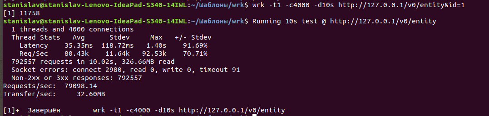

В рамках утилиты wrk сервер имеет следующие показатели по производительности. (wrk -t1 -c10 -d10s http://localhost:8080/v0/status)

Flamegraph выглядит следующим образом (./profiler.sh -d 5 -f flamegraph.svg 27555)

Логи после профилирования процессора (./profiler.sh -d 5 29233)

Started [cpu] profiling
--- Execution profile ---
Total samples       : 676
not_walkable_Java   : 1 (0,15%)

Frame buffer usage  : 0.7403%

142511144    2.07%       14  java.lang.StringLatin1.indexOf
   122353866    1.78%       12  one.nio.net.NativeSelector.epollWait
   122285574    1.78%       12  [vdso]
   122209820    1.77%       12  ipt_do_table?[ip_tables]_[k]
   122208116    1.77%       12  one.nio.util.Utf8.startsWith
   111976334    1.63%       11  __lock_text_start_[k]
   102205352    1.48%       10  do_syscall_64_[k]
   101940305    1.48%       10  java.lang.StringUTF16.checkIndex
   101887035    1.48%       10  __tcp_transmit_skb_[k]
   101837817    1.48%       10  one.nio.http.Response.toBytes
    91738448    1.33%        9  aa_sk_perm_[k]
    91653576    1.33%        9  clock_gettime
    91626865    1.33%        9  __ksize_[k]
    81584450    1.18%        8  epoll_wait
    81579409    1.18%        8  __fget_[k]
    81556485    1.18%        8  tcp_ack_[k]
    81515724    1.18%        8  tcp_sendmsg_locked_[k]
    81494617    1.18%        8  __check_object_size_[k]
    81467530    1.18%        8  __inet_lookup_established_[k]
    81436539    1.18%        8  one.nio.http.Request.getHeader
    71383571    1.04%        7  __nf_conntrack_find_get?[nf_conntrack]_[k]
    71358705    1.04%        7  tcp_recvmsg_[k]
    71352372    1.04%        7  jni_SetByteArrayRegion
    71316828    1.04%        7  __kmalloc_node_track_caller_[k]
    71279815    1.03%        7  java.util.HashMap.getNode
    71256852    1.03%        7  __slab_free_[k]
    71238445    1.03%        7  aa_label_sk_perm.part.4_[k]
    61186180    0.89%        6  ep_scan_ready_list.constprop.20_[k]
    61184944    0.89%        6  eth_type_trans_[k]
    61164647    0.89%        6  nf_conntrack_in?[nf_conntrack]_[k]
    61163508    0.89%        6  syscall_trace_enter_[k]
    61120315    0.89%        6  net_rx_action_[k]
    61081057    0.89%        6  __ip_queue_xmit_[k]
    51006066    0.74%        5  one.nio.net.NativeSelector.select
    50999001    0.74%        5  HandleMark::pop_and_restore()
    50980892    0.74%        5  one.nio.server.SelectorThread.run
    50962924    0.74%        5  tcp_in_window?[nf_conntrack]_[k]
    50959757    0.74%        5  skb_release_data_[k]
    50949899    0.74%        5  __fget_light_[k]
    50949566    0.74%        5  __libc_disable_asynccancel
    50949547    0.74%        5  read_tsc_[k]
    50929323    0.74%        5  nf_ct_get_tuple?[nf_conntrack]_[k]
    50919379    0.74%        5  one.nio.net.NativeSocket.read
    50887434    0.74%        5  _raw_spin_lock_bh_[k]
    50860150    0.74%        5  __libc_send
    50034633    0.73%        5  SpinPause
    41573095    0.60%        4  tcp_v4_rcv_[k]
    40928437    0.59%        4  __ip_finish_output_[k]
    40803502    0.59%        4  ThreadInVMfromNative::~ThreadInVMfromNative()
    40800894    0.59%        4  get_l4proto?[nf_conntrack]_[k]
    40795823    0.59%        4  copy_user_generic_unrolled_[k]
    40795590    0.59%        4  loopback_xmit_[k]
    40792276    0.59%        4  ipv4_dst_check_[k]
    40779629    0.59%        4  sock_def_readable_[k]
    40773433    0.59%        4  __netif_receive_skb_core_[k]
    40766544    0.59%        4  tcp_clean_rtx_queue_[k]
    40766481    0.59%        4  aa_profile_af_perm_[k]
    40764945    0.59%        4  tcp_wfree_[k]
    40753982    0.59%        4  one.nio.http.HttpSession.processHttpBuffer
    40752841    0.59%        4  tcp_current_mss_[k]
    40748291    0.59%        4  clock_gettime
    40740321    0.59%        4  __dev_queue_xmit_[k]
    40736990    0.59%        4  import_single_range_[k]
    40730708    0.59%        4  ip_finish_output2_[k]
    40723472    0.59%        4  fput_many_[k]
    40701501    0.59%        4  _raw_spin_unlock_bh_[k]
    40695212    0.59%        4  ipv4_conntrack_defrag?[nf_defrag_ipv4]_[k]
    30654064    0.44%        3  __GI___recv
    30620298    0.44%        3  one.nio.net.Session.read
    30613003    0.44%        3  security_socket_recvmsg_[k]
    30612239    0.44%        3  ip_rcv_finish_core.isra.18_[k]
    30605147    0.44%        3  __skb_clone_[k]
    30604472    0.44%        3  tcp_schedule_loss_probe_[k]
    30594485    0.44%        3  __tcp_select_window_[k]
    30593766    0.44%        3  tcp_rcv_established_[k]
    30591398    0.44%        3  __sk_dst_check_[k]
    30589203    0.44%        3  tcp_v4_fill_cb_[k]
    30584609    0.44%        3  ktime_get_[k]
    30576982    0.44%        3  mod_timer_[k]
    30575887    0.44%        3  ep_poll_[k]
    30574450    0.44%        3  unroll_tree_refs_[k]
    30565737    0.44%        3  process_backlog_[k]
    30563171    0.44%        3  tcp_event_new_data_sent_[k]
    30562293    0.44%        3  ip_output_[k]
    30559668    0.44%        3  memset_erms_[k]
    30558340    0.44%        3  __audit_syscall_exit_[k]
    30556824    0.44%        3  syscall_slow_exit_work_[k]
    30555057    0.44%        3  enqueue_to_backlog_[k]
    30547429    0.44%        3  java.lang.StringLatin1.regionMatchesCI
    30539972    0.44%        3  skb_page_frag_refill_[k]
    30536377    0.44%        3  _raw_spin_lock_[k]
    30525453    0.44%        3  __libc_enable_asynccancel
    30516587    0.44%        3  do_softirq.part.20_[k]
    20434610    0.30%        2  ipv4_mtu_[k]
    20420069    0.30%        2  __slab_alloc_[k]
    20417544    0.30%        2  check_bounds(int, int, int, Thread*)
    20415524    0.30%        2  rb_insert_color_[k]
    20414995    0.30%        2  ip_rcv_[k]
    20412614    0.30%        2  sock_sendmsg_[k]
    20411900    0.30%        2  Java_one_nio_net_NativeSelector_epollWait
    20411770    0.30%        2  kmem_cache_free_[k]
    20410117    0.30%        2  ipv4_conntrack_local?[nf_conntrack]_[k]
    20404719    0.30%        2  tcp_event_data_recv_[k]
    20403812    0.30%        2  kmem_cache_alloc_node_[k]
    20401959    0.30%        2  inet6_sendmsg_[k]
    20400201    0.30%        2  tcp_send_delayed_ack_[k]
    20398194    0.30%        2  validate_xmit_xfrm_[k]
    20397834    0.30%        2  sock_recvmsg_[k]
    20396476    0.30%        2  hash_conntrack_raw?[nf_conntrack]_[k]
    20395220    0.30%        2  one.nio.net.NativeSocket.write
    20395059    0.30%        2  ip_rcv_core.isra.20_[k]
    20394022    0.30%        2  schedule_[k]
    20387809    0.30%        2  validate_xmit_skb_[k]
    20387665    0.30%        2  __local_bh_enable_ip_[k]
    20387658    0.30%        2  jbyte_disjoint_arraycopy
    20385933    0.30%        2  __cgroup_bpf_run_filter_skb_[k]
    20379600    0.30%        2  __softirqentry_text_start_[k]
    20377191    0.30%        2  release_sock_[k]
    20374468    0.30%        2  one.nio.net.Session.write
    20373470    0.30%        2  netif_skb_features_[k]
    20368912    0.30%        2  sock_poll_[k]
    20368415    0.30%        2  tcp_release_cb_[k]
    20368175    0.30%        2  Java_one_nio_net_NativeSocket_read
    20365673    0.30%        2  iptable_filter_hook?[iptable_filter]_[k]
    20364816    0.30%        2  tcp_write_xmit_[k]
    20364713    0.30%        2  kfree_[k]
    20364507    0.30%        2  one.nio.http.HttpServer.handleRequest
    20364449    0.30%        2  nf_hook_slow_[k]
    20363713    0.30%        2  __kfree_skb_flush_[k]
    20362941    0.30%        2  security_sock_rcv_skb_[k]
    20356583    0.30%        2  tcp_ack_update_rtt.isra.45_[k]
    20355159    0.30%        2  tcp_queue_rcv_[k]
    20353538    0.30%        2  __alloc_skb_[k]
    20353176    0.30%        2  apparmor_socket_recvmsg_[k]
    20352895    0.30%        2  dst_release_[k]
    20352881    0.30%        2  tcp_cleanup_rbuf_[k]
    20351884    0.30%        2  nf_ct_deliver_cached_events?[nf_conntrack]_[k]
    20348595    0.30%        2  ktime_get_seconds_[k]
    20341916    0.30%        2  Java_one_nio_net_NativeSocket_write
    20323079    0.30%        2  __x64_sys_recvfrom_[k]
    20021331    0.29%        2  HeapRegion::block_size(HeapWord const*) const
    10441599    0.15%        1  schedule_hrtimeout_range_clock_[k]
    10234327    0.15%        1  ep_send_events_proc_[k]
    10226763    0.15%        1  __kfree_skb_[k]
    10222025    0.15%        1  __sched_text_start_[k]
    10220769    0.15%        1  tcp_push_[k]
    10219672    0.15%        1  tcp_rate_skb_delivered_[k]
    10218681    0.15%        1  one.nio.http.HttpSession.writeResponse
    10218053    0.15%        1  __virt_addr_valid_[k]
    10216889    0.15%        1  kfree_skbmem_[k]
    10216297    0.15%        1  java.lang.StringLatin1.hashCode
    10216051    0.15%        1  _raw_write_lock_irq_[k]
    10215640    0.15%        1  skb_network_protocol_[k]
    10215628    0.15%        1  __netif_receive_skb_one_core_[k]
    10213500    0.15%        1  tcp_v4_send_check_[k]
    10213202    0.15%        1  tcp_small_queue_check.isra.33_[k]
    10213021    0.15%        1  __audit_syscall_entry_[k]
    10212635    0.15%        1  _cond_resched_[k]
    10211883    0.15%        1  bictcp_cwnd_event_[k]
    10210784    0.15%        1  __x64_sys_epoll_wait_[k]
    10210041    0.15%        1  __usecs_to_jiffies_[k]
    10209866    0.15%        1  _raw_spin_lock_irqsave_[k]
    10208742    0.15%        1  __x86_indirect_thunk_rax_[k]
    10208188    0.15%        1  apparmor_socket_sendmsg_[k]
    10208028    0.15%        1  memmove@plt
    10207368    0.15%        1  bictcp_acked_[k]
    10206530    0.15%        1  lock_sock_nested_[k]
    10206270    0.15%        1  __kmalloc_reserve.isra.62_[k]
    10205421    0.15%        1  ipv4_confirm?[nf_conntrack]_[k]
    10204525    0.15%        1  __memmove_avx_unaligned_erms
    10203883    0.15%        1  simple_copy_to_iter_[k]
    10203854    0.15%        1  iov_iter_advance_[k]
    10203829    0.15%        1  __skb_datagram_iter_[k]
    10203672    0.15%        1  netif_rx_[k]
    10201814    0.15%        1  raw_local_deliver_[k]
    10201502    0.15%        1  recv@plt
    10200394    0.15%        1  sk_filter_trim_cap_[k]
    10199154    0.15%        1  tcp_rcv_space_adjust_[k]
    10198810    0.15%        1  ResourceMark::reset_to_mark()
    10197421    0.15%        1  __x64_sys_sendto_[k]
    10197265    0.15%        1  __sys_sendto_[k]
    10197107    0.15%        1  CodeHeap::find_blob_unsafe(void*) const
    10194829    0.15%        1  __ip_local_out_[k]
    10194117    0.15%        1  MemAllocator::Allocation::notify_allocation_jvmti_sampler()
    10193314    0.15%        1  clear_page_erms_[k]
    10191477    0.15%        1  skb_copy_datagram_iter_[k]
    10191104    0.15%        1  one.nio.net.Session.process
    10190139    0.15%        1  ip_local_deliver_[k]
    10190076    0.15%        1  rb_next_[k]
    10188778    0.15%        1  bictcp_cong_avoid_[k]
    10188598    0.15%        1  ip_copy_addrs_[k]
    10188363    0.15%        1  __tcp_ack_snd_check_[k]
    10187987    0.15%        1  rcu_all_qs_[k]
    10186103    0.15%        1  skb_clone_tx_timestamp_[k]
    10185584    0.15%        1  tcp_update_skb_after_send_[k]
    10185470    0.15%        1  ThreadStateTransition::transition_from_native(JavaThread*, JavaThreadState) [clone .constprop.222]
    10184219    0.15%        1  nf_conntrack_tcp_packet?[nf_conntrack]_[k]
    10182211    0.15%        1  epoll_wait@plt
    10180951    0.15%        1  tcp_rack_advance_[k]
    10179534    0.15%        1  aa_apply_modes_to_perms_[k]