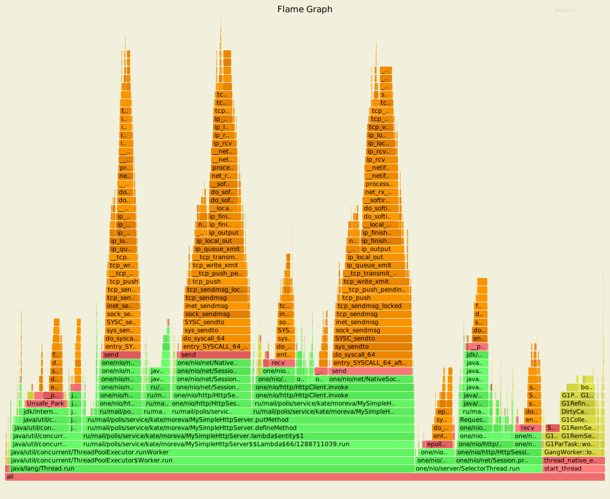
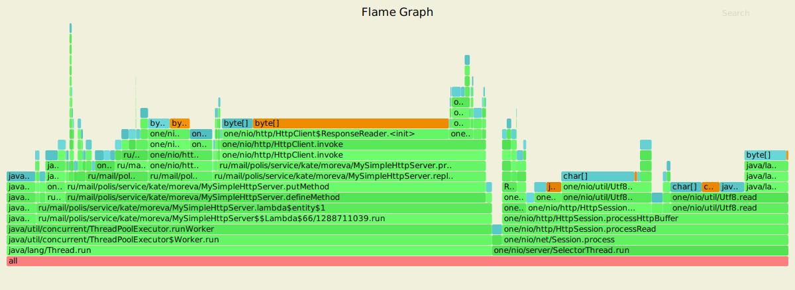
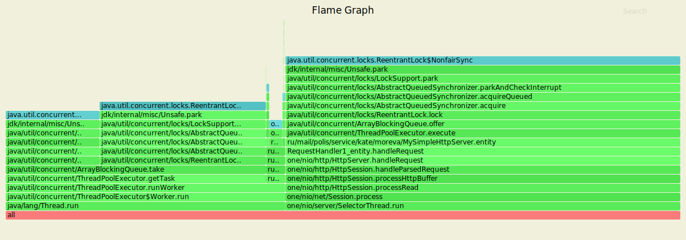
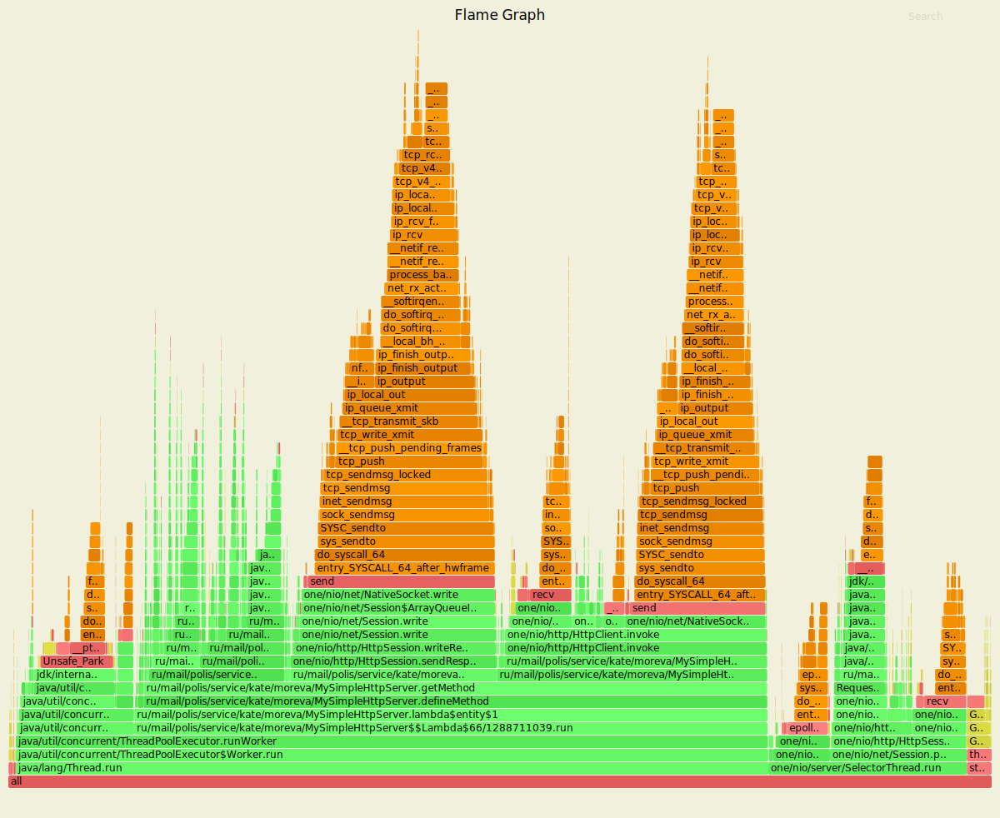
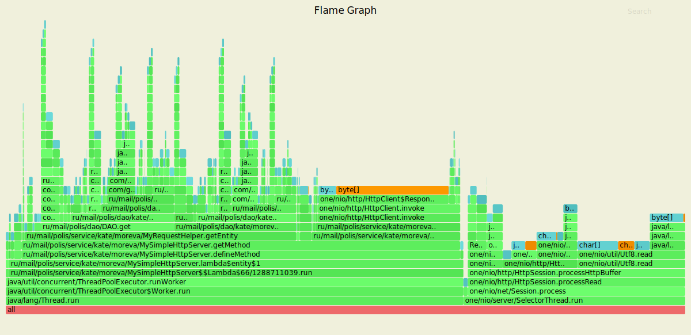
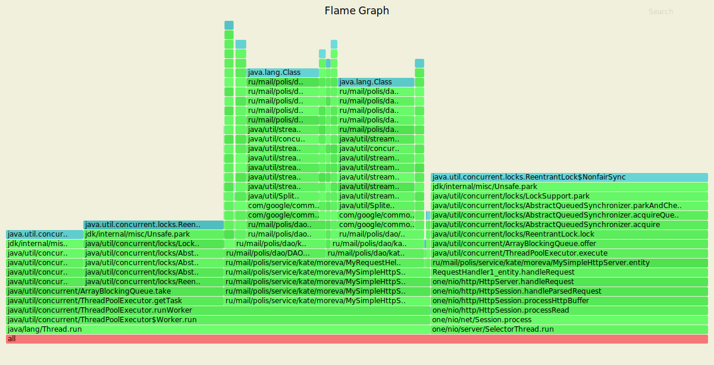

Результаты 
#PUT запросы

-t1 -c64 -d5m -R2000 -s ./wrk/put.lua --latency http://localhost:8080

**CPU**

Running 1m test @ http://localhost:8080
  1 threads and 64 connections
  Thread calibration: mean lat.: 1.837ms, rate sampling interval: 10ms
  Thread Stats   Avg      Stdev     Max   +/- Stdev
    Latency     1.78ms    0.89ms  17.07ms   87.16%
    Req/Sec     2.11k   320.81     4.78k    76.37%
  Latency Distribution (HdrHistogram - Recorded Latency)
 50.000%    1.63ms
 75.000%    2.06ms
 90.000%    2.60ms
 99.000%    5.88ms
 99.900%    9.47ms
 99.990%   15.03ms
 99.999%   17.06ms
100.000%   17.09ms

  Detailed Percentile spectrum:
       Value   Percentile   TotalCount 1/(1-Percentile)

       0.142     0.000000            1         1.00
       1.012     0.100000         9953         1.11
       1.176     0.200000        19925         1.25
       1.334     0.300000        29827         1.43
       1.485     0.400000        39805         1.67
       1.630     0.500000        49720         2.00
       1.700     0.550000        54650         2.22
       1.777     0.600000        59613         2.50
       1.858     0.650000        64592         2.86
       1.947     0.700000        69591         3.33
       2.055     0.750000        74593         4.00
       2.119     0.775000        77065         4.44
       2.191     0.800000        79509         5.00
       2.281     0.825000        82012         5.71
       2.381     0.850000        84493         6.67
       2.485     0.875000        86947         8.00
       2.541     0.887500        88202         8.89
       2.599     0.900000        89435        10.00
       2.661     0.912500        90669        11.43
       2.729     0.925000        91930        13.33
       2.801     0.937500        93148        16.00
       2.845     0.943750        93789        17.78
       2.891     0.950000        94399        20.00
       2.945     0.956250        95020        22.86
       3.023     0.962500        95630        26.67
       3.137     0.968750        96253        32.00
       3.205     0.971875        96561        35.56
       3.319     0.975000        96873        40.00
       3.701     0.978125        97182        45.71
       4.219     0.981250        97495        53.33
       4.763     0.984375        97803        64.00
       5.035     0.985938        97959        71.11
       5.399     0.987500        98114        80.00
       5.695     0.989062        98269        91.43
       6.023     0.990625        98424       106.67
       6.335     0.992188        98579       128.00
       6.487     0.992969        98657       142.22
       6.679     0.993750        98735       160.00
       6.907     0.994531        98813       182.86
       7.203     0.995313        98890       213.33
       7.479     0.996094        98967       256.00
       7.659     0.996484        99007       284.44
       7.803     0.996875        99045       320.00
       7.991     0.997266        99086       365.71
       8.191     0.997656        99123       426.67
       8.455     0.998047        99162       512.00
       8.655     0.998242        99181       568.89
       8.943     0.998437        99200       640.00
       9.103     0.998633        99220       731.43
       9.287     0.998828        99239       853.33
       9.479     0.999023        99258      1024.00
       9.615     0.999121        99268      1137.78
       9.855     0.999219        99279      1280.00
      10.127     0.999316        99288      1462.86
      10.471     0.999414        99297      1706.67
      10.887     0.999512        99308      2048.00
      11.023     0.999561        99312      2275.56
      11.823     0.999609        99317      2560.00
      12.247     0.999658        99322      2925.71
      12.383     0.999707        99326      3413.33
      12.959     0.999756        99331      4096.00
      13.183     0.999780        99334      4551.11
      13.351     0.999805        99336      5120.00
      14.047     0.999829        99339      5851.43
      14.431     0.999854        99341      6826.67
      14.839     0.999878        99343      8192.00
      15.031     0.999890        99345      9102.22
      15.343     0.999902        99346     10240.00
      15.351     0.999915        99347     11702.86
      15.751     0.999927        99348     13653.33
      15.807     0.999939        99349     16384.00
      16.623     0.999945        99350     18204.44
      16.655     0.999951        99351     20480.00
      16.655     0.999957        99351     23405.71
      16.687     0.999963        99352     27306.67
      16.687     0.999969        99352     32768.00
      16.847     0.999973        99353     36408.89
      16.847     0.999976        99353     40960.00
      16.847     0.999979        99353     46811.43
      17.055     0.999982        99354     54613.33
      17.055     0.999985        99354     65536.00
      17.055     0.999986        99354     72817.78
      17.055     0.999988        99354     81920.00
      17.055     0.999989        99354     93622.86
      17.087     0.999991        99355    109226.67
      17.087     1.000000        99355          inf
[Mean    =        1.776, StdDeviation   =        0.891]
[Max     =       17.072, Total count    =        99355]
[Buckets =           27, SubBuckets     =         2048]
----------------------------------------------------------
  119711 requests in 1.00m, 7.65MB read
Requests/sec:   1995.17
Transfer/sec:    130.54KB

Отправка ответа 13.46%
replication 27.11%
DAO.upsert 4.32%

**Alloc**

Running 1m test @ http://localhost:8080
  1 threads and 64 connections
  Thread calibration: mean lat.: 1.763ms, rate sampling interval: 10ms
  Thread Stats   Avg      Stdev     Max   +/- Stdev
    Latency     1.85ms    1.04ms  21.26ms   92.05%
    Req/Sec     2.11k   395.89     6.11k    77.98%
  Latency Distribution (HdrHistogram - Recorded Latency)
 50.000%    1.68ms
 75.000%    2.07ms
 90.000%    2.66ms
 99.000%    6.86ms
 99.900%   10.85ms
 99.990%   18.80ms
 99.999%   20.22ms
100.000%   21.28ms

  Detailed Percentile spectrum:
       Value   Percentile   TotalCount 1/(1-Percentile)

       0.169     0.000000            1         1.00
       1.024     0.100000         9936         1.11
       1.214     0.200000        19912         1.25
       1.392     0.300000        29816         1.43
       1.546     0.400000        39756         1.67
       1.683     0.500000        49735         2.00
       1.748     0.550000        54708         2.22
       1.818     0.600000        59635         2.50
       1.891     0.650000        64607         2.86
       1.973     0.700000        69599         3.33
       2.071     0.750000        74561         4.00
       2.135     0.775000        77018         4.44
       2.207     0.800000        79547         5.00
       2.295     0.825000        82021         5.71
       2.399     0.850000        84473         6.67
       2.523     0.875000        86966         8.00
       2.591     0.887500        88188         8.89
       2.657     0.900000        89451        10.00
       2.723     0.912500        90687        11.43
       2.797     0.925000        91927        13.33
       2.877     0.937500        93153        16.00
       2.923     0.943750        93794        17.78
       2.981     0.950000        94406        20.00
       3.069     0.956250        95024        22.86
       3.175     0.962500        95635        26.67
       3.457     0.968750        96254        32.00
       3.873     0.971875        96564        35.56
       4.379     0.975000        96877        40.00
       4.919     0.978125        97185        45.71
       5.431     0.981250        97498        53.33
       5.967     0.984375        97807        64.00
       6.207     0.985938        97961        71.11
       6.431     0.987500        98117        80.00
       6.683     0.989062        98274        91.43
       6.971     0.990625        98428       106.67
       7.279     0.992188        98582       128.00
       7.467     0.992969        98660       142.22
       7.675     0.993750        98738       160.00
       7.871     0.994531        98815       182.86
       8.139     0.995313        98894       213.33
       8.471     0.996094        98971       256.00
       8.647     0.996484        99010       284.44
       8.839     0.996875        99048       320.00
       9.143     0.997266        99087       365.71
       9.463     0.997656        99126       426.67
       9.791     0.998047        99165       512.00
       9.943     0.998242        99184       568.89
      10.143     0.998437        99204       640.00
      10.327     0.998633        99223       731.43
      10.575     0.998828        99242       853.33
      10.903     0.999023        99261      1024.00
      11.263     0.999121        99271      1137.78
      11.551     0.999219        99281      1280.00
      11.983     0.999316        99292      1462.86
      12.575     0.999414        99300      1706.67
      13.263     0.999512        99310      2048.00
      13.463     0.999561        99315      2275.56
      13.863     0.999609        99320      2560.00
      14.719     0.999658        99326      2925.71
      15.711     0.999707        99329      3413.33
      16.247     0.999756        99334      4096.00
      16.831     0.999780        99337      4551.11
      17.103     0.999805        99339      5120.00
      17.759     0.999829        99342      5851.43
      18.463     0.999854        99344      6826.67
      18.703     0.999878        99346      8192.00
      18.799     0.999890        99348      9102.22
      19.039     0.999902        99349     10240.00
      19.375     0.999915        99350     11702.86
      19.391     0.999927        99351     13653.33
      19.519     0.999939        99352     16384.00
      19.583     0.999945        99353     18204.44
      19.727     0.999951        99354     20480.00
      19.727     0.999957        99354     23405.71
      19.887     0.999963        99355     27306.67
      19.887     0.999969        99355     32768.00
      20.127     0.999973        99356     36408.89
      20.127     0.999976        99356     40960.00
      20.127     0.999979        99356     46811.43
      20.223     0.999982        99357     54613.33
      20.223     0.999985        99357     65536.00
      20.223     0.999986        99357     72817.78
      20.223     0.999988        99357     81920.00
      20.223     0.999989        99357     93622.86
      21.279     0.999991        99358    109226.67
      21.279     1.000000        99358          inf
[Mean    =        1.848, StdDeviation   =        1.043]
[Max     =       21.264, Total count    =        99358]
[Buckets =           27, SubBuckets     =         2048]
----------------------------------------------------------
  119713 requests in 1.00m, 7.65MB read
Requests/sec:   1995.16
Transfer/sec:    130.54KB

Отправка ответа 8.21%
DAO.upsert 4.23%

**Lock**

Running 1m test @ http://localhost:8080
  1 threads and 64 connections
  Thread calibration: mean lat.: 1.568ms, rate sampling interval: 10ms
  Thread Stats   Avg      Stdev     Max   +/- Stdev
    Latency     1.67ms    0.87ms  15.22ms   86.03%
    Req/Sec     2.11k   311.10     4.89k    80.10%
  Latency Distribution (HdrHistogram - Recorded Latency)
 50.000%    1.55ms
 75.000%    2.00ms
 90.000%    2.52ms
 99.000%    3.88ms
 99.900%   11.71ms
 99.990%   14.02ms
 99.999%   14.98ms
100.000%   15.23ms

  Detailed Percentile spectrum:
       Value   Percentile   TotalCount 1/(1-Percentile)

       0.126     0.000000            1         1.00
       0.922     0.100000         9971         1.11
       1.076     0.200000        19882         1.25
       1.226     0.300000        29862         1.43
       1.388     0.400000        39763         1.67
       1.550     0.500000        49685         2.00
       1.638     0.550000        54672         2.22
       1.724     0.600000        59614         2.50
       1.808     0.650000        64592         2.86
       1.895     0.700000        69585         3.33
       1.997     0.750000        74522         4.00
       2.059     0.775000        77081         4.44
       2.127     0.800000        79516         5.00
       2.207     0.825000        81979         5.71
       2.299     0.850000        84467         6.67
       2.403     0.875000        86944         8.00
       2.457     0.887500        88188         8.89
       2.517     0.900000        89427        10.00
       2.581     0.912500        90706        11.43
       2.643     0.925000        91928        13.33
       2.709     0.937500        93167        16.00
       2.743     0.943750        93801        17.78
       2.779     0.950000        94392        20.00
       2.821     0.956250        95036        22.86
       2.867     0.962500        95651        26.67
       2.915     0.968750        96268        32.00
       2.945     0.971875        96564        35.56
       2.979     0.975000        96878        40.00
       3.029     0.978125        97186        45.71
       3.095     0.981250        97502        53.33
       3.169     0.984375        97806        64.00
       3.215     0.985938        97961        71.11
       3.289     0.987500        98116        80.00
       3.517     0.989062        98270        91.43
       4.179     0.990625        98426       106.67
       4.875     0.992188        98581       128.00
       5.431     0.992969        98658       142.22
       6.015     0.993750        98737       160.00
       6.635     0.994531        98814       182.86
       7.259     0.995313        98891       213.33
       7.935     0.996094        98969       256.00
       8.311     0.996484        99007       284.44
       8.687     0.996875        99046       320.00
       9.063     0.997266        99085       365.71
       9.535     0.997656        99125       426.67
      10.119     0.998047        99162       512.00
      10.383     0.998242        99182       568.89
      10.655     0.998437        99202       640.00
      10.927     0.998633        99221       731.43
      11.287     0.998828        99240       853.33
      11.775     0.999023        99259      1024.00
      11.927     0.999121        99269      1137.78
      12.207     0.999219        99279      1280.00
      12.487     0.999316        99289      1462.86
      12.599     0.999414        99298      1706.67
      12.823     0.999512        99308      2048.00
      12.919     0.999561        99314      2275.56
      13.063     0.999609        99318      2560.00
      13.151     0.999658        99323      2925.71
      13.271     0.999707        99327      3413.33
      13.423     0.999756        99332      4096.00
      13.495     0.999780        99335      4551.11
      13.535     0.999805        99337      5120.00
      13.671     0.999829        99340      5851.43
      13.695     0.999854        99342      6826.67
      13.815     0.999878        99344      8192.00
      14.023     0.999890        99346      9102.22
      14.055     0.999902        99347     10240.00
      14.255     0.999915        99348     11702.86
      14.271     0.999927        99349     13653.33
      14.295     0.999939        99350     16384.00
      14.311     0.999945        99351     18204.44
      14.375     0.999951        99352     20480.00
      14.375     0.999957        99352     23405.71
      14.567     0.999963        99353     27306.67
      14.567     0.999969        99353     32768.00
      14.575     0.999973        99354     36408.89
      14.575     0.999976        99354     40960.00
      14.575     0.999979        99354     46811.43
      14.975     0.999982        99355     54613.33
      14.975     0.999985        99355     65536.00
      14.975     0.999986        99355     72817.78
      14.975     0.999988        99355     81920.00
      14.975     0.999989        99355     93622.86
      15.231     0.999991        99356    109226.67
      15.231     1.000000        99356          inf
[Mean    =        1.672, StdDeviation   =        0.872]
[Max     =       15.224, Total count    =        99356]
[Buckets =           27, SubBuckets     =         2048]
----------------------------------------------------------
  119710 requests in 1.00m, 7.65MB read
Requests/sec:   1995.14
Transfer/sec:    130.54KB

#GET запросы
-t1 -c64 -d5m -R2000 -s ./wrk/get.lua --latency http://localhost:8080

**CPU**

Running 1m test @ http://localhost:8080
  1 threads and 64 connections
  Thread calibration: mean lat.: 1.738ms, rate sampling interval: 10ms
  Thread Stats   Avg      Stdev     Max   +/- Stdev
    Latency     1.72ms  596.73us  12.81ms   71.15%
    Req/Sec     2.11k   244.12     3.44k    72.00%
  Latency Distribution (HdrHistogram - Recorded Latency)
 50.000%    1.64ms
 75.000%    2.02ms
 90.000%    2.53ms
 99.000%    3.22ms
 99.900%    5.55ms
 99.990%    7.98ms
 99.999%   10.93ms
100.000%   12.81ms

  Detailed Percentile spectrum:
       Value   Percentile   TotalCount 1/(1-Percentile)

       0.179     0.000000            1         1.00
       1.048     0.100000         9973         1.11
       1.211     0.200000        19878         1.25
       1.358     0.300000        29837         1.43
       1.497     0.400000        39771         1.67
       1.636     0.500000        49716         2.00
       1.706     0.550000        54662         2.22
       1.777     0.600000        59676         2.50
       1.849     0.650000        64638         2.86
       1.928     0.700000        69552         3.33
       2.023     0.750000        74541         4.00
       2.079     0.775000        77049         4.44
       2.143     0.800000        79517         5.00
       2.217     0.825000        81983         5.71
       2.313     0.850000        84488         6.67
       2.415     0.875000        86951         8.00
       2.471     0.887500        88210         8.89
       2.527     0.900000        89450        10.00
       2.587     0.912500        90667        11.43
       2.657     0.925000        91908        13.33
       2.729     0.937500        93169        16.00
       2.759     0.943750        93769        17.78
       2.795     0.950000        94419        20.00
       2.833     0.956250        95016        22.86
       2.875     0.962500        95639        26.67
       2.923     0.968750        96272        32.00
       2.953     0.971875        96578        35.56
       2.983     0.975000        96879        40.00
       3.017     0.978125        97198        45.71
       3.059     0.981250        97514        53.33
       3.101     0.984375        97811        64.00
       3.131     0.985938        97968        71.11
       3.161     0.987500        98117        80.00
       3.197     0.989062        98279        91.43
       3.231     0.990625        98430       106.67
       3.283     0.992188        98584       128.00
       3.331     0.992969        98659       142.22
       3.411     0.993750        98738       160.00
       3.563     0.994531        98815       182.86
       3.827     0.995313        98892       213.33
       4.163     0.996094        98969       256.00
       4.295     0.996484        99008       284.44
       4.431     0.996875        99048       320.00
       4.555     0.997266        99087       365.71
       4.755     0.997656        99125       426.67
       4.951     0.998047        99163       512.00
       5.051     0.998242        99183       568.89
       5.155     0.998437        99203       640.00
       5.263     0.998633        99222       731.43
       5.423     0.998828        99242       853.33
       5.567     0.999023        99260      1024.00
       5.683     0.999121        99270      1137.78
       5.783     0.999219        99280      1280.00
       5.879     0.999316        99291      1462.86
       5.971     0.999414        99299      1706.67
       6.107     0.999512        99309      2048.00
       6.187     0.999561        99314      2275.56
       6.231     0.999609        99319      2560.00
       6.279     0.999658        99324      2925.71
       6.355     0.999707        99328      3413.33
       6.619     0.999756        99333      4096.00
       6.683     0.999780        99336      4551.11
       6.739     0.999805        99338      5120.00
       6.947     0.999829        99341      5851.43
       7.571     0.999854        99343      6826.67
       7.651     0.999878        99345      8192.00
       7.983     0.999890        99347      9102.22
       8.115     0.999902        99348     10240.00
       8.423     0.999915        99349     11702.86
       8.439     0.999927        99350     13653.33
       8.527     0.999939        99351     16384.00
       8.911     0.999945        99352     18204.44
       8.991     0.999951        99353     20480.00
       8.991     0.999957        99353     23405.71
       9.631     0.999963        99354     27306.67
       9.631     0.999969        99354     32768.00
      10.199     0.999973        99355     36408.89
      10.199     0.999976        99355     40960.00
      10.199     0.999979        99355     46811.43
      10.927     0.999982        99356     54613.33
      10.927     0.999985        99356     65536.00
      10.927     0.999986        99356     72817.78
      10.927     0.999988        99356     81920.00
      10.927     0.999989        99356     93622.86
      12.815     0.999991        99357    109226.67
      12.815     1.000000        99357          inf
#[Mean    =        1.716, StdDeviation   =        0.597]
#[Max     =       12.808, Total count    =        99357]
#[Buckets =           27, SubBuckets     =         2048]
----------------------------------------------------------
  119710 requests in 1.00m, 11.99MB read
Requests/sec:   1995.16
Transfer/sec:    204.56KB

DAO.get 4.82%
replication 27.47%
Отправка ответа 20.99%

**Alloc**

Running 1m test @ http://localhost:8080
  1 threads and 64 connections
  Thread calibration: mean lat.: 1.750ms, rate sampling interval: 10ms
  Thread Stats   Avg      Stdev     Max   +/- Stdev
    Latency     1.73ms  582.98us  19.06ms   80.00%
    Req/Sec     2.11k   281.68     4.44k    63.17%
  Latency Distribution (HdrHistogram - Recorded Latency)
 50.000%    1.66ms
 75.000%    2.01ms
 90.000%    2.33ms
 99.000%    3.29ms
 99.900%    6.55ms
 99.990%   14.60ms
 99.999%   17.57ms
100.000%   19.07ms

  Detailed Percentile spectrum:
       Value   Percentile   TotalCount 1/(1-Percentile)

       0.161     0.000000            1         1.00
       1.154     0.100000         9938         1.11
       1.298     0.200000        19889         1.25
       1.417     0.300000        29812         1.43
       1.536     0.400000        39799         1.67
       1.657     0.500000        49698         2.00
       1.722     0.550000        54702         2.22
       1.789     0.600000        59622         2.50
       1.858     0.650000        64598         2.86
       1.932     0.700000        69551         3.33
       2.011     0.750000        74562         4.00
       2.053     0.775000        77081         4.44
       2.095     0.800000        79522         5.00
       2.145     0.825000        82019         5.71
       2.197     0.850000        84466         6.67
       2.259     0.875000        86989         8.00
       2.293     0.887500        88207         8.89
       2.333     0.900000        89476        10.00
       2.375     0.912500        90698        11.43
       2.423     0.925000        91937        13.33
       2.479     0.937500        93153        16.00
       2.511     0.943750        93771        17.78
       2.551     0.950000        94395        20.00
       2.601     0.956250        95020        22.86
       2.657     0.962500        95637        26.67
       2.729     0.968750        96258        32.00
       2.775     0.971875        96570        35.56
       2.823     0.975000        96881        40.00
       2.893     0.978125        97185        45.71
       2.969     0.981250        97503        53.33
       3.055     0.984375        97808        64.00
       3.109     0.985938        97961        71.11
       3.167     0.987500        98118        80.00
       3.237     0.989062        98273        91.43
       3.341     0.990625        98427       106.67
       3.585     0.992188        98583       128.00
       3.825     0.992969        98660       142.22
       4.057     0.993750        98738       160.00
       4.299     0.994531        98815       182.86
       4.595     0.995313        98893       213.33
       4.851     0.996094        98971       256.00
       4.979     0.996484        99009       284.44
       5.119     0.996875        99048       320.00
       5.295     0.997266        99087       365.71
       5.495     0.997656        99128       426.67
       5.723     0.998047        99164       512.00
       5.883     0.998242        99184       568.89
       6.003     0.998437        99205       640.00
       6.155     0.998633        99223       731.43
       6.291     0.998828        99242       853.33
       6.555     0.999023        99261      1024.00
       6.747     0.999121        99271      1137.78
       6.943     0.999219        99281      1280.00
       7.199     0.999316        99291      1462.86
       7.587     0.999414        99300      1706.67
       7.947     0.999512        99310      2048.00
       8.187     0.999561        99315      2275.56
       8.351     0.999609        99320      2560.00
       8.639     0.999658        99325      2925.71
       8.831     0.999707        99329      3413.33
       9.295     0.999756        99334      4096.00
       9.599     0.999780        99337      4551.11
      11.407     0.999805        99339      5120.00
      12.415     0.999829        99342      5851.43
      12.527     0.999854        99344      6826.67
      14.215     0.999878        99346      8192.00
      14.599     0.999890        99348      9102.22
      14.615     0.999902        99349     10240.00
      14.647     0.999915        99350     11702.86
      14.703     0.999927        99351     13653.33
      14.847     0.999939        99352     16384.00
      15.543     0.999945        99353     18204.44
      16.247     0.999951        99354     20480.00
      16.247     0.999957        99354     23405.71
      16.799     0.999963        99355     27306.67
      16.799     0.999969        99355     32768.00
      17.375     0.999973        99356     36408.89
      17.375     0.999976        99356     40960.00
      17.375     0.999979        99356     46811.43
      17.567     0.999982        99357     54613.33
      17.567     0.999985        99357     65536.00
      17.567     0.999986        99357     72817.78
      17.567     0.999988        99357     81920.00
      17.567     0.999989        99357     93622.86
      19.071     0.999991        99358    109226.67
      19.071     1.000000        99358          inf
[Mean    =        1.730, StdDeviation   =        0.583]
[Max     =       19.056, Total count    =        99358]
[Buckets =           27, SubBuckets     =         2048]
----------------------------------------------------------
  119712 requests in 1.00m, 11.99MB read
Requests/sec:   1995.18
Transfer/sec:    204.56KB

DAO.get 19.61% был 26.12% в прошлой реализации.
replication 21.86%
Отправка ответа 1.75%

**Lock**

Running 1m test @ http://localhost:8080
  1 threads and 64 connections
  Thread calibration: mean lat.: 1.730ms, rate sampling interval: 10ms
  Thread Stats   Avg      Stdev     Max   +/- Stdev
    Latency     1.71ms  599.00us  12.36ms   70.29%
    Req/Sec     2.11k   218.68     3.40k    70.33%
  Latency Distribution (HdrHistogram - Recorded Latency)
 50.000%    1.65ms
 75.000%    2.02ms
 90.000%    2.54ms
 99.000%    3.15ms
 99.900%    5.36ms
 99.990%   10.01ms
 99.999%   11.89ms
100.000%   12.37ms

  Detailed Percentile spectrum:
       Value   Percentile   TotalCount 1/(1-Percentile)

       0.140     0.000000            1         1.00
       1.027     0.100000         9975         1.11
       1.204     0.200000        19878         1.25
       1.367     0.300000        29859         1.43
       1.512     0.400000        39753         1.67
       1.647     0.500000        49743         2.00
       1.712     0.550000        54656         2.22
       1.781     0.600000        59668         2.50
       1.851     0.650000        64619         2.86
       1.930     0.700000        69570         3.33
       2.024     0.750000        74528         4.00
       2.083     0.775000        77049         4.44
       2.149     0.800000        79548         5.00
       2.225     0.825000        81998         5.71
       2.319     0.850000        84481         6.67
       2.425     0.875000        86969         8.00
       2.483     0.887500        88195         8.89
       2.539     0.900000        89435        10.00
       2.597     0.912500        90715        11.43
       2.655     0.925000        91913        13.33
       2.719     0.937500        93163        16.00
       2.751     0.943750        93789        17.78
       2.783     0.950000        94393        20.00
       2.821     0.956250        95014        22.86
       2.859     0.962500        95638        26.67
       2.899     0.968750        96270        32.00
       2.923     0.971875        96579        35.56
       2.949     0.975000        96897        40.00
       2.981     0.978125        97196        45.71
       3.017     0.981250        97501        53.33
       3.057     0.984375        97817        64.00
       3.081     0.985938        97972        71.11
       3.105     0.987500        98132        80.00
       3.129     0.989062        98277        91.43
       3.165     0.990625        98433       106.67
       3.205     0.992188        98585       128.00
       3.231     0.992969        98665       142.22
       3.269     0.993750        98742       160.00
       3.311     0.994531        98817       182.86
       3.389     0.995313        98896       213.33
       3.569     0.996094        98972       256.00
       3.815     0.996484        99011       284.44
       4.083     0.996875        99050       320.00
       4.307     0.997266        99091       365.71
       4.499     0.997656        99128       426.67
       4.707     0.998047        99166       512.00
       4.823     0.998242        99186       568.89
       4.939     0.998437        99205       640.00
       5.091     0.998633        99225       731.43
       5.223     0.998828        99245       853.33
       5.419     0.999023        99263      1024.00
       5.567     0.999121        99275      1137.78
       5.727     0.999219        99283      1280.00
       5.895     0.999316        99293      1462.86
       6.171     0.999414        99302      1706.67
       6.363     0.999512        99312      2048.00
       6.443     0.999561        99317      2275.56
       6.723     0.999609        99322      2560.00
       6.895     0.999658        99327      2925.71
       7.047     0.999707        99331      3413.33
       7.659     0.999756        99336      4096.00
       8.423     0.999780        99339      4551.11
       8.431     0.999805        99341      5120.00
       8.671     0.999829        99344      5851.43
       8.919     0.999854        99346      6826.67
       9.807     0.999878        99349      8192.00
      10.007     0.999890        99350      9102.22
      10.063     0.999902        99351     10240.00
      10.199     0.999915        99352     11702.86
      10.271     0.999927        99353     13653.33
      10.647     0.999939        99354     16384.00
      10.727     0.999945        99355     18204.44
      11.063     0.999951        99356     20480.00
      11.063     0.999957        99356     23405.71
      11.263     0.999963        99357     27306.67
      11.263     0.999969        99357     32768.00
      11.855     0.999973        99358     36408.89
      11.855     0.999976        99358     40960.00
      11.855     0.999979        99358     46811.43
      11.887     0.999982        99359     54613.33
      11.887     0.999985        99359     65536.00
      11.887     0.999986        99359     72817.78
      11.887     0.999988        99359     81920.00
      11.887     0.999989        99359     93622.86
      12.367     0.999991        99360    109226.67
      12.367     1.000000        99360          inf
[Mean    =        1.713, StdDeviation   =        0.599]
[Max     =       12.360, Total count    =        99360]
[Buckets =           27, SubBuckets     =         2048]
----------------------------------------------------------
  119716 requests in 1.00m, 11.99MB read
Requests/sec:   1995.22
Transfer/sec:    204.57KB

Ухудшения по количеству обработанных заявок, по сравнению с предыдущем этапом, нет.

Максимальное время ответов возросло примерно в 1.58 раза, тк теперь проксирование идет на несколько нод и нужно от каждой дождаться ответа.
Stdev тоже оставляет желать лучшего.
