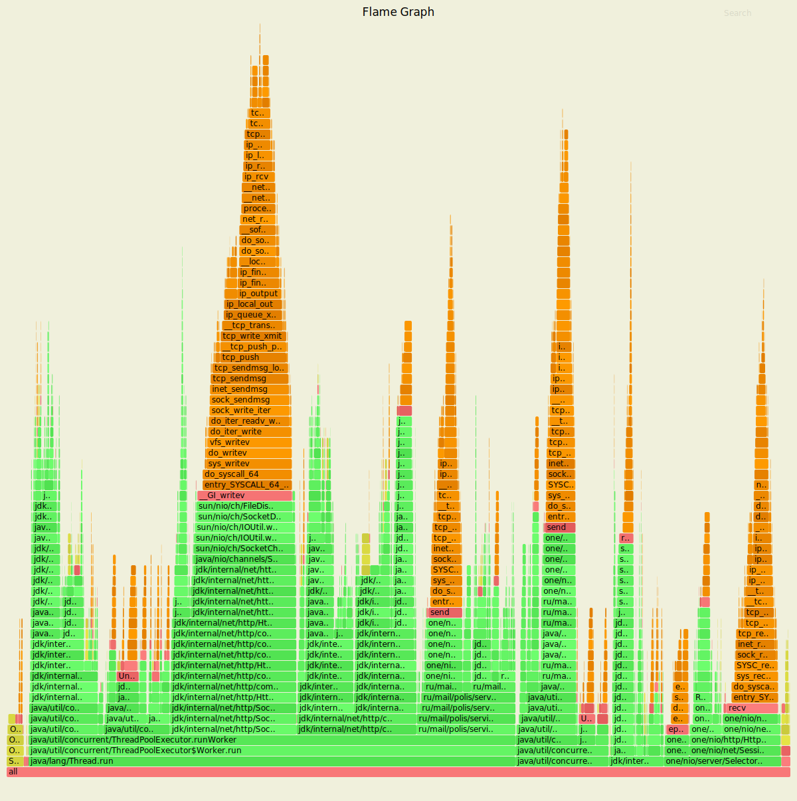
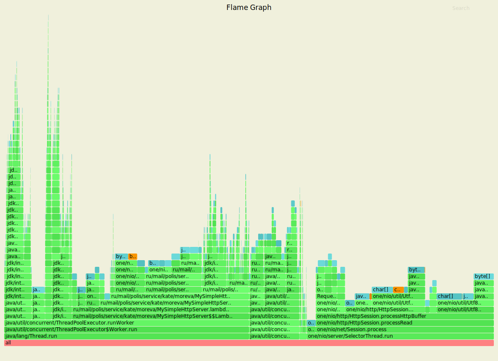
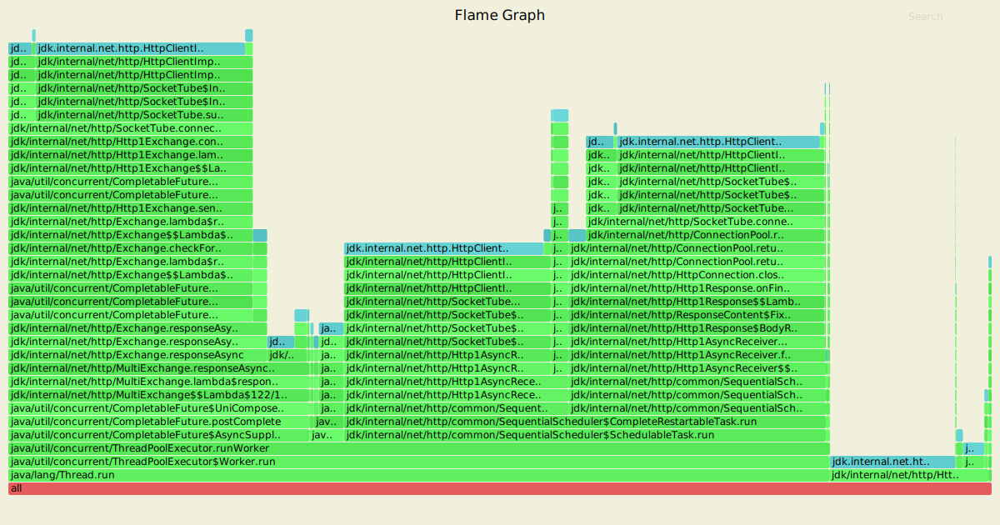
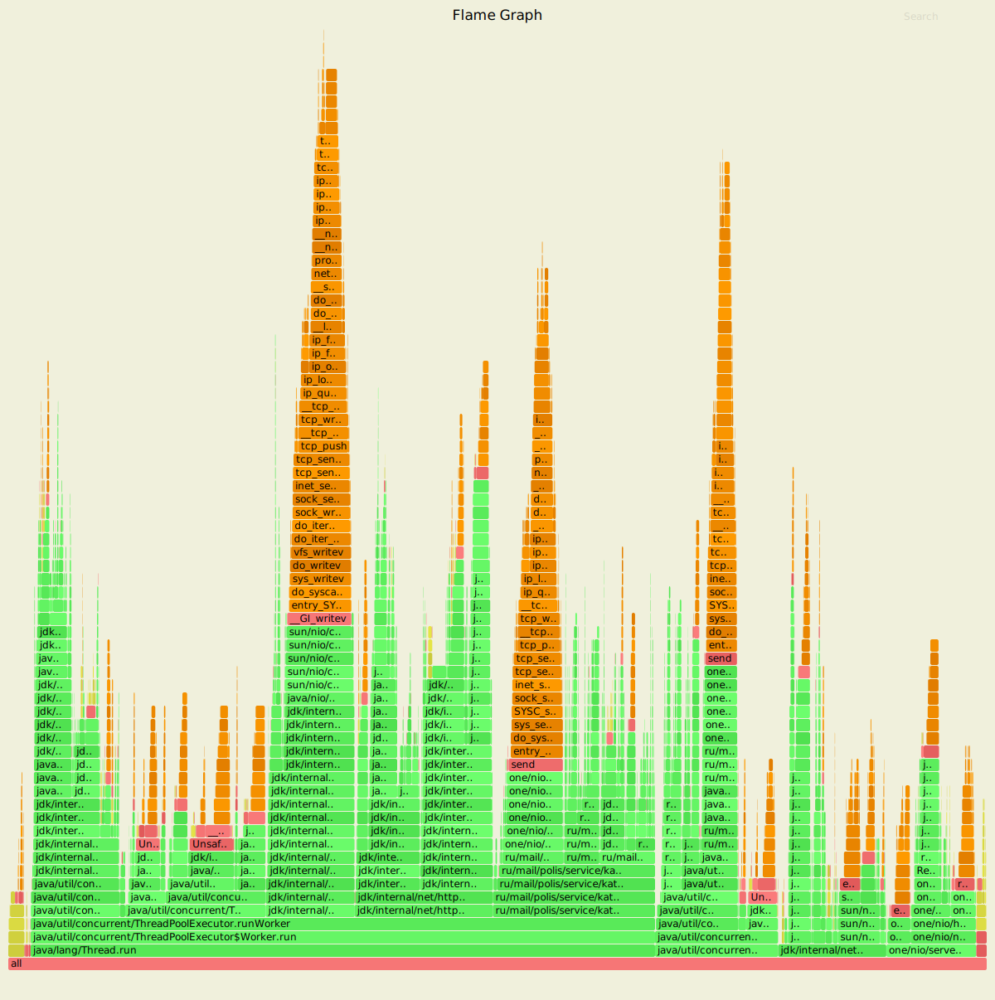
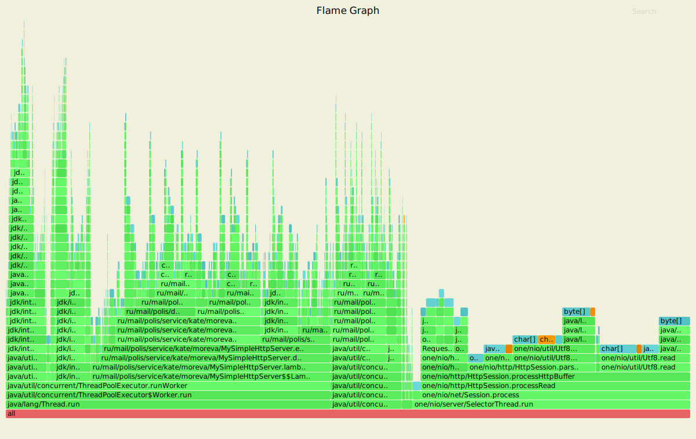
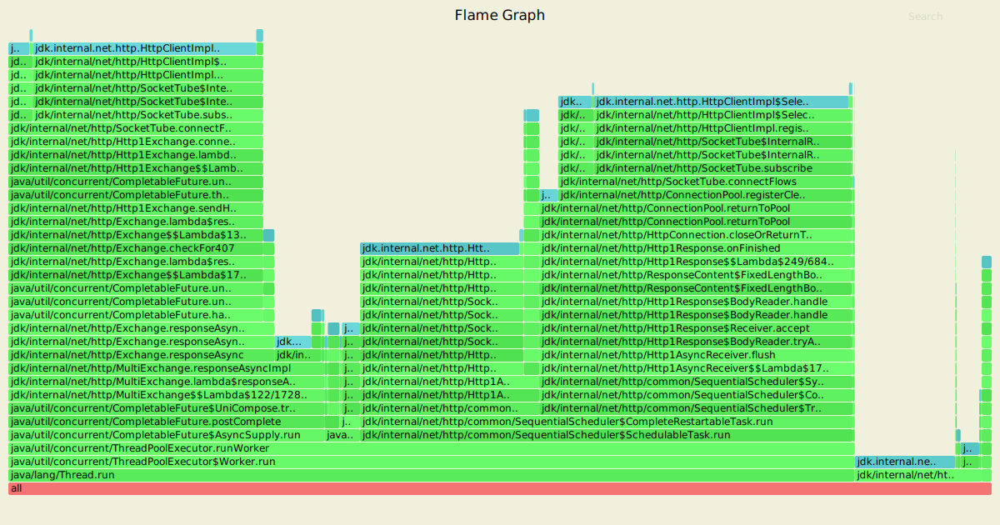

PUT запрсы

-t64 -c64 -d60s -R2000 -s ./wrk/put.lua --latency http://localhost:8080
Running 1m test @ http://localhost:8080
  64 threads and 64 connections
  Thread calibration: mean lat.: 1.549ms, rate sampling interval: 10ms
  Thread calibration: mean lat.: 1.589ms, rate sampling interval: 10ms
  Thread calibration: mean lat.: 1.368ms, rate sampling interval: 10ms
  Thread calibration: mean lat.: 1.449ms, rate sampling interval: 10ms
  Thread calibration: mean lat.: 1.361ms, rate sampling interval: 10ms
  Thread calibration: mean lat.: 1.333ms, rate sampling interval: 10ms
  Thread calibration: mean lat.: 1.388ms, rate sampling interval: 10ms
  Thread calibration: mean lat.: 1.379ms, rate sampling interval: 10ms
  Thread calibration: mean lat.: 1.360ms, rate sampling interval: 10ms
  Thread calibration: mean lat.: 1.322ms, rate sampling interval: 10ms
  Thread calibration: mean lat.: 1.426ms, rate sampling interval: 10ms
  Thread calibration: mean lat.: 1.416ms, rate sampling interval: 10ms
  Thread calibration: mean lat.: 1.423ms, rate sampling interval: 10ms
  Thread calibration: mean lat.: 1.364ms, rate sampling interval: 10ms
  Thread calibration: mean lat.: 1.396ms, rate sampling interval: 10ms
  Thread calibration: mean lat.: 1.322ms, rate sampling interval: 10ms
  Thread calibration: mean lat.: 1.374ms, rate sampling interval: 10ms
  Thread calibration: mean lat.: 1.360ms, rate sampling interval: 10ms
  Thread calibration: mean lat.: 1.369ms, rate sampling interval: 10ms
  Thread calibration: mean lat.: 1.410ms, rate sampling interval: 10ms
  Thread calibration: mean lat.: 1.428ms, rate sampling interval: 10ms
  Thread calibration: mean lat.: 1.386ms, rate sampling interval: 10ms
  Thread calibration: mean lat.: 1.452ms, rate sampling interval: 10ms
  Thread calibration: mean lat.: 1.524ms, rate sampling interval: 10ms
  Thread calibration: mean lat.: 1.641ms, rate sampling interval: 10ms
  Thread calibration: mean lat.: 1.649ms, rate sampling interval: 10ms
  Thread calibration: mean lat.: 1.637ms, rate sampling interval: 10ms
  Thread calibration: mean lat.: 1.444ms, rate sampling interval: 10ms
  Thread calibration: mean lat.: 1.354ms, rate sampling interval: 10ms
  Thread calibration: mean lat.: 1.427ms, rate sampling interval: 10ms
  Thread calibration: mean lat.: 1.498ms, rate sampling interval: 10ms
  Thread calibration: mean lat.: 1.477ms, rate sampling interval: 10ms
  Thread calibration: mean lat.: 1.582ms, rate sampling interval: 10ms
  Thread calibration: mean lat.: 1.611ms, rate sampling interval: 10ms
  Thread calibration: mean lat.: 1.635ms, rate sampling interval: 10ms
  Thread calibration: mean lat.: 1.529ms, rate sampling interval: 10ms
  Thread calibration: mean lat.: 1.609ms, rate sampling interval: 10ms
  Thread calibration: mean lat.: 1.566ms, rate sampling interval: 10ms
  Thread calibration: mean lat.: 1.808ms, rate sampling interval: 10ms
  Thread calibration: mean lat.: 1.630ms, rate sampling interval: 10ms
  Thread calibration: mean lat.: 2.183ms, rate sampling interval: 10ms
  Thread calibration: mean lat.: 2.033ms, rate sampling interval: 10ms
  Thread calibration: mean lat.: 2.184ms, rate sampling interval: 10ms
  Thread calibration: mean lat.: 2.193ms, rate sampling interval: 10ms
  Thread calibration: mean lat.: 2.120ms, rate sampling interval: 10ms
  Thread calibration: mean lat.: 2.194ms, rate sampling interval: 10ms
  Thread calibration: mean lat.: 2.220ms, rate sampling interval: 10ms
  Thread calibration: mean lat.: 2.190ms, rate sampling interval: 10ms
  Thread calibration: mean lat.: 2.069ms, rate sampling interval: 10ms
  Thread calibration: mean lat.: 2.078ms, rate sampling interval: 10ms
  Thread calibration: mean lat.: 1.949ms, rate sampling interval: 10ms
  Thread calibration: mean lat.: 1.880ms, rate sampling interval: 10ms
  Thread calibration: mean lat.: 1.708ms, rate sampling interval: 10ms
  Thread calibration: mean lat.: 1.580ms, rate sampling interval: 10ms
  Thread calibration: mean lat.: 1.491ms, rate sampling interval: 10ms
  Thread calibration: mean lat.: 1.501ms, rate sampling interval: 10ms
  Thread calibration: mean lat.: 1.454ms, rate sampling interval: 10ms
  Thread calibration: mean lat.: 1.520ms, rate sampling interval: 10ms
  Thread calibration: mean lat.: 1.472ms, rate sampling interval: 10ms
  Thread calibration: mean lat.: 1.474ms, rate sampling interval: 10ms
  Thread calibration: mean lat.: 1.538ms, rate sampling interval: 10ms
  Thread calibration: mean lat.: 1.645ms, rate sampling interval: 10ms
  Thread calibration: mean lat.: 1.501ms, rate sampling interval: 10ms
  Thread calibration: mean lat.: 1.724ms, rate sampling interval: 10ms
  Thread Stats   Avg      Stdev     Max   +/- Stdev
    Latency     1.83ms    0.89ms  17.30ms   88.28%
    Req/Sec    33.03     48.83   111.00     68.54%
  Latency Distribution (HdrHistogram - Recorded Latency)
 50.000%    1.70ms
 75.000%    2.05ms
 90.000%    2.54ms
 99.000%    5.45ms
 99.900%   10.94ms
 99.990%   15.59ms
 99.999%   16.62ms
100.000%   17.31ms

  Detailed Percentile spectrum:
       Value   Percentile   TotalCount 1/(1-Percentile)

       0.204     0.000000            1         1.00
       1.135     0.100000        10007         1.11
       1.310     0.200000        20005         1.25
       1.448     0.300000        30018         1.43
       1.576     0.400000        40063         1.67
       1.700     0.500000        50038         2.00
       1.763     0.550000        55028         2.22
       1.826     0.600000        60043         2.50
       1.895     0.650000        64998         2.86
       1.965     0.700000        69956         3.33
       2.046     0.750000        75004         4.00
       2.091     0.775000        77464         4.44
       2.143     0.800000        79993         5.00
       2.207     0.825000        82478         5.71
       2.287     0.850000        84980         6.67
       2.393     0.875000        87478         8.00
       2.461     0.887500        88698         8.89
       2.537     0.900000        89980        10.00
       2.621     0.912500        91210        11.43
       2.715     0.925000        92452        13.33
       2.833     0.937500        93687        16.00
       2.907     0.943750        94310        17.78
       2.991     0.950000        94935        20.00
       3.089     0.956250        95568        22.86
       3.203     0.962500        96194        26.67
       3.367     0.968750        96809        32.00
       3.473     0.971875        97127        35.56
       3.599     0.975000        97434        40.00
       3.769     0.978125        97750        45.71
       4.025     0.981250        98060        53.33
       4.379     0.984375        98370        64.00
       4.587     0.985938        98526        71.11
       4.855     0.987500        98683        80.00
       5.211     0.989062        98840        91.43
       5.619     0.990625        98996       106.67
       6.227     0.992188        99151       128.00
       6.595     0.992969        99229       142.22
       6.863     0.993750        99307       160.00
       7.183     0.994531        99386       182.86
       7.531     0.995313        99464       213.33
       7.919     0.996094        99541       256.00
       8.119     0.996484        99580       284.44
       8.343     0.996875        99620       320.00
       8.591     0.997266        99658       365.71
       8.951     0.997656        99698       426.67
       9.375     0.998047        99736       512.00
       9.639     0.998242        99756       568.89
       9.975     0.998437        99775       640.00
      10.255     0.998633        99797       731.43
      10.511     0.998828        99814       853.33
      10.999     0.999023        99834      1024.00
      11.119     0.999121        99844      1137.78
      11.343     0.999219        99853      1280.00
      11.495     0.999316        99863      1462.86
      11.887     0.999414        99873      1706.67
      12.247     0.999512        99883      2048.00
      12.471     0.999561        99888      2275.56
      12.711     0.999609        99892      2560.00
      12.999     0.999658        99897      2925.71
      13.247     0.999707        99902      3413.33
      13.807     0.999756        99907      4096.00
      14.047     0.999780        99910      4551.11
      14.111     0.999805        99912      5120.00
      14.335     0.999829        99914      5851.43
      14.591     0.999854        99917      6826.67
      15.223     0.999878        99919      8192.00
      15.591     0.999890        99921      9102.22
      15.607     0.999902        99922     10240.00
      15.639     0.999915        99923     11702.86
      15.663     0.999927        99924     13653.33
      15.783     0.999939        99925     16384.00
      15.815     0.999945        99926     18204.44
      15.919     0.999951        99927     20480.00
      15.919     0.999957        99927     23405.71
      16.095     0.999963        99928     27306.67
      16.095     0.999969        99928     32768.00
      16.199     0.999973        99929     36408.89
      16.199     0.999976        99929     40960.00
      16.199     0.999979        99929     46811.43
      16.623     0.999982        99930     54613.33
      16.623     0.999985        99930     65536.00
      16.623     0.999986        99930     72817.78
      16.623     0.999988        99930     81920.00
      16.623     0.999989        99930     93622.86
      17.311     0.999991        99931    109226.67
      17.311     1.000000        99931          inf
#[Mean    =        1.830, StdDeviation   =        0.886]
#[Max     =       17.296, Total count    =        99931]
#[Buckets =           27, SubBuckets     =         2048]
----------------------------------------------------------
  120027 requests in 1.00m, 7.67MB read
Requests/sec:   2001.50
Transfer/sec:    130.96KB

GET запросы

-t64 -c64 -d60s -R2000 -s ./wrk/get.lua --latency http://localhost:8080
Running 1m test @ http://localhost:8080
  64 threads and 64 connections
  Thread calibration: mean lat.: 1.747ms, rate sampling interval: 10ms
  Thread calibration: mean lat.: 1.692ms, rate sampling interval: 10ms
  Thread calibration: mean lat.: 1.697ms, rate sampling interval: 10ms
  Thread calibration: mean lat.: 1.562ms, rate sampling interval: 10ms
  Thread calibration: mean lat.: 1.620ms, rate sampling interval: 10ms
  Thread calibration: mean lat.: 1.721ms, rate sampling interval: 10ms
  Thread calibration: mean lat.: 1.852ms, rate sampling interval: 10ms
  Thread calibration: mean lat.: 1.907ms, rate sampling interval: 10ms
  Thread calibration: mean lat.: 1.876ms, rate sampling interval: 10ms
  Thread calibration: mean lat.: 1.759ms, rate sampling interval: 10ms
  Thread calibration: mean lat.: 1.825ms, rate sampling interval: 10ms
  Thread calibration: mean lat.: 1.694ms, rate sampling interval: 10ms
  Thread calibration: mean lat.: 1.611ms, rate sampling interval: 10ms
  Thread calibration: mean lat.: 1.690ms, rate sampling interval: 10ms
  Thread calibration: mean lat.: 1.819ms, rate sampling interval: 10ms
  Thread calibration: mean lat.: 1.625ms, rate sampling interval: 10ms
  Thread calibration: mean lat.: 1.776ms, rate sampling interval: 10ms
  Thread calibration: mean lat.: 1.408ms, rate sampling interval: 10ms
  Thread calibration: mean lat.: 1.461ms, rate sampling interval: 10ms
  Thread calibration: mean lat.: 1.409ms, rate sampling interval: 10ms
  Thread calibration: mean lat.: 1.453ms, rate sampling interval: 10ms
  Thread calibration: mean lat.: 1.505ms, rate sampling interval: 10ms
  Thread calibration: mean lat.: 1.488ms, rate sampling interval: 10ms
  Thread calibration: mean lat.: 1.586ms, rate sampling interval: 10ms
  Thread calibration: mean lat.: 1.595ms, rate sampling interval: 10ms
  Thread calibration: mean lat.: 1.595ms, rate sampling interval: 10ms
  Thread calibration: mean lat.: 1.437ms, rate sampling interval: 10ms
  Thread calibration: mean lat.: 1.499ms, rate sampling interval: 10ms
  Thread calibration: mean lat.: 1.420ms, rate sampling interval: 10ms
  Thread calibration: mean lat.: 1.511ms, rate sampling interval: 10ms
  Thread calibration: mean lat.: 1.582ms, rate sampling interval: 10ms
  Thread calibration: mean lat.: 1.596ms, rate sampling interval: 10ms
  Thread calibration: mean lat.: 1.427ms, rate sampling interval: 10ms
  Thread calibration: mean lat.: 1.495ms, rate sampling interval: 10ms
  Thread calibration: mean lat.: 1.521ms, rate sampling interval: 10ms
  Thread calibration: mean lat.: 1.560ms, rate sampling interval: 10ms
  Thread calibration: mean lat.: 1.442ms, rate sampling interval: 10ms
  Thread calibration: mean lat.: 1.537ms, rate sampling interval: 10ms
  Thread calibration: mean lat.: 1.555ms, rate sampling interval: 10ms
  Thread calibration: mean lat.: 1.465ms, rate sampling interval: 10ms
  Thread calibration: mean lat.: 1.517ms, rate sampling interval: 10ms
  Thread calibration: mean lat.: 1.604ms, rate sampling interval: 10ms
  Thread calibration: mean lat.: 1.511ms, rate sampling interval: 10ms
  Thread calibration: mean lat.: 1.448ms, rate sampling interval: 10ms
  Thread calibration: mean lat.: 1.574ms, rate sampling interval: 10ms
  Thread calibration: mean lat.: 1.604ms, rate sampling interval: 10ms
  Thread calibration: mean lat.: 1.567ms, rate sampling interval: 10ms
  Thread calibration: mean lat.: 1.485ms, rate sampling interval: 10ms
  Thread calibration: mean lat.: 1.614ms, rate sampling interval: 10ms
  Thread calibration: mean lat.: 1.633ms, rate sampling interval: 10ms
  Thread calibration: mean lat.: 1.730ms, rate sampling interval: 10ms
  Thread calibration: mean lat.: 1.622ms, rate sampling interval: 10ms
  Thread calibration: mean lat.: 1.857ms, rate sampling interval: 10ms
  Thread calibration: mean lat.: 1.735ms, rate sampling interval: 10ms
  Thread calibration: mean lat.: 1.754ms, rate sampling interval: 10ms
  Thread calibration: mean lat.: 1.878ms, rate sampling interval: 10ms
  Thread calibration: mean lat.: 1.862ms, rate sampling interval: 10ms
  Thread calibration: mean lat.: 1.904ms, rate sampling interval: 10ms
  Thread calibration: mean lat.: 1.699ms, rate sampling interval: 10ms
  Thread calibration: mean lat.: 1.790ms, rate sampling interval: 10ms
  Thread calibration: mean lat.: 1.767ms, rate sampling interval: 10ms
  Thread calibration: mean lat.: 1.799ms, rate sampling interval: 10ms
  Thread calibration: mean lat.: 1.586ms, rate sampling interval: 10ms
  Thread calibration: mean lat.: 1.676ms, rate sampling interval: 10ms
  Thread Stats   Avg      Stdev     Max   +/- Stdev
    Latency     1.77ms    0.91ms  18.94ms   94.81%
    Req/Sec    33.06     48.89   111.00     68.53%
  Latency Distribution (HdrHistogram - Recorded Latency)
 50.000%    1.66ms
 75.000%    1.96ms
 90.000%    2.23ms
 99.000%    5.76ms
 99.900%   13.20ms
 99.990%   16.75ms
 99.999%   18.69ms
100.000%   18.96ms

  Detailed Percentile spectrum:
       Value   Percentile   TotalCount 1/(1-Percentile)

       0.191     0.000000            1         1.00
       1.152     0.100000         9995         1.11
       1.315     0.200000        19984         1.25
       1.443     0.300000        30014         1.43
       1.557     0.400000        40054         1.67
       1.664     0.500000        50038         2.00
       1.718     0.550000        54953         2.22
       1.776     0.600000        60006         2.50
       1.834     0.650000        65037         2.86
       1.894     0.700000        70010         3.33
       1.957     0.750000        74979         4.00
       1.992     0.775000        77499         4.44
       2.028     0.800000        79972         5.00
       2.067     0.825000        82488         5.71
       2.113     0.850000        85025         6.67
       2.167     0.875000        87515         8.00
       2.195     0.887500        88677         8.89
       2.231     0.900000        89922        10.00
       2.275     0.912500        91197        11.43
       2.325     0.925000        92436        13.33
       2.391     0.937500        93673        16.00
       2.435     0.943750        94301        17.78
       2.489     0.950000        94918        20.00
       2.555     0.956250        95552        22.86
       2.651     0.962500        96181        26.67
       2.793     0.968750        96797        32.00
       2.899     0.971875        97102        35.56
       3.059     0.975000        97421        40.00
       3.315     0.978125        97727        45.71
       3.729     0.981250        98041        53.33
       4.263     0.984375        98351        64.00
       4.623     0.985938        98507        71.11
       5.039     0.987500        98665        80.00
       5.487     0.989062        98820        91.43
       5.955     0.990625        98976       106.67
       6.539     0.992188        99133       128.00
       6.859     0.992969        99210       142.22
       7.243     0.993750        99288       160.00
       7.659     0.994531        99366       182.86
       8.139     0.995313        99444       213.33
       8.679     0.996094        99522       256.00
       8.959     0.996484        99562       284.44
       9.415     0.996875        99600       320.00
       9.927     0.997266        99640       365.71
      10.607     0.997656        99678       426.67
      11.175     0.998047        99717       512.00
      11.551     0.998242        99737       568.89
      11.983     0.998437        99756       640.00
      12.375     0.998633        99776       731.43
      12.751     0.998828        99795       853.33
      13.255     0.999023        99815      1024.00
      13.439     0.999121        99825      1137.78
      13.695     0.999219        99834      1280.00
      14.079     0.999316        99844      1462.86
      14.511     0.999414        99854      1706.67
      14.799     0.999512        99864      2048.00
      14.903     0.999561        99869      2275.56
      15.039     0.999609        99873      2560.00
      15.319     0.999658        99878      2925.71
      15.575     0.999707        99883      3413.33
      15.775     0.999756        99888      4096.00
      15.887     0.999780        99891      4551.11
      16.031     0.999805        99893      5120.00
      16.135     0.999829        99895      5851.43
      16.359     0.999854        99898      6826.67
      16.447     0.999878        99900      8192.00
      16.751     0.999890        99902      9102.22
      16.847     0.999902        99903     10240.00
      17.087     0.999915        99904     11702.86
      17.199     0.999927        99905     13653.33
      17.471     0.999939        99906     16384.00
      17.631     0.999945        99907     18204.44
      17.711     0.999951        99908     20480.00
      17.711     0.999957        99908     23405.71
      17.727     0.999963        99909     27306.67
      17.727     0.999969        99909     32768.00
      18.063     0.999973        99910     36408.89
      18.063     0.999976        99910     40960.00
      18.063     0.999979        99910     46811.43
      18.687     0.999982        99911     54613.33
      18.687     0.999985        99911     65536.00
      18.687     0.999986        99911     72817.78
      18.687     0.999988        99911     81920.00
      18.687     0.999989        99911     93622.86
      18.959     0.999991        99912    109226.67
      18.959     1.000000        99912          inf
#[Mean    =        1.769, StdDeviation   =        0.914]
#[Max     =       18.944, Total count    =        99912]
#[Buckets =           27, SubBuckets     =         2048]
----------------------------------------------------------
  120008 requests in 1.00m, 8.06MB read
Requests/sec:   2002.26
Transfer/sec:    137.67KB
 
