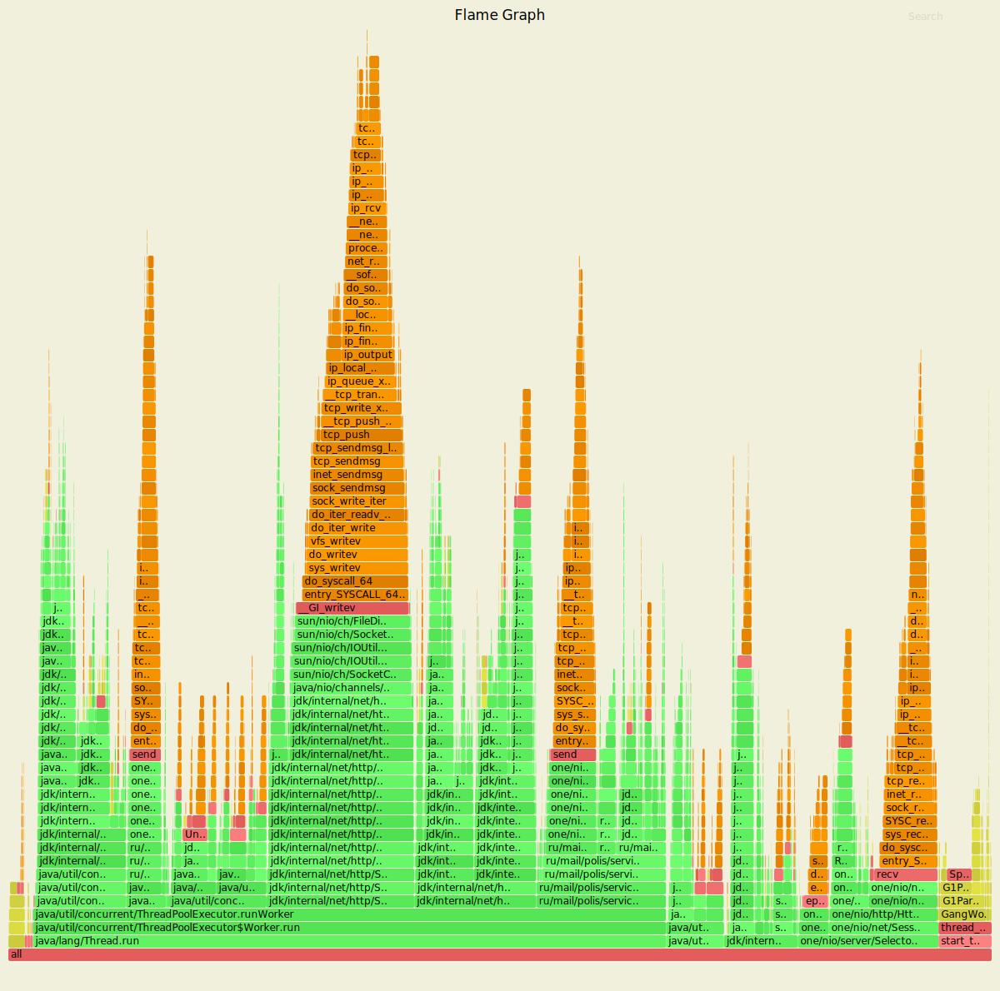
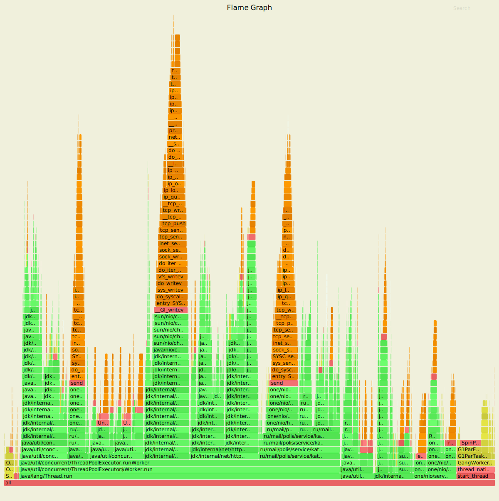
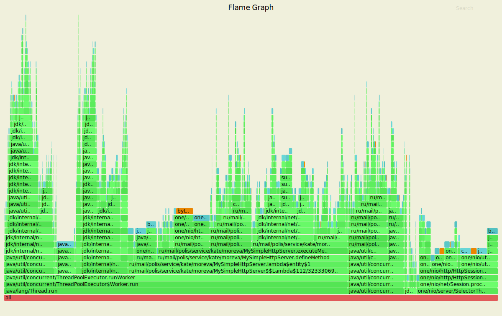
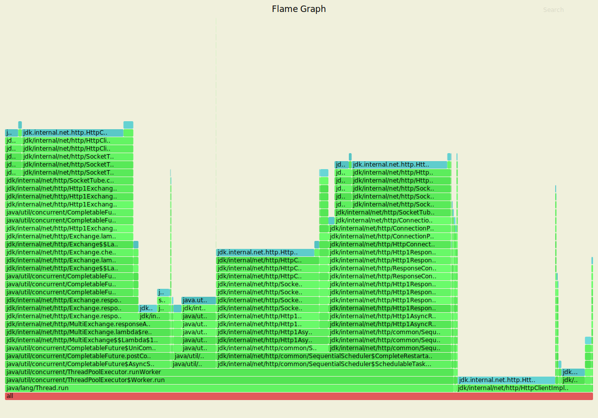

PUT запросы

-t64 -c64 -d60s -R2000 -s ./wrk/put.lua --latency http://localhost:8080

CPU

Running 1m test @ http://localhost:8080
  64 threads and 64 connections
  Thread calibration: mean lat.: 9.425ms, rate sampling interval: 12ms
  Thread calibration: mean lat.: 9.626ms, rate sampling interval: 11ms
  Thread calibration: mean lat.: 9.625ms, rate sampling interval: 14ms
  Thread calibration: mean lat.: 9.362ms, rate sampling interval: 14ms
  Thread calibration: mean lat.: 10.843ms, rate sampling interval: 16ms
  Thread calibration: mean lat.: 9.590ms, rate sampling interval: 12ms
  Thread calibration: mean lat.: 10.865ms, rate sampling interval: 16ms
  Thread calibration: mean lat.: 11.145ms, rate sampling interval: 16ms
  Thread calibration: mean lat.: 10.753ms, rate sampling interval: 15ms
  Thread calibration: mean lat.: 10.049ms, rate sampling interval: 15ms
  Thread calibration: mean lat.: 10.969ms, rate sampling interval: 16ms
  Thread calibration: mean lat.: 10.792ms, rate sampling interval: 15ms
  Thread calibration: mean lat.: 10.563ms, rate sampling interval: 15ms
  Thread calibration: mean lat.: 10.957ms, rate sampling interval: 16ms
  Thread calibration: mean lat.: 10.174ms, rate sampling interval: 13ms
  Thread calibration: mean lat.: 10.781ms, rate sampling interval: 14ms
  Thread calibration: mean lat.: 10.463ms, rate sampling interval: 15ms
  Thread calibration: mean lat.: 9.983ms, rate sampling interval: 13ms
  Thread calibration: mean lat.: 10.648ms, rate sampling interval: 15ms
  Thread calibration: mean lat.: 10.119ms, rate sampling interval: 15ms
  Thread calibration: mean lat.: 10.027ms, rate sampling interval: 13ms
  Thread calibration: mean lat.: 9.176ms, rate sampling interval: 11ms
  Thread calibration: mean lat.: 10.467ms, rate sampling interval: 16ms
  Thread calibration: mean lat.: 8.805ms, rate sampling interval: 11ms
  Thread calibration: mean lat.: 9.736ms, rate sampling interval: 12ms
  Thread calibration: mean lat.: 10.684ms, rate sampling interval: 15ms
  Thread calibration: mean lat.: 9.967ms, rate sampling interval: 13ms
  Thread calibration: mean lat.: 10.661ms, rate sampling interval: 15ms
  Thread calibration: mean lat.: 10.716ms, rate sampling interval: 15ms
  Thread calibration: mean lat.: 10.262ms, rate sampling interval: 14ms
  Thread calibration: mean lat.: 6.759ms, rate sampling interval: 10ms
  Thread calibration: mean lat.: 6.223ms, rate sampling interval: 10ms
  Thread calibration: mean lat.: 6.415ms, rate sampling interval: 10ms
  Thread calibration: mean lat.: 5.786ms, rate sampling interval: 10ms
  Thread calibration: mean lat.: 6.471ms, rate sampling interval: 10ms
  Thread calibration: mean lat.: 6.136ms, rate sampling interval: 10ms
  Thread calibration: mean lat.: 5.700ms, rate sampling interval: 10ms
  Thread calibration: mean lat.: 5.772ms, rate sampling interval: 10ms
  Thread calibration: mean lat.: 6.317ms, rate sampling interval: 10ms
  Thread calibration: mean lat.: 6.099ms, rate sampling interval: 10ms
  Thread calibration: mean lat.: 6.425ms, rate sampling interval: 10ms
  Thread calibration: mean lat.: 6.086ms, rate sampling interval: 10ms
  Thread calibration: mean lat.: 5.973ms, rate sampling interval: 10ms
  Thread calibration: mean lat.: 5.986ms, rate sampling interval: 10ms
  Thread calibration: mean lat.: 5.670ms, rate sampling interval: 10ms
  Thread calibration: mean lat.: 5.897ms, rate sampling interval: 10ms
  Thread calibration: mean lat.: 5.595ms, rate sampling interval: 10ms
  Thread calibration: mean lat.: 6.290ms, rate sampling interval: 10ms
  Thread calibration: mean lat.: 6.214ms, rate sampling interval: 10ms
  Thread calibration: mean lat.: 6.186ms, rate sampling interval: 10ms
  Thread calibration: mean lat.: 6.501ms, rate sampling interval: 10ms
  Thread calibration: mean lat.: 6.212ms, rate sampling interval: 10ms
  Thread calibration: mean lat.: 6.653ms, rate sampling interval: 10ms
  Thread calibration: mean lat.: 6.313ms, rate sampling interval: 10ms
  Thread calibration: mean lat.: 6.606ms, rate sampling interval: 10ms
  Thread calibration: mean lat.: 5.958ms, rate sampling interval: 10ms
  Thread calibration: mean lat.: 6.234ms, rate sampling interval: 10ms
  Thread calibration: mean lat.: 6.156ms, rate sampling interval: 10ms
  Thread calibration: mean lat.: 6.553ms, rate sampling interval: 10ms
  Thread calibration: mean lat.: 6.296ms, rate sampling interval: 10ms
  Thread calibration: mean lat.: 6.438ms, rate sampling interval: 10ms
  Thread calibration: mean lat.: 6.185ms, rate sampling interval: 10ms
  Thread calibration: mean lat.: 6.170ms, rate sampling interval: 10ms
  Thread calibration: mean lat.: 6.667ms, rate sampling interval: 10ms
  Thread Stats   Avg      Stdev     Max   +/- Stdev
    Latency     2.86ms    1.53ms  18.22ms   78.44%
    Req/Sec    32.47     44.22   111.00     76.40%
  Latency Distribution (HdrHistogram - Recorded Latency)
 50.000%    2.42ms
 75.000%    3.73ms
 90.000%    4.65ms
 99.000%    8.26ms
 99.900%   13.84ms
 99.990%   17.06ms
 99.999%   17.95ms
100.000%   18.24ms

  Detailed Percentile spectrum:
       Value   Percentile   TotalCount 1/(1-Percentile)

       0.186     0.000000            1         1.00
       1.388     0.100000        10008         1.11
       1.682     0.200000        19989         1.25
       1.917     0.300000        30017         1.43
       2.135     0.400000        40010         1.67
       2.425     0.500000        50016         2.00
       2.629     0.550000        54993         2.22
       2.893     0.600000        59995         2.50
       3.189     0.650000        64981         2.86
       3.473     0.700000        69979         3.33
       3.735     0.750000        74962         4.00
       3.867     0.775000        77469         4.44
       3.999     0.800000        79968         5.00
       4.143     0.825000        82503         5.71
       4.287     0.850000        84976         6.67
       4.455     0.875000        87479         8.00
       4.547     0.887500        88734         8.89
       4.647     0.900000        89955        10.00
       4.759     0.912500        91199        11.43
       4.887     0.925000        92468        13.33
       5.043     0.937500        93704        16.00
       5.139     0.943750        94315        17.78
       5.251     0.950000        94950        20.00
       5.387     0.956250        95568        22.86
       5.563     0.962500        96197        26.67
       5.807     0.968750        96814        32.00
       5.971     0.971875        97124        35.56
       6.191     0.975000        97437        40.00
       6.471     0.978125        97754        45.71
       6.843     0.981250        98064        53.33
       7.299     0.984375        98374        64.00
       7.575     0.985938        98530        71.11
       7.819     0.987500        98686        80.00
       8.075     0.989062        98842        91.43
       8.399     0.990625        99000       106.67
       8.895     0.992188        99155       128.00
       9.151     0.992969        99233       142.22
       9.471     0.993750        99310       160.00
       9.727     0.994531        99388       182.86
      10.183     0.995313        99466       213.33
      10.719     0.996094        99544       256.00
      10.991     0.996484        99585       284.44
      11.303     0.996875        99622       320.00
      11.695     0.997266        99661       365.71
      12.039     0.997656        99700       426.67
      12.615     0.998047        99740       512.00
      12.767     0.998242        99761       568.89
      12.991     0.998437        99779       640.00
      13.287     0.998633        99798       731.43
      13.583     0.998828        99817       853.33
      13.855     0.999023        99837      1024.00
      14.047     0.999121        99847      1137.78
      14.503     0.999219        99856      1280.00
      14.903     0.999316        99867      1462.86
      15.303     0.999414        99876      1706.67
      15.711     0.999512        99886      2048.00
      15.815     0.999561        99891      2275.56
      15.911     0.999609        99895      2560.00
      16.023     0.999658        99900      2925.71
      16.111     0.999707        99906      3413.33
      16.167     0.999756        99910      4096.00
      16.207     0.999780        99913      4551.11
      16.287     0.999805        99915      5120.00
      16.335     0.999829        99917      5851.43
      16.495     0.999854        99920      6826.67
      16.607     0.999878        99922      8192.00
      17.055     0.999890        99924      9102.22
      17.295     0.999902        99925     10240.00
      17.407     0.999915        99926     11702.86
      17.471     0.999927        99927     13653.33
      17.647     0.999939        99928     16384.00
      17.679     0.999945        99929     18204.44
      17.695     0.999951        99930     20480.00
      17.695     0.999957        99930     23405.71
      17.759     0.999963        99931     27306.67
      17.759     0.999969        99931     32768.00
      17.855     0.999973        99932     36408.89
      17.855     0.999976        99932     40960.00
      17.855     0.999979        99932     46811.43
      17.951     0.999982        99933     54613.33
      17.951     0.999985        99933     65536.00
      17.951     0.999986        99933     72817.78
      17.951     0.999988        99933     81920.00
      17.951     0.999989        99933     93622.86
      18.239     0.999991        99934    109226.67
      18.239     1.000000        99934          inf
[Mean    =        2.860, StdDeviation   =        1.533]
[Max     =       18.224, Total count    =        99934]
[Buckets =           27, SubBuckets     =         2048]
----------------------------------------------------------
  120030 requests in 1.00m, 7.67MB read
Requests/sec:   2001.29
Transfer/sec:    130.94KB

Отправка ответа 3.47%
replication 5.04%
DAO.upsert 1.71%

Alloc

Running 1m test @ http://localhost:8080
  64 threads and 64 connections
  Thread calibration: mean lat.: 4.302ms, rate sampling interval: 14ms
  Thread calibration: mean lat.: 5.306ms, rate sampling interval: 16ms
  Thread calibration: mean lat.: 3.529ms, rate sampling interval: 12ms
  Thread calibration: mean lat.: 4.832ms, rate sampling interval: 15ms
  Thread calibration: mean lat.: 6.187ms, rate sampling interval: 17ms
  Thread calibration: mean lat.: 6.520ms, rate sampling interval: 17ms
  Thread calibration: mean lat.: 7.049ms, rate sampling interval: 18ms
  Thread calibration: mean lat.: 6.637ms, rate sampling interval: 18ms
  Thread calibration: mean lat.: 7.302ms, rate sampling interval: 18ms
  Thread calibration: mean lat.: 7.517ms, rate sampling interval: 18ms
  Thread calibration: mean lat.: 7.459ms, rate sampling interval: 18ms
  Thread calibration: mean lat.: 7.318ms, rate sampling interval: 18ms
  Thread calibration: mean lat.: 6.919ms, rate sampling interval: 18ms
  Thread calibration: mean lat.: 7.520ms, rate sampling interval: 18ms
  Thread calibration: mean lat.: 7.270ms, rate sampling interval: 17ms
  Thread calibration: mean lat.: 7.607ms, rate sampling interval: 18ms
  Thread calibration: mean lat.: 5.460ms, rate sampling interval: 15ms
  Thread calibration: mean lat.: 7.337ms, rate sampling interval: 18ms
  Thread calibration: mean lat.: 7.379ms, rate sampling interval: 17ms
  Thread calibration: mean lat.: 7.604ms, rate sampling interval: 18ms
  Thread calibration: mean lat.: 7.388ms, rate sampling interval: 17ms
  Thread calibration: mean lat.: 7.423ms, rate sampling interval: 17ms
  Thread calibration: mean lat.: 7.589ms, rate sampling interval: 19ms
  Thread calibration: mean lat.: 7.047ms, rate sampling interval: 16ms
  Thread calibration: mean lat.: 7.114ms, rate sampling interval: 17ms
  Thread calibration: mean lat.: 6.939ms, rate sampling interval: 16ms
  Thread calibration: mean lat.: 7.504ms, rate sampling interval: 17ms
  Thread calibration: mean lat.: 7.244ms, rate sampling interval: 17ms
  Thread calibration: mean lat.: 7.429ms, rate sampling interval: 18ms
  Thread calibration: mean lat.: 7.307ms, rate sampling interval: 17ms
  Thread calibration: mean lat.: 2.008ms, rate sampling interval: 10ms
  Thread calibration: mean lat.: 1.702ms, rate sampling interval: 10ms
  Thread calibration: mean lat.: 1.849ms, rate sampling interval: 10ms
  Thread calibration: mean lat.: 1.637ms, rate sampling interval: 10ms
  Thread calibration: mean lat.: 1.639ms, rate sampling interval: 10ms
  Thread calibration: mean lat.: 1.678ms, rate sampling interval: 10ms
  Thread calibration: mean lat.: 2.701ms, rate sampling interval: 10ms
  Thread calibration: mean lat.: 4.226ms, rate sampling interval: 14ms
  Thread calibration: mean lat.: 5.370ms, rate sampling interval: 16ms
  Thread calibration: mean lat.: 6.815ms, rate sampling interval: 17ms
  Thread calibration: mean lat.: 7.372ms, rate sampling interval: 18ms
  Thread calibration: mean lat.: 7.608ms, rate sampling interval: 18ms
  Thread calibration: mean lat.: 7.438ms, rate sampling interval: 17ms
  Thread calibration: mean lat.: 7.599ms, rate sampling interval: 18ms
  Thread calibration: mean lat.: 7.330ms, rate sampling interval: 18ms
  Thread calibration: mean lat.: 7.271ms, rate sampling interval: 17ms
  Thread calibration: mean lat.: 6.723ms, rate sampling interval: 16ms
  Thread calibration: mean lat.: 6.862ms, rate sampling interval: 16ms
  Thread calibration: mean lat.: 6.276ms, rate sampling interval: 15ms
  Thread calibration: mean lat.: 6.625ms, rate sampling interval: 15ms
  Thread calibration: mean lat.: 6.005ms, rate sampling interval: 14ms
  Thread calibration: mean lat.: 5.886ms, rate sampling interval: 14ms
  Thread calibration: mean lat.: 6.457ms, rate sampling interval: 15ms
  Thread calibration: mean lat.: 6.369ms, rate sampling interval: 15ms
  Thread calibration: mean lat.: 6.119ms, rate sampling interval: 14ms
  Thread calibration: mean lat.: 5.649ms, rate sampling interval: 13ms
  Thread calibration: mean lat.: 6.124ms, rate sampling interval: 14ms
  Thread calibration: mean lat.: 5.721ms, rate sampling interval: 13ms
  Thread calibration: mean lat.: 7.013ms, rate sampling interval: 16ms
  Thread calibration: mean lat.: 5.789ms, rate sampling interval: 14ms
  Thread calibration: mean lat.: 6.564ms, rate sampling interval: 15ms
  Thread calibration: mean lat.: 5.561ms, rate sampling interval: 13ms
  Thread calibration: mean lat.: 4.026ms, rate sampling interval: 13ms
  Thread calibration: mean lat.: 5.521ms, rate sampling interval: 16ms
  Thread Stats   Avg      Stdev     Max   +/- Stdev
    Latency     6.52ms    2.65ms  22.46ms   75.54%
    Req/Sec    32.04     35.27   133.00     84.00%
  Latency Distribution (HdrHistogram - Recorded Latency)
 50.000%    6.69ms
 75.000%    7.82ms
 90.000%    9.00ms
 99.000%   14.71ms
 99.900%   18.98ms
 99.990%   21.39ms
 99.999%   22.43ms
100.000%   22.48ms

  Detailed Percentile spectrum:
       Value   Percentile   TotalCount 1/(1-Percentile)

       0.239     0.000000            1         1.00
       2.313     0.100000        10011         1.11
       4.871     0.200000        20002         1.25
       5.715     0.300000        30034         1.43
       6.239     0.400000        40041         1.67
       6.691     0.500000        49971         2.00
       6.911     0.550000        55006         2.22
       7.127     0.600000        60001         2.50
       7.343     0.650000        64967         2.86
       7.571     0.700000        69985         3.33
       7.819     0.750000        75000         4.00
       7.955     0.775000        77507         4.44
       8.103     0.800000        79975         5.00
       8.271     0.825000        82559         5.71
       8.463     0.850000        84990         6.67
       8.695     0.875000        87478         8.00
       8.831     0.887500        88732         8.89
       8.999     0.900000        89984        10.00
       9.207     0.912500        91207        11.43
       9.495     0.925000        92451        13.33
       9.935     0.937500        93702        16.00
      10.223     0.943750        94315        17.78
      10.623     0.950000        94943        20.00
      11.119     0.956250        95563        22.86
      11.695     0.962500        96190        26.67
      12.319     0.968750        96814        32.00
      12.647     0.971875        97129        35.56
      12.943     0.975000        97437        40.00
      13.247     0.978125        97751        45.71
      13.575     0.981250        98064        53.33
      13.911     0.984375        98382        64.00
      14.103     0.985938        98534        71.11
      14.311     0.987500        98690        80.00
      14.559     0.989062        98846        91.43
      14.839     0.990625        99001       106.67
      15.223     0.992188        99164       128.00
      15.415     0.992969        99233       142.22
      15.663     0.993750        99313       160.00
      15.959     0.994531        99391       182.86
      16.191     0.995313        99468       213.33
      16.479     0.996094        99547       256.00
      16.655     0.996484        99585       284.44
      16.863     0.996875        99623       320.00
      17.135     0.997266        99662       365.71
      17.487     0.997656        99704       426.67
      17.823     0.998047        99740       512.00
      17.887     0.998242        99760       568.89
      18.095     0.998437        99779       640.00
      18.303     0.998633        99799       731.43
      18.575     0.998828        99819       853.33
      18.991     0.999023        99838      1024.00
      19.199     0.999121        99848      1137.78
      19.359     0.999219        99857      1280.00
      19.551     0.999316        99870      1462.86
      19.727     0.999414        99877      1706.67
      19.951     0.999512        99887      2048.00
      20.095     0.999561        99892      2275.56
      20.223     0.999609        99896      2560.00
      20.415     0.999658        99901      2925.71
      20.655     0.999707        99906      3413.33
      20.847     0.999756        99911      4096.00
      20.959     0.999780        99914      4551.11
      21.007     0.999805        99916      5120.00
      21.087     0.999829        99918      5851.43
      21.247     0.999854        99922      6826.67
      21.327     0.999878        99923      8192.00
      21.391     0.999890        99925      9102.22
      21.439     0.999902        99926     10240.00
      21.551     0.999915        99927     11702.86
      21.759     0.999927        99929     13653.33
      21.759     0.999939        99929     16384.00
      21.775     0.999945        99930     18204.44
      21.935     0.999951        99931     20480.00
      21.935     0.999957        99931     23405.71
      22.095     0.999963        99932     27306.67
      22.095     0.999969        99932     32768.00
      22.271     0.999973        99933     36408.89
      22.271     0.999976        99933     40960.00
      22.271     0.999979        99933     46811.43
      22.431     0.999982        99934     54613.33
      22.431     0.999985        99934     65536.00
      22.431     0.999986        99934     72817.78
      22.431     0.999988        99934     81920.00
      22.431     0.999989        99934     93622.86
      22.479     0.999991        99935    109226.67
      22.479     1.000000        99935          inf
[Mean    =        6.518, StdDeviation   =        2.650]
[Max     =       22.464, Total count    =        99935]
[Buckets =           27, SubBuckets     =         2048]
----------------------------------------------------------
  120019 requests in 1.00m, 7.67MB read
Requests/sec:   2001.41
Transfer/sec:    130.95KB

Работа селекторов 37.6%
Отправка ответа 5.28%
DAO.upsert 6.83%

Lock

Running 1m test @ http://localhost:8080
  64 threads and 64 connections
  Thread calibration: mean lat.: 3.725ms, rate sampling interval: 13ms
  Thread calibration: mean lat.: 3.297ms, rate sampling interval: 10ms
  Thread calibration: mean lat.: 4.747ms, rate sampling interval: 16ms
  Thread calibration: mean lat.: 5.653ms, rate sampling interval: 18ms
  Thread calibration: mean lat.: 4.029ms, rate sampling interval: 14ms
  Thread calibration: mean lat.: 5.970ms, rate sampling interval: 18ms
  Thread calibration: mean lat.: 5.721ms, rate sampling interval: 17ms
  Thread calibration: mean lat.: 5.055ms, rate sampling interval: 16ms
  Thread calibration: mean lat.: 7.070ms, rate sampling interval: 19ms
  Thread calibration: mean lat.: 6.136ms, rate sampling interval: 18ms
  Thread calibration: mean lat.: 7.478ms, rate sampling interval: 20ms
  Thread calibration: mean lat.: 7.738ms, rate sampling interval: 20ms
  Thread calibration: mean lat.: 7.969ms, rate sampling interval: 20ms
  Thread calibration: mean lat.: 7.371ms, rate sampling interval: 20ms
  Thread calibration: mean lat.: 7.991ms, rate sampling interval: 20ms
  Thread calibration: mean lat.: 7.904ms, rate sampling interval: 20ms
  Thread calibration: mean lat.: 7.965ms, rate sampling interval: 20ms
  Thread calibration: mean lat.: 7.827ms, rate sampling interval: 20ms
  Thread calibration: mean lat.: 7.904ms, rate sampling interval: 20ms
  Thread calibration: mean lat.: 7.939ms, rate sampling interval: 20ms
  Thread calibration: mean lat.: 7.997ms, rate sampling interval: 21ms
  Thread calibration: mean lat.: 7.849ms, rate sampling interval: 19ms
  Thread calibration: mean lat.: 7.807ms, rate sampling interval: 19ms
  Thread calibration: mean lat.: 7.872ms, rate sampling interval: 20ms
  Thread calibration: mean lat.: 7.738ms, rate sampling interval: 19ms
  Thread calibration: mean lat.: 7.006ms, rate sampling interval: 18ms
  Thread calibration: mean lat.: 7.711ms, rate sampling interval: 19ms
  Thread calibration: mean lat.: 7.929ms, rate sampling interval: 20ms
  Thread calibration: mean lat.: 7.621ms, rate sampling interval: 20ms
  Thread calibration: mean lat.: 7.923ms, rate sampling interval: 20ms
  Thread calibration: mean lat.: 1.944ms, rate sampling interval: 10ms
  Thread calibration: mean lat.: 1.902ms, rate sampling interval: 10ms
  Thread calibration: mean lat.: 1.983ms, rate sampling interval: 10ms
  Thread calibration: mean lat.: 4.316ms, rate sampling interval: 15ms
  Thread calibration: mean lat.: 2.813ms, rate sampling interval: 10ms
  Thread calibration: mean lat.: 5.958ms, rate sampling interval: 19ms
  Thread calibration: mean lat.: 8.038ms, rate sampling interval: 21ms
  Thread calibration: mean lat.: 7.987ms, rate sampling interval: 20ms
  Thread calibration: mean lat.: 7.918ms, rate sampling interval: 20ms
  Thread calibration: mean lat.: 8.012ms, rate sampling interval: 20ms
  Thread calibration: mean lat.: 7.447ms, rate sampling interval: 18ms
  Thread calibration: mean lat.: 7.919ms, rate sampling interval: 20ms
  Thread calibration: mean lat.: 7.860ms, rate sampling interval: 20ms
  Thread calibration: mean lat.: 7.873ms, rate sampling interval: 20ms
  Thread calibration: mean lat.: 7.779ms, rate sampling interval: 20ms
  Thread calibration: mean lat.: 7.658ms, rate sampling interval: 19ms
  Thread calibration: mean lat.: 7.721ms, rate sampling interval: 19ms
  Thread calibration: mean lat.: 6.206ms, rate sampling interval: 16ms
  Thread calibration: mean lat.: 7.529ms, rate sampling interval: 19ms
  Thread calibration: mean lat.: 7.836ms, rate sampling interval: 19ms
  Thread calibration: mean lat.: 7.693ms, rate sampling interval: 19ms
  Thread calibration: mean lat.: 7.391ms, rate sampling interval: 18ms
  Thread calibration: mean lat.: 7.274ms, rate sampling interval: 18ms
  Thread calibration: mean lat.: 6.698ms, rate sampling interval: 17ms
  Thread calibration: mean lat.: 7.597ms, rate sampling interval: 19ms
  Thread calibration: mean lat.: 8.000ms, rate sampling interval: 20ms
  Thread calibration: mean lat.: 6.224ms, rate sampling interval: 16ms
  Thread calibration: mean lat.: 7.163ms, rate sampling interval: 18ms
  Thread calibration: mean lat.: 7.015ms, rate sampling interval: 18ms
  Thread calibration: mean lat.: 6.897ms, rate sampling interval: 17ms
  Thread calibration: mean lat.: 6.583ms, rate sampling interval: 17ms
  Thread calibration: mean lat.: 6.770ms, rate sampling interval: 17ms
  Thread calibration: mean lat.: 7.072ms, rate sampling interval: 18ms
  Thread calibration: mean lat.: 1.796ms, rate sampling interval: 10ms
  Thread Stats   Avg      Stdev     Max   +/- Stdev
    Latency     6.95ms    2.68ms  23.31ms   75.47%
    Req/Sec    31.99     31.69   117.00     91.12%
  Latency Distribution (HdrHistogram - Recorded Latency)
 50.000%    7.09ms
 75.000%    8.09ms
 90.000%    9.51ms
 99.000%   15.10ms
 99.900%   18.35ms
 99.990%   22.70ms
 99.999%   23.31ms
100.000%   23.33ms

  Detailed Percentile spectrum:
       Value   Percentile   TotalCount 1/(1-Percentile)

       0.341     0.000000            1         1.00
       2.939     0.100000         9997         1.11
       5.291     0.200000        20015         1.25
       6.179     0.300000        30025         1.43
       6.683     0.400000        40024         1.67
       7.091     0.500000        50043         2.00
       7.283     0.550000        55057         2.22
       7.467     0.600000        60009         2.50
       7.659     0.650000        65004         2.86
       7.867     0.700000        70030         3.33
       8.091     0.750000        74982         4.00
       8.223     0.775000        77491         4.44
       8.367     0.800000        80027         5.00
       8.543     0.825000        82544         5.71
       8.751     0.850000        84954         6.67
       9.039     0.875000        87454         8.00
       9.247     0.887500        88702         8.89
       9.511     0.900000        89957        10.00
       9.855     0.912500        91195        11.43
      10.359     0.925000        92446        13.33
      11.079     0.937500        93694        16.00
      11.511     0.943750        94315        17.78
      11.967     0.950000        94939        20.00
      12.407     0.956250        95564        22.86
      12.807     0.962500        96186        26.67
      13.215     0.968750        96818        32.00
      13.439     0.971875        97127        35.56
      13.647     0.975000        97437        40.00
      13.879     0.978125        97748        45.71
      14.159     0.981250        98068        53.33
      14.447     0.984375        98377        64.00
      14.591     0.985938        98533        71.11
      14.767     0.987500        98690        80.00
      14.975     0.989062        98842        91.43
      15.215     0.990625        99008       106.67
      15.431     0.992188        99155       128.00
      15.567     0.992969        99238       142.22
      15.695     0.993750        99309       160.00
      15.855     0.994531        99389       182.86
      16.031     0.995313        99465       213.33
      16.215     0.996094        99545       256.00
      16.343     0.996484        99583       284.44
      16.479     0.996875        99624       320.00
      16.639     0.997266        99662       365.71
      16.831     0.997656        99699       426.67
      17.087     0.998047        99738       512.00
      17.295     0.998242        99758       568.89
      17.487     0.998437        99777       640.00
      17.727     0.998633        99799       731.43
      17.999     0.998828        99817       853.33
      18.399     0.999023        99837      1024.00
      18.671     0.999121        99847      1137.78
      18.911     0.999219        99855      1280.00
      19.183     0.999316        99865      1462.86
      19.551     0.999414        99875      1706.67
      21.007     0.999512        99885      2048.00
      21.327     0.999561        99890      2275.56
      21.471     0.999609        99895      2560.00
      21.647     0.999658        99899      2925.71
      21.823     0.999707        99905      3413.33
      21.999     0.999756        99909      4096.00
      22.095     0.999780        99913      4551.11
      22.111     0.999805        99914      5120.00
      22.191     0.999829        99916      5851.43
      22.527     0.999854        99919      6826.67
      22.607     0.999878        99921      8192.00
      22.703     0.999890        99923      9102.22
      22.719     0.999902        99924     10240.00
      22.735     0.999915        99925     11702.86
      22.751     0.999927        99926     13653.33
      22.943     0.999939        99927     16384.00
      22.959     0.999945        99928     18204.44
      23.151     0.999951        99929     20480.00
      23.151     0.999957        99929     23405.71
      23.183     0.999963        99930     27306.67
      23.183     0.999969        99930     32768.00
      23.279     0.999973        99931     36408.89
      23.279     0.999976        99931     40960.00
      23.279     0.999979        99931     46811.43
      23.311     0.999982        99932     54613.33
      23.311     0.999985        99932     65536.00
      23.311     0.999986        99932     72817.78
      23.311     0.999988        99932     81920.00
      23.311     0.999989        99932     93622.86
      23.327     0.999991        99933    109226.67
      23.327     1.000000        99933          inf
[Mean    =        6.951, StdDeviation   =        2.680]
[Max     =       23.312, Total count    =        99933]
[Buckets =           27, SubBuckets     =         2048]
----------------------------------------------------------
  120018 requests in 1.00m, 7.67MB read
Requests/sec:   2002.36
Transfer/sec:    131.01KB

Блокировка CompletableFuture занимает 30%
6% держит executor service 
Планировщик client 45.58%
16.03% client

GET запрсы

-t64 -c64 -d60s -R2000 -s ./wrk/get.lua --latency http://localhost:8080

CPU

Running 1m test @ http://localhost:8080
  64 threads and 64 connections
  Thread calibration: mean lat.: 1.547ms, rate sampling interval: 10ms
  Thread calibration: mean lat.: 1.647ms, rate sampling interval: 10ms
  Thread calibration: mean lat.: 1.720ms, rate sampling interval: 10ms
  Thread calibration: mean lat.: 1.628ms, rate sampling interval: 10ms
  Thread calibration: mean lat.: 1.670ms, rate sampling interval: 10ms
  Thread calibration: mean lat.: 1.595ms, rate sampling interval: 10ms
  Thread calibration: mean lat.: 1.676ms, rate sampling interval: 10ms
  Thread calibration: mean lat.: 1.728ms, rate sampling interval: 10ms
  Thread calibration: mean lat.: 1.715ms, rate sampling interval: 10ms
  Thread calibration: mean lat.: 1.617ms, rate sampling interval: 10ms
  Thread calibration: mean lat.: 2.308ms, rate sampling interval: 10ms
  Thread calibration: mean lat.: 2.433ms, rate sampling interval: 10ms
  Thread calibration: mean lat.: 3.407ms, rate sampling interval: 10ms
  Thread calibration: mean lat.: 2.876ms, rate sampling interval: 10ms
  Thread calibration: mean lat.: 3.482ms, rate sampling interval: 10ms
  Thread calibration: mean lat.: 3.461ms, rate sampling interval: 10ms
  Thread calibration: mean lat.: 3.622ms, rate sampling interval: 10ms
  Thread calibration: mean lat.: 3.561ms, rate sampling interval: 10ms
  Thread calibration: mean lat.: 4.122ms, rate sampling interval: 12ms
  Thread calibration: mean lat.: 4.232ms, rate sampling interval: 12ms
  Thread calibration: mean lat.: 4.324ms, rate sampling interval: 12ms
  Thread calibration: mean lat.: 4.047ms, rate sampling interval: 12ms
  Thread calibration: mean lat.: 4.356ms, rate sampling interval: 12ms
  Thread calibration: mean lat.: 4.303ms, rate sampling interval: 12ms
  Thread calibration: mean lat.: 4.404ms, rate sampling interval: 12ms
  Thread calibration: mean lat.: 4.001ms, rate sampling interval: 11ms
  Thread calibration: mean lat.: 4.127ms, rate sampling interval: 11ms
  Thread calibration: mean lat.: 3.844ms, rate sampling interval: 10ms
  Thread calibration: mean lat.: 3.517ms, rate sampling interval: 10ms
  Thread calibration: mean lat.: 3.325ms, rate sampling interval: 10ms
  Thread calibration: mean lat.: 3.405ms, rate sampling interval: 10ms
  Thread calibration: mean lat.: 3.237ms, rate sampling interval: 10ms
  Thread calibration: mean lat.: 3.508ms, rate sampling interval: 10ms
  Thread calibration: mean lat.: 3.614ms, rate sampling interval: 10ms
  Thread calibration: mean lat.: 3.624ms, rate sampling interval: 11ms
  Thread calibration: mean lat.: 3.452ms, rate sampling interval: 10ms
  Thread calibration: mean lat.: 4.040ms, rate sampling interval: 12ms
  Thread calibration: mean lat.: 4.020ms, rate sampling interval: 12ms
  Thread calibration: mean lat.: 4.232ms, rate sampling interval: 12ms
  Thread calibration: mean lat.: 4.272ms, rate sampling interval: 12ms
  Thread calibration: mean lat.: 4.327ms, rate sampling interval: 12ms
  Thread calibration: mean lat.: 4.286ms, rate sampling interval: 11ms
  Thread calibration: mean lat.: 4.367ms, rate sampling interval: 12ms
  Thread calibration: mean lat.: 4.163ms, rate sampling interval: 11ms
  Thread calibration: mean lat.: 2.957ms, rate sampling interval: 10ms
  Thread calibration: mean lat.: 2.955ms, rate sampling interval: 10ms
  Thread calibration: mean lat.: 3.119ms, rate sampling interval: 10ms
  Thread calibration: mean lat.: 2.450ms, rate sampling interval: 10ms
  Thread calibration: mean lat.: 2.482ms, rate sampling interval: 10ms
  Thread calibration: mean lat.: 2.258ms, rate sampling interval: 10ms
  Thread calibration: mean lat.: 2.176ms, rate sampling interval: 10ms
  Thread calibration: mean lat.: 2.233ms, rate sampling interval: 10ms
  Thread calibration: mean lat.: 2.000ms, rate sampling interval: 10ms
  Thread calibration: mean lat.: 2.139ms, rate sampling interval: 10ms
  Thread calibration: mean lat.: 1.939ms, rate sampling interval: 10ms
  Thread calibration: mean lat.: 1.919ms, rate sampling interval: 10ms
  Thread calibration: mean lat.: 1.932ms, rate sampling interval: 10ms
  Thread calibration: mean lat.: 1.932ms, rate sampling interval: 10ms
  Thread calibration: mean lat.: 1.815ms, rate sampling interval: 10ms
  Thread calibration: mean lat.: 1.842ms, rate sampling interval: 10ms
  Thread calibration: mean lat.: 1.734ms, rate sampling interval: 10ms
  Thread calibration: mean lat.: 1.621ms, rate sampling interval: 10ms
  Thread calibration: mean lat.: 2.905ms, rate sampling interval: 10ms
  Thread calibration: mean lat.: 3.172ms, rate sampling interval: 10ms
  Thread Stats   Avg      Stdev     Max   +/- Stdev
    Latency     3.04ms    1.89ms  23.18ms   86.22%
    Req/Sec    32.77     47.16   111.00     67.21%
  Latency Distribution (HdrHistogram - Recorded Latency)
 50.000%    2.53ms
 75.000%    3.72ms
 90.000%    5.09ms
 99.000%   10.90ms
 99.900%   17.89ms
 99.990%   21.47ms
 99.999%   22.93ms
100.000%   23.20ms

  Detailed Percentile spectrum:
       Value   Percentile   TotalCount 1/(1-Percentile)

       0.264     0.000000            1         1.00
       1.460     0.100000        10015         1.11
       1.721     0.200000        19989         1.25
       1.949     0.300000        30024         1.43
       2.197     0.400000        39987         1.67
       2.525     0.500000        49996         2.00
       2.727     0.550000        55006         2.22
       2.947     0.600000        59982         2.50
       3.177     0.650000        64985         2.86
       3.431     0.700000        69959         3.33
       3.717     0.750000        74960         4.00
       3.881     0.775000        77456         4.44
       4.057     0.800000        79966         5.00
       4.255     0.825000        82473         5.71
       4.487     0.850000        84975         6.67
       4.759     0.875000        87458         8.00
       4.923     0.887500        88713         8.89
       5.087     0.900000        89944        10.00
       5.287     0.912500        91189        11.43
       5.527     0.925000        92437        13.33
       5.819     0.937500        93694        16.00
       5.995     0.943750        94316        17.78
       6.183     0.950000        94940        20.00
       6.435     0.956250        95560        22.86
       6.723     0.962500        96187        26.67
       7.103     0.968750        96809        32.00
       7.339     0.971875        97127        35.56
       7.619     0.975000        97438        40.00
       8.003     0.978125        97746        45.71
       8.447     0.981250        98058        53.33
       9.167     0.984375        98372        64.00
       9.575     0.985938        98529        71.11
      10.055     0.987500        98683        80.00
      10.559     0.989062        98839        91.43
      11.135     0.990625        98996       106.67
      11.743     0.992188        99151       128.00
      12.095     0.992969        99231       142.22
      12.543     0.993750        99308       160.00
      12.983     0.994531        99387       182.86
      13.359     0.995313        99463       213.33
      13.871     0.996094        99541       256.00
      14.255     0.996484        99581       284.44
      14.759     0.996875        99620       320.00
      15.175     0.997266        99658       365.71
      15.567     0.997656        99697       426.67
      16.063     0.998047        99736       512.00
      16.247     0.998242        99757       568.89
      16.575     0.998437        99776       640.00
      16.991     0.998633        99795       731.43
      17.471     0.998828        99815       853.33
      17.951     0.999023        99834      1024.00
      18.191     0.999121        99845      1137.78
      18.495     0.999219        99853      1280.00
      18.879     0.999316        99863      1462.86
      19.103     0.999414        99873      1706.67
      19.311     0.999512        99885      2048.00
      19.487     0.999561        99888      2275.56
      19.583     0.999609        99892      2560.00
      19.791     0.999658        99897      2925.71
      20.063     0.999707        99903      3413.33
      20.287     0.999756        99907      4096.00
      20.351     0.999780        99910      4551.11
      20.463     0.999805        99912      5120.00
      20.703     0.999829        99914      5851.43
      21.023     0.999854        99917      6826.67
      21.119     0.999878        99919      8192.00
      21.471     0.999890        99921      9102.22
      21.551     0.999902        99922     10240.00
      21.679     0.999915        99923     11702.86
      21.759     0.999927        99924     13653.33
      21.855     0.999939        99925     16384.00
      21.951     0.999945        99926     18204.44
      22.095     0.999951        99927     20480.00
      22.095     0.999957        99927     23405.71
      22.335     0.999963        99928     27306.67
      22.335     0.999969        99928     32768.00
      22.863     0.999973        99929     36408.89
      22.863     0.999976        99929     40960.00
      22.863     0.999979        99929     46811.43
      22.927     0.999982        99930     54613.33
      22.927     0.999985        99930     65536.00
      22.927     0.999986        99930     72817.78
      22.927     0.999988        99930     81920.00
      22.927     0.999989        99930     93622.86
      23.199     0.999991        99931    109226.67
      23.199     1.000000        99931          inf
[Mean    =        3.045, StdDeviation   =        1.891]
[Max     =       23.184, Total count    =        99931]
[Buckets =           27, SubBuckets     =         2048]
----------------------------------------------------------
  120027 requests in 1.00m, 8.06MB read
Requests/sec:   2002.94
Transfer/sec:    137.72KB

Работа селекторов 8.84%
Отправка ответа 6.65%
DAO.getCell 2.69%
replication 5.73%

Alloc

Running 1m test @ http://localhost:8080
  64 threads and 64 connections
  Thread calibration: mean lat.: 3.091ms, rate sampling interval: 10ms
  Thread calibration: mean lat.: 4.333ms, rate sampling interval: 12ms
  Thread calibration: mean lat.: 3.415ms, rate sampling interval: 10ms
  Thread calibration: mean lat.: 2.899ms, rate sampling interval: 10ms
  Thread calibration: mean lat.: 3.777ms, rate sampling interval: 11ms
  Thread calibration: mean lat.: 4.019ms, rate sampling interval: 12ms
  Thread calibration: mean lat.: 4.484ms, rate sampling interval: 12ms
  Thread calibration: mean lat.: 4.883ms, rate sampling interval: 13ms
  Thread calibration: mean lat.: 4.682ms, rate sampling interval: 12ms
  Thread calibration: mean lat.: 5.129ms, rate sampling interval: 13ms
  Thread calibration: mean lat.: 5.081ms, rate sampling interval: 13ms
  Thread calibration: mean lat.: 5.161ms, rate sampling interval: 12ms
  Thread calibration: mean lat.: 5.047ms, rate sampling interval: 12ms
  Thread calibration: mean lat.: 4.924ms, rate sampling interval: 12ms
  Thread calibration: mean lat.: 5.190ms, rate sampling interval: 13ms
  Thread calibration: mean lat.: 5.139ms, rate sampling interval: 13ms
  Thread calibration: mean lat.: 5.129ms, rate sampling interval: 13ms
  Thread calibration: mean lat.: 5.183ms, rate sampling interval: 13ms
  Thread calibration: mean lat.: 5.093ms, rate sampling interval: 13ms
  Thread calibration: mean lat.: 5.227ms, rate sampling interval: 13ms
  Thread calibration: mean lat.: 5.164ms, rate sampling interval: 13ms
  Thread calibration: mean lat.: 4.512ms, rate sampling interval: 11ms
  Thread calibration: mean lat.: 4.766ms, rate sampling interval: 11ms
  Thread calibration: mean lat.: 5.065ms, rate sampling interval: 12ms
  Thread calibration: mean lat.: 4.886ms, rate sampling interval: 12ms
  Thread calibration: mean lat.: 4.334ms, rate sampling interval: 11ms
  Thread calibration: mean lat.: 4.358ms, rate sampling interval: 11ms
  Thread calibration: mean lat.: 4.076ms, rate sampling interval: 10ms
  Thread calibration: mean lat.: 4.831ms, rate sampling interval: 12ms
  Thread calibration: mean lat.: 5.007ms, rate sampling interval: 12ms
  Thread calibration: mean lat.: 1.646ms, rate sampling interval: 10ms
  Thread calibration: mean lat.: 1.640ms, rate sampling interval: 10ms
  Thread calibration: mean lat.: 1.534ms, rate sampling interval: 10ms
  Thread calibration: mean lat.: 1.484ms, rate sampling interval: 10ms
  Thread calibration: mean lat.: 1.612ms, rate sampling interval: 10ms
  Thread calibration: mean lat.: 1.455ms, rate sampling interval: 10ms
  Thread calibration: mean lat.: 1.562ms, rate sampling interval: 10ms
  Thread calibration: mean lat.: 1.451ms, rate sampling interval: 10ms
  Thread calibration: mean lat.: 1.584ms, rate sampling interval: 10ms
  Thread calibration: mean lat.: 1.491ms, rate sampling interval: 10ms
  Thread calibration: mean lat.: 1.474ms, rate sampling interval: 10ms
  Thread calibration: mean lat.: 1.541ms, rate sampling interval: 10ms
  Thread calibration: mean lat.: 1.532ms, rate sampling interval: 10ms
  Thread calibration: mean lat.: 1.517ms, rate sampling interval: 10ms
  Thread calibration: mean lat.: 2.555ms, rate sampling interval: 10ms
  Thread calibration: mean lat.: 1.513ms, rate sampling interval: 10ms
  Thread calibration: mean lat.: 2.619ms, rate sampling interval: 10ms
  Thread calibration: mean lat.: 3.637ms, rate sampling interval: 11ms
  Thread calibration: mean lat.: 5.195ms, rate sampling interval: 13ms
  Thread calibration: mean lat.: 4.824ms, rate sampling interval: 12ms
  Thread calibration: mean lat.: 5.210ms, rate sampling interval: 13ms
  Thread calibration: mean lat.: 5.034ms, rate sampling interval: 12ms
  Thread calibration: mean lat.: 4.601ms, rate sampling interval: 11ms
  Thread calibration: mean lat.: 4.253ms, rate sampling interval: 10ms
  Thread calibration: mean lat.: 3.125ms, rate sampling interval: 10ms
  Thread calibration: mean lat.: 3.412ms, rate sampling interval: 10ms
  Thread calibration: mean lat.: 3.907ms, rate sampling interval: 10ms
  Thread calibration: mean lat.: 2.078ms, rate sampling interval: 10ms
  Thread calibration: mean lat.: 1.821ms, rate sampling interval: 10ms
  Thread calibration: mean lat.: 1.861ms, rate sampling interval: 10ms
  Thread calibration: mean lat.: 1.749ms, rate sampling interval: 10ms
  Thread calibration: mean lat.: 1.680ms, rate sampling interval: 10ms
  Thread calibration: mean lat.: 1.849ms, rate sampling interval: 10ms
  Thread calibration: mean lat.: 1.726ms, rate sampling interval: 10ms
  Thread Stats   Avg      Stdev     Max   +/- Stdev
    Latency     3.70ms    2.13ms  22.00ms   76.69%
    Req/Sec    32.55     45.31   111.00     69.37%
  Latency Distribution (HdrHistogram - Recorded Latency)
 50.000%    3.64ms
 75.000%    4.90ms
 90.000%    5.83ms
 99.000%   11.72ms
 99.900%   15.53ms
 99.990%   18.01ms
 99.999%   18.85ms
100.000%   22.01ms

  Detailed Percentile spectrum:
       Value   Percentile   TotalCount 1/(1-Percentile)

       0.360     0.000000            1         1.00
       1.466     0.100000        10010         1.11
       1.757     0.200000        20029         1.25
       2.042     0.300000        29992         1.43
       2.681     0.400000        39982         1.67
       3.645     0.500000        49977         2.00
       3.949     0.550000        54991         2.22
       4.203     0.600000        59970         2.50
       4.443     0.650000        65035         2.86
       4.671     0.700000        70005         3.33
       4.899     0.750000        75006         4.00
       5.019     0.775000        77502         4.44
       5.147     0.800000        80005         5.00
       5.287     0.825000        82511         5.71
       5.439     0.850000        84957         6.67
       5.611     0.875000        87454         8.00
       5.715     0.887500        88738         8.89
       5.831     0.900000        89960        10.00
       5.975     0.912500        91229        11.43
       6.147     0.925000        92452        13.33
       6.399     0.937500        93703        16.00
       6.575     0.943750        94334        17.78
       6.807     0.950000        94949        20.00
       7.163     0.956250        95576        22.86
       7.727     0.962500        96200        26.67
       8.375     0.968750        96826        32.00
       8.783     0.971875        97138        35.56
       9.231     0.975000        97452        40.00
       9.735     0.978125        97761        45.71
      10.287     0.981250        98073        53.33
      10.783     0.984375        98388        64.00
      11.031     0.985938        98544        71.11
      11.271     0.987500        98697        80.00
      11.527     0.989062        98856        91.43
      11.839     0.990625        99013       106.67
      12.199     0.992188        99167       128.00
      12.407     0.992969        99244       142.22
      12.727     0.993750        99322       160.00
      13.015     0.994531        99400       182.86
      13.343     0.995313        99480       213.33
      13.687     0.996094        99556       256.00
      13.935     0.996484        99596       284.44
      14.135     0.996875        99638       320.00
      14.327     0.997266        99674       365.71
      14.527     0.997656        99712       426.67
      14.759     0.998047        99751       512.00
      14.927     0.998242        99772       568.89
      15.063     0.998437        99794       640.00
      15.175     0.998633        99811       731.43
      15.383     0.998828        99829       853.33
      15.543     0.999023        99849      1024.00
      15.663     0.999121        99859      1137.78
      15.735     0.999219        99869      1280.00
      15.911     0.999316        99878      1462.86
      16.143     0.999414        99888      1706.67
      16.383     0.999512        99899      2048.00
      16.463     0.999561        99904      2275.56
      16.559     0.999609        99907      2560.00
      16.799     0.999658        99913      2925.71
      16.943     0.999707        99917      3413.33
      17.103     0.999756        99922      4096.00
      17.135     0.999780        99926      4551.11
      17.311     0.999805        99927      5120.00
      17.375     0.999829        99929      5851.43
      17.759     0.999854        99932      6826.67
      17.839     0.999878        99934      8192.00
      18.015     0.999890        99936      9102.22
      18.031     0.999902        99937     10240.00
      18.223     0.999915        99938     11702.86
      18.463     0.999927        99939     13653.33
      18.527     0.999939        99940     16384.00
      18.607     0.999945        99941     18204.44
      18.639     0.999951        99942     20480.00
      18.639     0.999957        99942     23405.71
      18.719     0.999963        99943     27306.67
      18.719     0.999969        99943     32768.00
      18.831     0.999973        99944     36408.89
      18.831     0.999976        99944     40960.00
      18.831     0.999979        99944     46811.43
      18.847     0.999982        99945     54613.33
      18.847     0.999985        99945     65536.00
      18.847     0.999986        99945     72817.78
      18.847     0.999988        99945     81920.00
      18.847     0.999989        99945     93622.86
      22.015     0.999991        99946    109226.67
      22.015     1.000000        99946          inf
[Mean    =        3.697, StdDeviation   =        2.134]
[Max     =       22.000, Total count    =        99946]
[Buckets =           27, SubBuckets     =         2048]
----------------------------------------------------------
  120041 requests in 1.00m, 8.06MB read
Requests/sec:   2002.10
Transfer/sec:    137.66KB

Работа селекторов 16.47%
Отправка ответа 7.28%
DAO.getCell 7.23%
replication 19.52%

Lock

Running 1m test @ http://localhost:8080
  64 threads and 64 connections
  Thread calibration: mean lat.: 2.171ms, rate sampling interval: 10ms
  Thread calibration: mean lat.: 3.118ms, rate sampling interval: 10ms
  Thread calibration: mean lat.: 4.329ms, rate sampling interval: 12ms
  Thread calibration: mean lat.: 4.101ms, rate sampling interval: 12ms
  Thread calibration: mean lat.: 3.702ms, rate sampling interval: 11ms
  Thread calibration: mean lat.: 3.663ms, rate sampling interval: 11ms
  Thread calibration: mean lat.: 5.033ms, rate sampling interval: 13ms
  Thread calibration: mean lat.: 4.517ms, rate sampling interval: 13ms
  Thread calibration: mean lat.: 4.523ms, rate sampling interval: 12ms
  Thread calibration: mean lat.: 4.949ms, rate sampling interval: 13ms
  Thread calibration: mean lat.: 5.129ms, rate sampling interval: 13ms
  Thread calibration: mean lat.: 5.244ms, rate sampling interval: 14ms
  Thread calibration: mean lat.: 5.178ms, rate sampling interval: 14ms
  Thread calibration: mean lat.: 5.185ms, rate sampling interval: 13ms
  Thread calibration: mean lat.: 5.266ms, rate sampling interval: 14ms
  Thread calibration: mean lat.: 5.167ms, rate sampling interval: 13ms
  Thread calibration: mean lat.: 5.264ms, rate sampling interval: 14ms
  Thread calibration: mean lat.: 5.232ms, rate sampling interval: 13ms
  Thread calibration: mean lat.: 5.255ms, rate sampling interval: 14ms
  Thread calibration: mean lat.: 5.078ms, rate sampling interval: 13ms
  Thread calibration: mean lat.: 5.221ms, rate sampling interval: 13ms
  Thread calibration: mean lat.: 5.241ms, rate sampling interval: 13ms
  Thread calibration: mean lat.: 4.875ms, rate sampling interval: 12ms
  Thread calibration: mean lat.: 4.837ms, rate sampling interval: 12ms
  Thread calibration: mean lat.: 4.939ms, rate sampling interval: 13ms
  Thread calibration: mean lat.: 4.751ms, rate sampling interval: 12ms
  Thread calibration: mean lat.: 5.123ms, rate sampling interval: 13ms
  Thread calibration: mean lat.: 5.010ms, rate sampling interval: 13ms
  Thread calibration: mean lat.: 4.690ms, rate sampling interval: 12ms
  Thread calibration: mean lat.: 5.031ms, rate sampling interval: 13ms
  Thread calibration: mean lat.: 1.542ms, rate sampling interval: 10ms
  Thread calibration: mean lat.: 1.571ms, rate sampling interval: 10ms
  Thread calibration: mean lat.: 1.537ms, rate sampling interval: 10ms
  Thread calibration: mean lat.: 1.601ms, rate sampling interval: 10ms
  Thread calibration: mean lat.: 1.666ms, rate sampling interval: 10ms
  Thread calibration: mean lat.: 2.494ms, rate sampling interval: 10ms
  Thread calibration: mean lat.: 5.057ms, rate sampling interval: 14ms
  Thread calibration: mean lat.: 3.527ms, rate sampling interval: 11ms
  Thread calibration: mean lat.: 5.256ms, rate sampling interval: 14ms
  Thread calibration: mean lat.: 4.753ms, rate sampling interval: 12ms
  Thread calibration: mean lat.: 5.031ms, rate sampling interval: 13ms
  Thread calibration: mean lat.: 4.425ms, rate sampling interval: 12ms
  Thread calibration: mean lat.: 3.930ms, rate sampling interval: 11ms
  Thread calibration: mean lat.: 3.512ms, rate sampling interval: 10ms
  Thread calibration: mean lat.: 3.077ms, rate sampling interval: 10ms
  Thread calibration: mean lat.: 2.697ms, rate sampling interval: 10ms
  Thread calibration: mean lat.: 2.040ms, rate sampling interval: 10ms
  Thread calibration: mean lat.: 2.337ms, rate sampling interval: 10ms
  Thread calibration: mean lat.: 1.679ms, rate sampling interval: 10ms
  Thread calibration: mean lat.: 1.597ms, rate sampling interval: 10ms
  Thread calibration: mean lat.: 1.585ms, rate sampling interval: 10ms
  Thread calibration: mean lat.: 1.605ms, rate sampling interval: 10ms
  Thread calibration: mean lat.: 1.632ms, rate sampling interval: 10ms
  Thread calibration: mean lat.: 1.615ms, rate sampling interval: 10ms
  Thread calibration: mean lat.: 1.621ms, rate sampling interval: 10ms
  Thread calibration: mean lat.: 1.476ms, rate sampling interval: 10ms
  Thread calibration: mean lat.: 1.462ms, rate sampling interval: 10ms
  Thread calibration: mean lat.: 1.579ms, rate sampling interval: 10ms
  Thread calibration: mean lat.: 1.484ms, rate sampling interval: 10ms
  Thread calibration: mean lat.: 1.513ms, rate sampling interval: 10ms
  Thread calibration: mean lat.: 1.536ms, rate sampling interval: 10ms
  Thread calibration: mean lat.: 1.520ms, rate sampling interval: 10ms
  Thread calibration: mean lat.: 1.559ms, rate sampling interval: 10ms
  Thread calibration: mean lat.: 1.575ms, rate sampling interval: 10ms
  Thread Stats   Avg      Stdev     Max   +/- Stdev
    Latency     3.82ms    2.24ms  26.16ms   77.85%
    Req/Sec    32.54     44.45   111.00     73.18%
  Latency Distribution (HdrHistogram - Recorded Latency)
 50.000%    3.80ms
 75.000%    5.10ms
 90.000%    6.00ms
 99.000%   11.77ms
 99.900%   18.43ms
 99.990%   24.38ms
 99.999%   25.95ms
100.000%   26.17ms

  Detailed Percentile spectrum:
       Value   Percentile   TotalCount 1/(1-Percentile)

       0.417     0.000000            1         1.00
       1.489     0.100000        10008         1.11
       1.777     0.200000        20000         1.25
       2.071     0.300000        29999         1.43
       2.703     0.400000        39974         1.67
       3.803     0.500000        49982         2.00
       4.163     0.550000        54999         2.22
       4.431     0.600000        60018         2.50
       4.663     0.650000        65042         2.86
       4.879     0.700000        69990         3.33
       5.099     0.750000        75025         4.00
       5.215     0.775000        77489         4.44
       5.335     0.800000        80012         5.00
       5.463     0.825000        82462         5.71
       5.607     0.850000        84964         6.67
       5.779     0.875000        87482         8.00
       5.883     0.887500        88746         8.89
       6.003     0.900000        89968        10.00
       6.143     0.912500        91206        11.43
       6.323     0.925000        92453        13.33
       6.575     0.937500        93693        16.00
       6.763     0.943750        94316        17.78
       7.023     0.950000        94945        20.00
       7.419     0.956250        95564        22.86
       7.983     0.962500        96188        26.67
       8.639     0.968750        96818        32.00
       8.975     0.971875        97126        35.56
       9.383     0.975000        97439        40.00
       9.863     0.978125        97748        45.71
      10.367     0.981250        98065        53.33
      10.823     0.984375        98373        64.00
      11.031     0.985938        98533        71.11
      11.287     0.987500        98685        80.00
      11.583     0.989062        98843        91.43
      11.895     0.990625        99000       106.67
      12.367     0.992188        99156       128.00
      12.599     0.992969        99234       142.22
      12.895     0.993750        99311       160.00
      13.247     0.994531        99390       182.86
      13.647     0.995313        99467       213.33
      14.047     0.996094        99545       256.00
      14.415     0.996484        99584       284.44
      14.815     0.996875        99623       320.00
      15.311     0.997266        99661       365.71
      16.199     0.997656        99700       426.67
      16.815     0.998047        99739       512.00
      17.055     0.998242        99759       568.89
      17.295     0.998437        99778       640.00
      17.679     0.998633        99798       731.43
      17.999     0.998828        99817       853.33
      18.463     0.999023        99837      1024.00
      18.719     0.999121        99847      1137.78
      19.119     0.999219        99856      1280.00
      19.535     0.999316        99866      1462.86
      20.127     0.999414        99876      1706.67
      21.023     0.999512        99886      2048.00
      21.439     0.999561        99891      2275.56
      21.583     0.999609        99895      2560.00
      22.143     0.999658        99900      2925.71
      22.303     0.999707        99905      3413.33
      22.607     0.999756        99910      4096.00
      22.863     0.999780        99913      4551.11
      22.943     0.999805        99915      5120.00
      23.103     0.999829        99917      5851.43
      23.807     0.999854        99920      6826.67
      24.015     0.999878        99922      8192.00
      24.383     0.999890        99924      9102.22
      24.463     0.999902        99925     10240.00
      24.479     0.999915        99927     11702.86
      24.479     0.999927        99927     13653.33
      24.623     0.999939        99928     16384.00
      24.703     0.999945        99929     18204.44
      25.119     0.999951        99930     20480.00
      25.119     0.999957        99930     23405.71
      25.807     0.999963        99931     27306.67
      25.807     0.999969        99931     32768.00
      25.919     0.999973        99932     36408.89
      25.919     0.999976        99932     40960.00
      25.919     0.999979        99932     46811.43
      25.951     0.999982        99933     54613.33
      25.951     0.999985        99933     65536.00
      25.951     0.999986        99933     72817.78
      25.951     0.999988        99933     81920.00
      25.951     0.999989        99933     93622.86
      26.175     0.999991        99934    109226.67
      26.175     1.000000        99934          inf
[Mean    =        3.819, StdDeviation   =        2.245]
[Max     =       26.160, Total count    =        99934]
[Buckets =           27, SubBuckets     =         2048]
----------------------------------------------------------
  120029 requests in 1.00m, 8.06MB read
Requests/sec:   2002.12
Transfer/sec:    137.66KB

Блокировка локального запроса занимает 28.11%
7.60% держит executor service 
Планировщик client 40%
22.94% client

Ухудшения по количеству обработанных заявок, по сравнению с предыдущем этапом, нет.

Среднее время ответов на get запросы возросло примерно в 1.6 раз, на put запросы в 1.2 раза. Stdev стало немного лучше.
